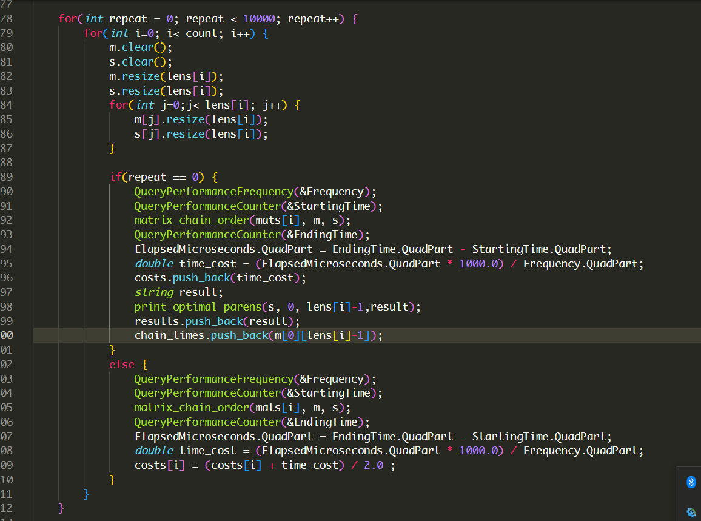
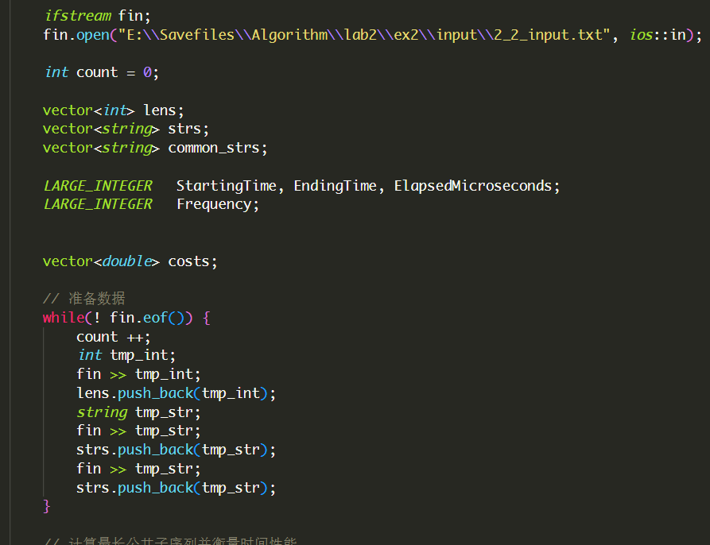
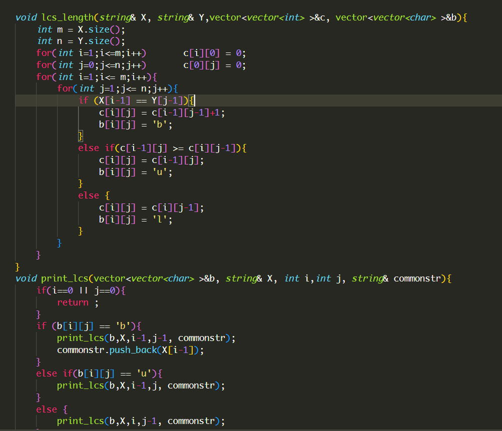
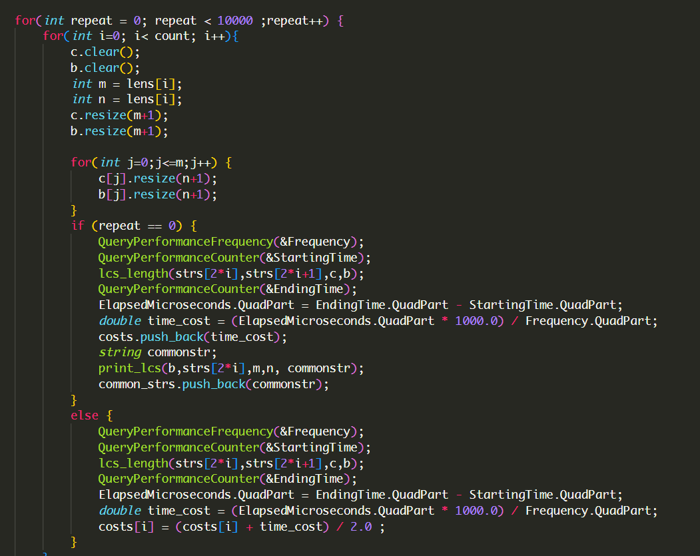

# lab2实验报告

学号：PB20061338
姓名： 柯志伟

## 实验设备和环境

    平台: windows
    编程语言: C与C++

## 实验内容及要求

### 实验内容

#### 实验2.1: 求矩阵链乘最优方案

    1. n个矩阵链乘，求最优链乘方案，使链乘过程中乘法运算次数最少。
    2. n的取值5, 10, 15, 20, 25，矩阵大小见2_1_input.txt。
    3. 求最优链乘方案及最少乘法运算次数，记录运行时间，画出曲线分析。
    仿照P214 图15-5，打印n=5时的结果并截图

#### 实验2.2: 求最长公共子序列
    1. 给定两个序列X、Y，求出这两个序列的最长公共子序列（某一个即可）。
    2. X, Y序列由A、B、C、D四种字符构成,序列长度分别取10、15、20、25、30，见2_2_input.txt。
    3. 打印最长公共子序列，记录运行时间，画出曲线分析

### 实验要求
    1. 完成实验2.1和实验2.2,并使用给定不同规模数据分析程序运行的渐进时间复杂度
    2. 撰写实验报告,包含实验设备和环境、实验内容及要求、方法和步骤、结果与分析(比较实际复杂度和理论复杂度是否相同，给出分析)

### 方法和步骤

#### 矩阵链乘

1. 获取所有输入数据

2. 实现矩阵链乘算法

3. 运行程序,衡量程序运行时间,保存结果

程序输出结果

规模为5时运行结果

#### 最长公共子序列

1. 获取所有输入数据

2. 实现最长公共子序列算法

3. 运行程序,衡量程序运行时间,保存结果

程序输出结果

### 结果与分析

#### 矩阵链乘

`运行时间:`
| 数据规模(矩阵数) | 运行时间(ms) |
|:--: | :--: |
| 5  |  0.000489026 |
|  10 | 0.00303599  |
| 15  |  0.00942401 |
| 20  | 0.0196768  |
| 25  | 0.037236  |

`时间复杂度趋势图:`

`使用n^3分析:`

`实验分析:` 分析矩阵链乘动态规划算法程序可知,程序设计三重循环,总的时间复杂度为O(n\^3),通过实验结果,算法运行时间随输入数据规模的增大呈非线性变化, 当使用n\^3进行分析作图时,效果较好,符合矩阵链乘动态规划算法O(n\^3)的时间复杂度

#### 最长公共子序列

`运行时间:`
| 数据规模(序列长) | 运行时间(ms) |
|:--: | :--: |
| 10  |  0.00183116 |
|  12 | 0.00384997  |
| 20  |  0.00669922 |
| 25  | 0.0102735  |
| 30  | 0.0144551  |

`时间复杂度趋势图:`

`使用n^2分析:`

`实验分析:`分析最长公共子序列动态规划算法可知,程序包含两重循环,总的时间复杂度为O(mn),其中m,n分别为两个串的长度, 本次实验中m=n,故为O(n\^2),通过实验结果,算法运行时间随输入数据规模的增大呈非线性变化, 当使用n\^2进行分析作图时,效果较好,符合最长公共子序列动态规划算法O(n\^2)的时间复杂度

