## Lab01 LC3实现乘法操作
**L程序部分**

  1. L程序设计思路
     
     > ​		针对输入的两个数，将第二个数(R1)的符号转移到第一个数(R0)上，保证第二个数为正数，并作为计数量，将第一个数逐个加入到R7中，同时将计数量减一，重复操作直至计数量减至0
     
     代码如下：


```LC3
    0011 0000 0000 0000 ; start the program at location x3000
    0101 000 000 1 00000 ; set R0 to 0
    0101 001 001 1 00000 ; set R1 to 0
    0101 111 111 1 00000 ; set R7 to 0,the location to store the    result
    0001 000 000 1 00100 ; R0 <-- 4
    0001 001 001 1 00101 ; R1 <-- 5

    0001 010 001 1 00000 ; R2 <-- R1
    0000 011 000000100 ; R2 >= 0?
    1001 000 000 111111 ; R0 <-- ~R0
    0001 000 000 1 00001 ; R0 <-- R0 + 1
    1001 001 001 111111 ; R1 <-- ~R1
    0001 001 001 1 00001 ; R1 <-- R1 + 1
    0000 010 000000011 ; R2 = 0?
    0001 111 111 0 00 000 ; R7 <-- R7 + R0 
    0001 001 001 1 11111 ; R1 <-- R1 -1
    0000 001 111111101 ; back to "R7 <-- R7 + R0"
    1111 0000 00100101 ; halt
```
  2. L程序代码行数
     
     > ​		对R1符号的判断共三行(8,9,14)，对R1为负的单独操作共四行(10,11,12,13)，将R0加入到R7并更新计数变量同时判断是否循环共三行(15,16,17),终止一行(18)，总共十一行.
  3. P程序测试样例测试结果

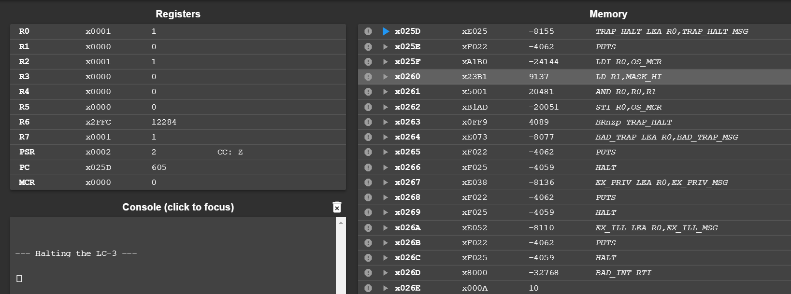
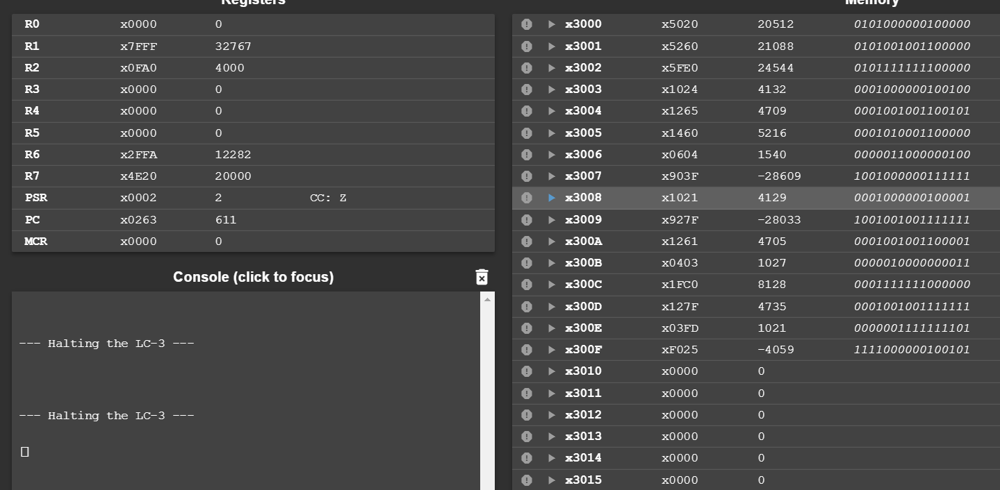
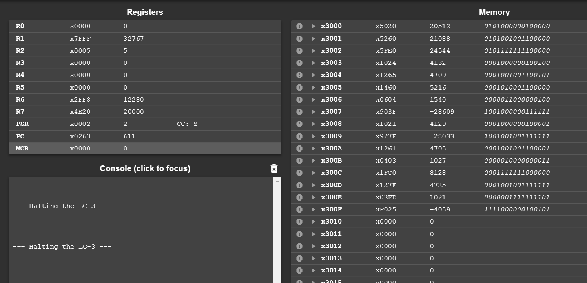
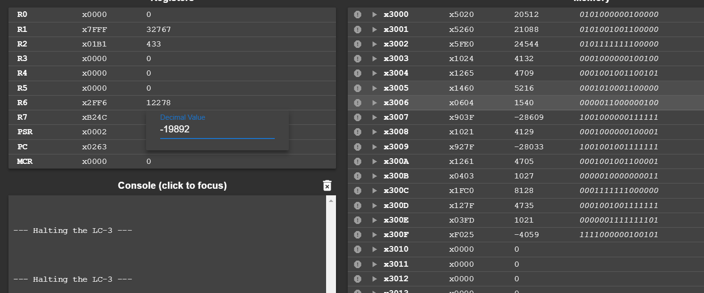
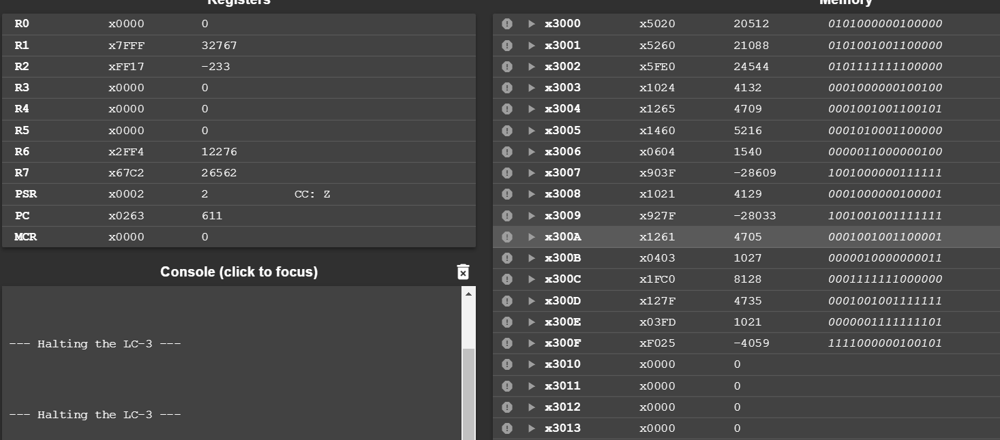
**P程序部分**

  1. P程序设计思路

     > ​		由于用LC3实现乘法只能通过加法，那么要想实现更快的乘法，即执行更少的指令，必须减少执行加法的次数，故采取以下两种想法：
     >
     > ​		 (1) 将两个相乘的数中，较大的作为基数，较小的作为计数量，可减少进入加法循环的次数
     >
     > ​		 (2) 选取一个可以接受的执行逐个相加的数，比如16，对于计数量，如果大于16，则逐次减去16，而R7则逐次加上16*R0，从而直接减少加法次数
     
     代码如下：
     
     ```LC3
         0011 0000 0000 0000 ; start the program at location x3000
         0101 000 000 1 00000 ; set R0 to 0
         0101 001 001 1 00000 ; set R1 to 0
         0101 111 111 1 00000 ; set R7 to 0,the location to store the result
         0101 110 110 1 00000 ; set R6 to 0
         0001 000 000 1 00100 ; R0 <-- 4
         0001 001 001 1 00101 ; R1 <-- 5
     
         ;确定可以接受的逐个相加的基数为16
     
         ;1.let R1,R0 to be positive and record  "+-" of the result
         0001 010 001 1 00000 ; R2 <-- R1
         0000 011 000001001 ; R2 >= 0?
         ;R1<0
         1001 001 001 111111 ; R1 <-- ~R1
         0001 001 001 1 00001 ; R1 <-- R1 + 1,let R1 to be positive or zero
         0001 011 000 1 00000 ; R3 <-- R0
         0000 011 000000011 ; R3 >0
         ;;R0<0
         1001 000 000 111111 ;  R0 <-- ~R0
         0001 000 000 1 00001 ; R0 <-- R0 + 1
         0000 111 000000111 ; 无条件跳转
         ;;R0>=0
         0001 110 110 1 00001 ; R6 <-- 1 ,R6为1代表结果为负，为0代表结果为正,let R0 to be positive or zero
         0000 111 000000101 ;无条件跳转
         ;R1>=0
         0001 011 000 1 00000 ; R3 <-- R0
         0000 011 000000011 ; R3 >0
         ;;R0<0
         1001 000 000 111111 ;  R0 <-- ~R0
         0001 000 000 1 00001 ; R0 <-- R0 + 1
         0001 110 110 1 00001 ; R6 <-- 1 ,R6为1代表结果为负，为0代表结果为正,let R0 to be positive or zero
         ;;R0>=0
     
         ;2.compute the result,make R0 store the bigger
         1001 100 001 111111 ; R4 <-- ~R1
         0001 100 100 1 00001 ; R4 <-- R4 + 1
         0001 101 000 0 00 100 ; let R5 to be R0-R1
         0000 011  000000011   ; R5>=0?
         ;R0<R1
         0001 100 000 1 00000 ; R4 <-- R0
         0001 000 001 1 00000 ; R0 <-- R1
         0001 001 100 1 00000 ; R1 <-- R4
     
         ;make R5 to be 16*R0
         0101 101 101 1 00000 ; set R5 to 0
         0001 101 101 0 00 000 ; R5 <-- R5 + R0
         0001 101 101 0 00 101 ; R5 <-- R5 + R5
         0001 101 101 0 00 101 ; R5 <-- R5 + R5
         0001 101 101 0 00 101 ; R5 <-- R5 + R5
         0001 101 101 0 00 101 ; R5 <-- R5 + R5
     
         0001 100 001 1 00000 ; R4 <-- R1
         0000 010 000001101  ;R4 = 0 ?
         ;;R1>0
         0001 100 100 1 10000 ;R4 <-- R4-16
         0000 100 000000100 ;R4<0?
         0001 111 111 0 00 101 ; R7 <-- R7 + R5
         0001 001 001 1 10000 ;R1 <-- R1-16
         0000 001 111111011 ; back to "R4 <-- R4-16"
         0000 010 000000011 ; R1 =0?
     
         0001 111 111 0 00 000 ; R7 <-- R7 + R0 
         0001 001 001 1 11111 ; R1 <-- R1 -1
         0000 001 111111101 ; back to "R7 <-- R7 + R0"
     
         0001 110 110 1 00000 ; R6 <-- R6
         0000 010 000000010 ;R6=0?
         1001 111 111 111111 ;  R7 <-- ~R7
         0001 111 111 1 00001 ; R7 <-- R7 + 1
         1111 0000 00100101 ; halt
     ```
     
1. P程序执行指令数
  - P程序执行指令数统计方法：
      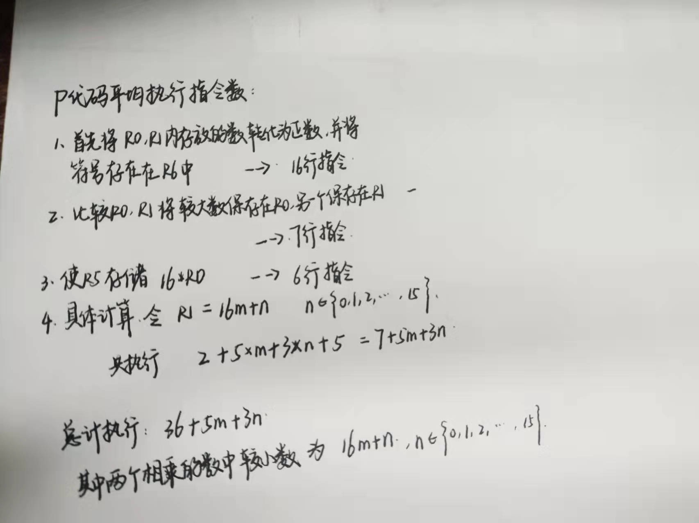
      以测试用例为例：
      1\*1  执行 36+3 = 39
      5\*4000 执行 36+5\*3 = 51
      4000\*5 执行 36+5\*3 = 51
      -500\*433 执行36+27\*5+3\*1=172
      -114\*-233 执行36+7\*5+3\*2=77
      在测试样例上平均执行指令数： 78

3. P程序测试样例测试结果
   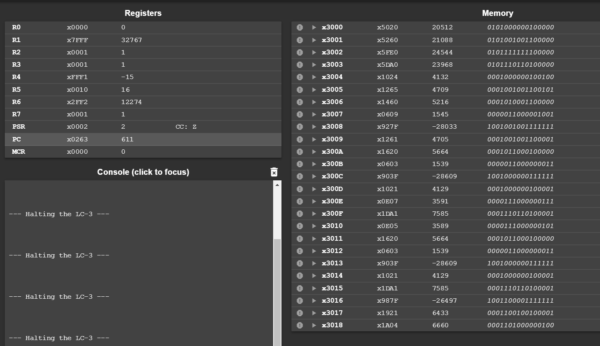
    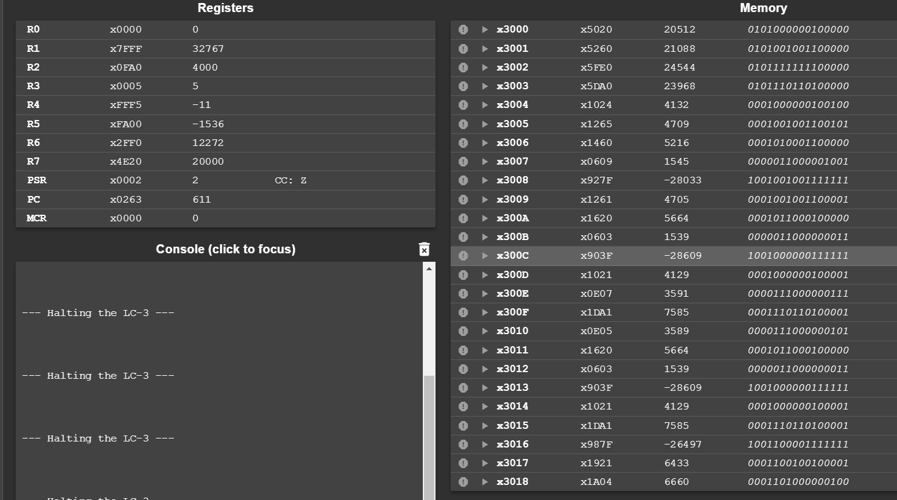
    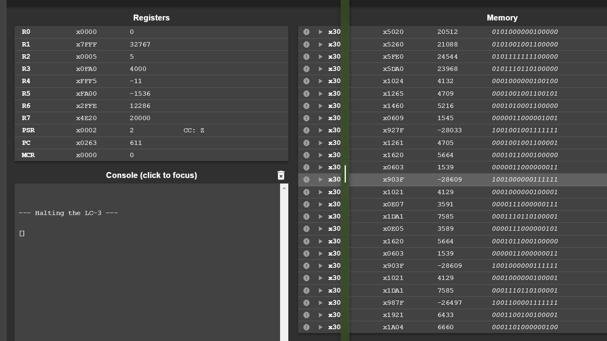
    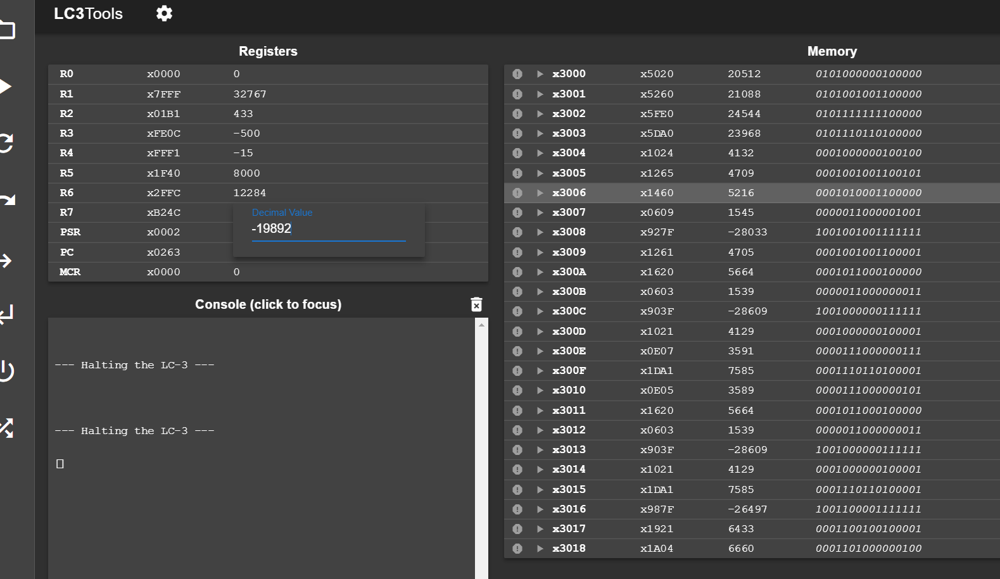
    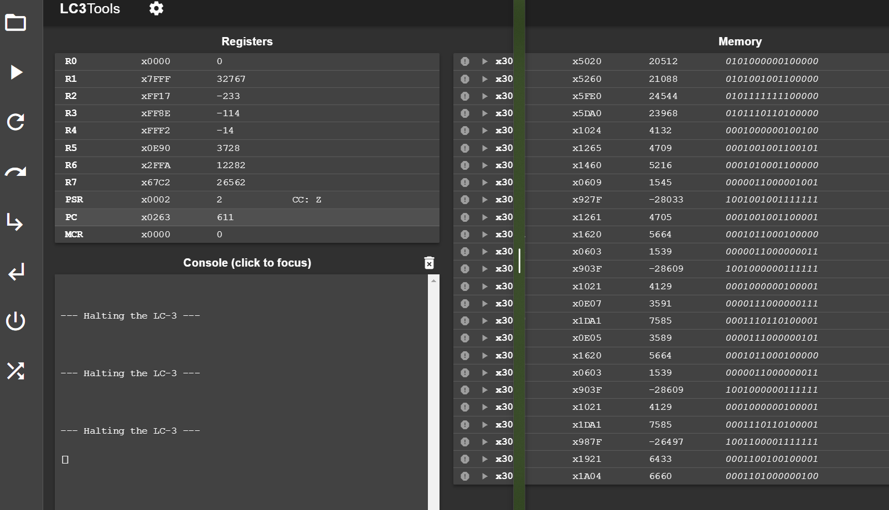


​    

