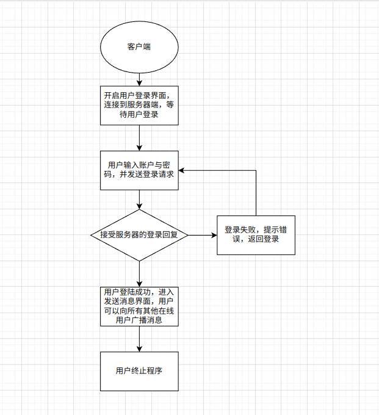
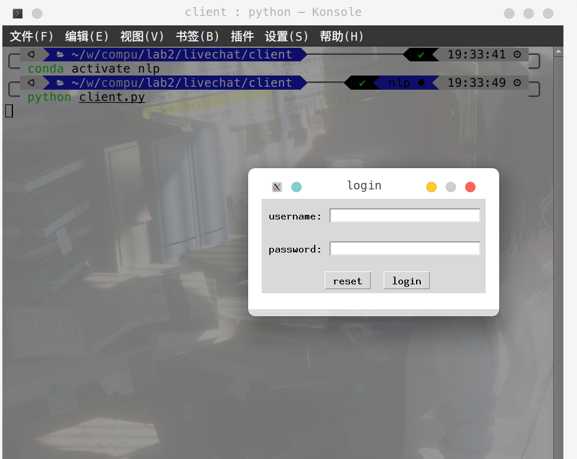
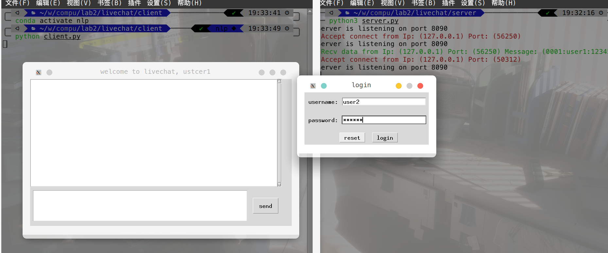
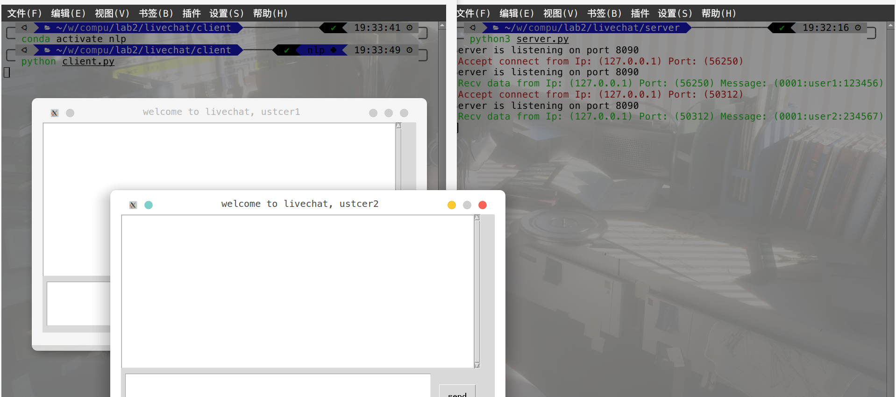
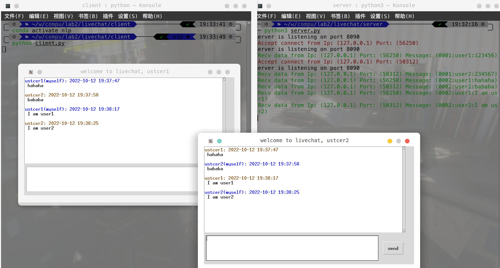

## lab2实验报告

```
学号： PB20061338
姓名： 柯志伟

```

#### 实验题目
```
Socket编程
```


#### 实验内容
```
- 实验要求：
    高级聊天程序
    一个服务器，多个客户端，服务器负责消息中转、客户端可以互相聊天(广播或单播)
- 实现说明：
    为简化服务器的处理，目前服务器支持客户端的连接并登录，发送消息采用广播机制
(即客户端放送的消息由服务器向除自己以外的所有在线的其他用户转发，类似于网络聊天
室的功能)

```

#### 实验平台和语言

实验平台：Ubuntu
编程语言：python3

#### 实验过程
- 总体架构

```
聊天应用程序作为应用层采用C-S架构，并使用下层网络协议的TCP协议
1. 客户端与服务器间约定消息类型与格式如下：

C-->S(请求消息)：其中'|'为消息内容分隔符
    0001 | username | password    登录请求
    0002 | username | messages    聊天请求

S-->C(响应消息，包含转发消息): 其中'|'为消息内容分隔符
    1001 | result | nickname | username  登录响应
    1002 | nickname | messages           聊天响应


2. 为简单起见，使用json配置文件模拟数据库的使用，同时暂不支持注册功能(即在json文件里预先定义了所有的用户)
{
    "user1":{
        "username":"user1",
        "password":"123456",
        "nickname":"ustcer1"
    },
    "user2":{
        "username":"user2",
        "password":"234567",
        "nickname":"ustcer2"
    },
    "user3":{
        "username":"user3",
        "password":"345678",
        "nickname":"ustcer2"
    },
    "user4":{
        "username":"user4",
        "password":"456789",
        "nickname":"ustcer2"
    },
    "user5":{
        "username":"user5",
        "password":"567890",
        "nickname":"ustcer2"
    }
}

```
- 服务器端与客户端的功能逻辑

服务器端


客户端


```
说明： 客户端存在两个线程(一个线程用于GUI界面的显示，另一线程实现具体的功能逻辑，由于
GUI界面主要与显示有关，具体的显示转换逻辑由实现功能逻辑的线程控制)

```

- 完成服务器端的编写

1. 实现客户端与服务器间的协议约定(具体通过约定的配置文件实现)
```python
## 数据协议相关配置

REQUEST_LOGIN = "0001"  ## 登录请求
REQUEST_CHAT = "0002"  ## 聊天请求
RESPONSE_LOGIN_RESULT = "1001" ## 登录响应结果
RESPONSE_CHAT = "1002" ## 聊天响应
DELIMITER = ":" ## 数据字段分隔符
SERVER_IP = "127.0.0.1"
SERVER_PORT = 8090

DATA_BASE_FILE = "users.json"

```

2. 定义消息封装的类
```python
from config import *


## 定义用于响应拼接的类
class ResponseProtocol(object):

    @staticmethod
    def response_login_result(result,nickname,username):
        
        return DELIMITER.join([RESPONSE_LOGIN_RESULT,result,nickname,username])

    @staticmethod
    def response_chat(nickname,messages):

        return DELIMITER.join([RESPONSE_CHAT,nickname,messages])

```

```
response_login_result、response_chat 按照约定协议分别封装登录响应消息、聊天消息响应


```

3. 封装socket类，实现自用的socket
```python
import socket
from config import * 

class ServerSocket(socket.socket):

    def __init__(self):
        super().__init__(socket.AF_INET,socket.SOCK_STREAM)   ## 使用ipv4和tcp协议
        self.bind((SERVER_IP,SERVER_PORT))  ## 绑定ip地址与端口号
        self.listen(128)                    ## 设置监听模式


class SocketWrapper(object):

    def __init__(self,soc):
        self.soc = soc

    def recv_data(self):
        try:
            return self.soc.recv(512).decode('utf-8')
        except:
            return ""

    def send_data(self,messages):

        return self.soc.send(messages.encode('utf-8'))

    def close(self):
        self.soc.close()

```

```
封装socket类，实现初始化socket，绑定端口与监听，并对外提供收发数据的接口

```

4. 使用json文件模拟实现数据库存储用户信息的功能

```python

import json
from config import *

class DB(object):
    def __init__(self):
        
        self.users = self.database_init()

    def database_init(self):

        with open(DATA_BASE_FILE,"r") as f:
            users = json.load(f)
            return users

    def get_user(self,username):
        if username in self.users.keys(): 
            return self.users[username]
        else:
            return None

```

```
为简单起见，在使用json配置文件存储用户账号与密码，模拟数据库供服务器使用

```

5. 实现服务器类，实现服务器的功能逻辑

```python

from threading import Thread
from config import *
from response_for_protocol import ResponseProtocol
from server_socket import ServerSocket, SocketWrapper
from db import DB


class Server(object):

    def __init__(self):
        ## 创建服务器套接字
        self.server_socket = ServerSocket()

        ## 创建请求id及其对应的处理函数
        self.request_handle_functions = {}
        self.register(REQUEST_LOGIN, self.request_login_handle)
        self.register(REQUEST_CHAT, self.request_chat_handle)

        ## 创建保存当前登录用户的字典
        self.clients = {}

        ## 创建数据库对象
        self.db = DB()

    def register(self, request_id, handle_function):
        ## 注册消息类型及处理函数
        self.request_handle_functions[request_id] = handle_function

    def startup(self):

        while True:
            print("Server is listening on port "+str(SERVER_PORT))
            soc, addr = self.server_socket.accept()
            client_ip,client_port = soc.getpeername()
            print("\033[31m Accept connect from Ip: ("+str(client_ip)+") Port: ("+str(client_port)+")\033[0m")
            client_soc = SocketWrapper(soc)

            Thread(target=lambda: self.request_handle(client_soc)).start()

    def request_handle(self, client_soc):
        client_ip,client_port = client_soc.soc.getpeername()

        while True:

            ## 接收客户端请求
            recv_data = client_soc.recv_data()

            if not recv_data:
                self.remove_offline_user(client_soc)
                client_soc.close()
                break


            print("\033[32m Recv data from Ip: ("+str(client_ip)+") Port: ("+str(client_port)+") Message: ("+recv_data.strip("\n")+")\033[0m")

            ## 解析客户端请求
            parse_data = self.parse_request_data(recv_data)

            ## 判断请求类型
            handle_function = self.request_handle_functions.get(parse_data['request_id'])

            if handle_function:
                handle_function(client_soc, parse_data)

                ## 调用请求对应的处理函数

    def remove_offline_user(self, client_soc):
        client_ip,client_port = client_soc.soc.getpeername()
        print("\033[31m Client Ip: ("+str(client_ip)+") Port: ("+str(client_port)+") is offline\033[0m")
        for username, info in self.clients.items():
            if info['sock'] == client_soc:
                del self.clients[username]
                break

    @staticmethod
    def parse_request_data(text):
        """
            登录信息格式  0001|username|password
            聊天信息格式  0002|username|messages
        """

        request_list = text.split(DELIMITER)

        request_data = {}

        request_data['request_id'] = request_list[0]

        if request_data['request_id'] == REQUEST_LOGIN:
            request_data['username'] = request_list[1]
            request_data['password'] = request_list[2]
        elif request_data['request_id'] == REQUEST_CHAT:
            request_data['username'] = request_list[1]
            request_data['messages'] = request_list[2]

        return request_data

    def request_login_handle(self, client_sock, request_data):

        username = request_data['username']
        password = request_data['password']

        ret, nickname, username = self.check_user_login(username, password)

        if ret == '1':
            self.clients[username] = {'sock': client_sock, 'nickname': nickname}

        response_text = ResponseProtocol.response_login_result(ret, nickname, username)

        client_sock.send_data(response_text)

    def request_chat_handle(self, client_soc, request_data):
        ## 获取消息内容
        username = request_data['username']
        messages = request_data['messages']
        nickname = self.clients[username]['nickname']
        ## 拼接消息文本
        msg = ResponseProtocol.response_chat(nickname, messages)
        ## 转发消息给在线用户
        for u_name, info in self.clients.items():
            if username == u_name:
                continue
            info['sock'].send_data(msg)

    def check_user_login(self, username, password):
        result = self.db.get_user(username)

        if not result:
            return '0', '', username

        if password != result['password']:
            return '0', '', username

        return '1', result['nickname'], username


if __name__ == '__main__':
    Server().startup()
```

```
Server类封装了使用的socket以及相关功能的处理逻辑
startup 启动server服务，持续在8090端口接受tcp连接
request_handle    解析客户端请求，并实现请求处理的分配器，
                    根据消息类型交给对应的处理逻辑处理
request_login_handle  具体处理登录请求
request_chat_handle   具体处理聊天请求

```

- 实现客户端的编写

1. 实现与服务器的约定协议

```python
LOGIN_WINDOW_WIDTH = 380
LOGIN_WINDOW_HEIGHT = 160
CHAT_WINDOW_WIDTH = 800
CHAT_WINDOW_HEIGHT = 450

MYCOLOR = "system"
OTHERCOLOR = "otheruser"

REQUEST_LOGIN = "0001"  ## 登录请求
REQUEST_CHAT = "0002"  ## 聊天请求
RESPONSE_LOGIN_RESULT = "1001" ## 登录响应结果
RESPONSE_CHAT = "1002" ## 聊天响应
DELIMITER = ":" ## 数据字段分隔符

SERVER_IP = "127.0.0.1"
SERVER_PORT = 8090

```

2. 定义消息封装的类
```python

from config import *

class RequestProcotol(object):
    @staticmethod
    def request_login_result(username,password):

        return DELIMITER.join([REQUEST_LOGIN,username,password])

    @staticmethod
    def request_chat(username,messages):

        return DELIMITER.join([REQUEST_CHAT,username,messages])

```

```
request_login_result、request_chat 按照约定协议分别封装登录请求与聊天请求
```
3. 封装socket类，实现自用的socket
```python

import socket
from config import *

class ClientSocket(socket.socket):
    def __init__(self):
        super().__init__(socket.AF_INET,socket.SOCK_STREAM)

    def connect(self):
        super().connect((SERVER_IP,SERVER_PORT))

    def recv_data(self):

        return self.recv(512).decode('utf-8')

    def send_data(self,messages):

        return self.send(messages.encode('utf-8'))

```

```
封装socket类，实现初始化socket，并对外提供收发数据的接口

```


4. 定义登录界面的GUI窗口
```python
from tkinter import Tk
from tkinter import Label,Entry,Frame,Button,LEFT,END
from config import *


class LoginWindow(Tk):
    def __init__(self):
        super().__init__()
        ## 初始化窗口属性
        self.window_init()
        ## 填充控件
        self.add_widgets()

    def window_init(self):
        """初始化窗口属性"""

        ## 设置窗口名称
        self.title('login')

        ## 设置窗口不能拉伸
        self.resizable(False,False)
        ## 设置窗口大小和位置
        screen_width = self.winfo_screenwidth()
        screen_height = self.winfo_screenheight()
        pos_x = (screen_width-LOGIN_WINDOW_WIDTH)/2
        pos_y = (screen_height-LOGIN_WINDOW_HEIGHT)/2
        self.geometry('%dx%d+%d+%d'%(LOGIN_WINDOW_WIDTH,LOGIN_WINDOW_HEIGHT,pos_x,pos_y))
 
    def add_widgets(self):

        ## 用户名
        username_label = Label(self,font=("Monaco",15))
        username_label['text'] = 'username:'
        username_label.grid(row=0,column=0,rowspan=2,padx=10)
        username_entry = Entry(self,name='username_entry',bd=2,font=("Monaco",15))
        username_entry['width'] = 25
        username_entry.grid(row=0,column=1,rowspan=2,padx=0,pady=15)

        ## 密码
        password_label = Label(self,font=("Monaco",15))
        password_label['text'] = 'password:'
        password_label.grid(row=2,column=0,rowspan=2,padx=10)
        password_entry = Entry(self,name='password_entry',bd=2,font=("Monaco",15))
        password_entry['width'] = 25
        password_entry['show'] = '*'
        password_entry.grid(row=2,column=1,rowspan=2,padx=0,pady=15)

        ## 按钮区
        button_frame = Frame(self,name='button_frame')

        reset_button = Button(button_frame,name='reset_button',font=("Monaco",15))
        reset_button['text'] = 'reset'
        reset_button.pack(side=LEFT,padx=20)

        login_button = Button(button_frame,name='login_button',font=("Monaco",15))
        login_button['text'] = 'login'
        login_button.pack(side=LEFT)

        button_frame.grid(row=6,columnspan=2,pady=10)

    def on_login_button_click(self,command):
        login_button = self.children['button_frame'].children['login_button']
        login_button['command'] = command

    def on_reset_button_click(self,command):
        reset_button = self.children['button_frame'].children['reset_button']
        reset_button['command'] = command

    def get_username(self):

        return self.children['username_entry'].get()

    def get_password(self):
        
        return self.children['password_entry'].get()


    def clear_username(self):
        
        self.children['username_entry'].delete(0,END)

    def clear_password(self):
        
        self.children['password_entry'].delete(0,END)

    def on_window_close(self,command):

        self.protocol('WM_DELETE_WINDOW',command)

```

```
定义登录窗口类，并初始化一些简单的控件，以及一些事件触发时的处理函数，供外部初始化类时使用
```

5. 定义聊天界面的GUI窗口

```python
from time import strftime,time,localtime
from tkinter import END, UNITS, Toplevel
from tkinter.scrolledtext import ScrolledText
from tkinter import Text
from tkinter import Button
from config import *

from config import CHAT_WINDOW_HEIGHT


class ChatWindow(Toplevel):
    def __init__(self):
        super().__init__()

        ## 设置窗口大小
        self.geometry("%dx%d"%(CHAT_WINDOW_WIDTH,CHAT_WINDOW_HEIGHT))
        ## 设置窗口不可修改
        self.resizable(False,False)

        ## 添加组件
        self.add_widget()


    def add_widget(self):
        
        ## 聊天区
        chat_text_area = ScrolledText(self,font=("Monaco",15))
        chat_text_area['width'] = 75
        chat_text_area['height'] = 18
        chat_text_area.grid(row=0,column=0,columnspan=2)

        ## 添加标签
        chat_text_area.tag_config(MYCOLOR,foreground='#0000ff')
        chat_text_area.tag_config(OTHERCOLOR,foreground='#804000')
        chat_text_area.tag_config('black',foreground='#000000')
        self.children['chat_text_area'] = chat_text_area
        

        ## 输入区
        chat_input_area = Text(self,name='chat_input_area',font=("Monaco",15))
        chat_input_area['width'] = 65
        chat_input_area['height'] = 5
        chat_input_area.grid(row=1,column=0,pady=10)

        ## 发送按钮
        send_button = Button(self,name='send_button',font=("Monaco",15))
        send_button['text'] = "send"
        send_button['width'] = 5
        send_button['height'] = 2

        send_button.grid(row=1,column=1)

    def set_title(self,name):
        self.title('welcome to livechat, %s '%(name))

    def on_send_button_click(self,command):
        self.children['send_button']['command'] = command

    def get_inputs(self):

        return self.children['chat_input_area'].get(0.0,END)

    def clear_inputs(self):
        self.children['chat_input_area'].delete(0.0,END)

    def append_message(self,sender,messages,color):
        send_time = strftime('%Y-%m-%d %H:%M:%S',localtime(time()))
        send_info = '%s: %s\n'%(sender,send_time)
        self.children['chat_text_area'].insert(END,send_info,color)
        self.children['chat_text_area'].insert(END,' '+messages+'\n','black')

        self.children['chat_text_area'].yview_scroll(3,UNITS)

    def on_window_close(self,command):

        self.protocol('WM_DELETE_WINDOW',command)

```

```
定义聊天窗口类，并初始化一些简单的控件，以及一些事件触发时的处理函数，供外部初始化类时使用
```

6. 实现客户端的GUI界面逻辑和功能逻辑

```python

from config import *
from login_window import LoginWindow
from chat_window import ChatWindow
from request_for_protocol import RequestProcotol
from client_socket import ClientSocket
from threading import Thread
from tkinter.messagebox import showinfo
import sys

from config import DELIMITER, RESPONSE_CHAT

class Client(object):

    def __init__(self):

        ## 初始化登录窗口
        self.window = LoginWindow() 
        self.window.on_reset_button_click(self.clear_inputs)
        self.window.on_login_button_click(self.send_login_data)
        self.window.on_window_close(self.exit)

        self.mycolor =  MYCOLOR
        self.othercolor = OTHERCOLOR

        ## 初始化聊天窗口
        self.window_chat = ChatWindow()
        self.window_chat.withdraw() ## 隐藏窗口
        self.window_chat.on_send_button_click(self.send_chat_data)
        self.window_chat.on_window_close(self.exit)

        self.response_handle_functions = {}
        self.register(RESPONSE_LOGIN_RESULT,self.response_login_handle)
        self.register(RESPONSE_CHAT,self.response_chat_handle)

        self.conn = ClientSocket()

        self.is_running = True

    def register(self,response_id,handle_function):
        self.response_handle_functions[response_id] = handle_function

    def startup(self):
        self.conn.connect()
        self.t = Thread(target=self.response_handle)
        self.t.start()
        self.window.mainloop()

    def clear_inputs(self):

        self.window.clear_username()
        self.window.clear_password()

    def send_login_data(self):
        username = self.window.get_username()
        password = self.window.get_password()

        request_text = RequestProcotol.request_login_result(username,password)
        self.conn.send_data(request_text)


    def send_chat_data(self):
        messages = self.window_chat.get_inputs()
        self.window_chat.clear_inputs()
        request_text = RequestProcotol.request_chat(self.username,messages)
        self.window_chat.append_message(self.nickname+"(myself)",messages,self.mycolor)
        self.conn.send_data(request_text)

    def response_handle(self):

        while self.is_running:

            ## 获取服务器的消息
            recv_data = self.conn.recv_data()

            ## 解析消息内容
            parse_data = self.parse_request_data(recv_data)

            handle_function = self.response_handle_functions.get(parse_data['response_id'])
            if handle_function:
                handle_function(parse_data) 
        sys.exit(0)


    @staticmethod
    def parse_request_data(recv_data):
        """
            登录响应格式  1001|成功/失败|nickname|username
            聊天响应格式  1002|nickname|messages
        """
        response_list = recv_data.split(DELIMITER)

        response_data = {}
        response_data['response_id'] = response_list[0]

        if response_data['response_id'] == RESPONSE_LOGIN_RESULT:
            response_data['result'] = response_list[1]
            response_data['nickname'] = response_list[2]
            response_data['username'] = response_list[3]
        elif response_data['response_id'] == RESPONSE_CHAT:
            response_data['nickname'] = response_list[1]
            response_data['messages'] = response_list[2]

        return response_data


    def response_login_handle(self,response_data):
        result = response_data['result']
        if result == '0':
            showinfo('info','login failed,username or password is wrong!')
            return 
        self.nickname = response_data['nickname']
        self.username = response_data['username']

        ## 显示聊天窗口，隐藏登录窗口
        self.window_chat.set_title(self.nickname)
        self.window_chat.update()
        self.window_chat.deiconify()

        self.window.withdraw()


    def response_chat_handle(self,response_data):
        messages = response_data['messages']
        sender = response_data['nickname']
        self.window_chat.append_message(sender,messages,self.othercolor)

    def exit(self):
        self.is_running = False 
        self.conn.close()
        self.window.destroy()
        sys.exit(0)
        


if __name__ == '__main__':
    Client().startup()

```
```
Client类封装了使用的socket,登录窗口、聊天窗口以及相关功能的处理逻辑
startup 启动client服务，并创建独立于GUI界面线程用于向服务器发送请求的线程
response_handle       解析客户端响应，并实现响应处理的分配器，
                        根据响应类型交给对应的处理逻辑处理
response_login_handle   具体处理登录响应
response_chat_handle    具体处理聊天响应


```

#### 实验结果

```
演示两个用户通过客户端登录并互发消息,为方便，服务器端将所有消息在命令行打印，在右侧命令行可以看出
```
1. 启动服务器端


2. 启动客户端并登录用户1



3. 启动客户端并登录用户2




4. 互发消息



