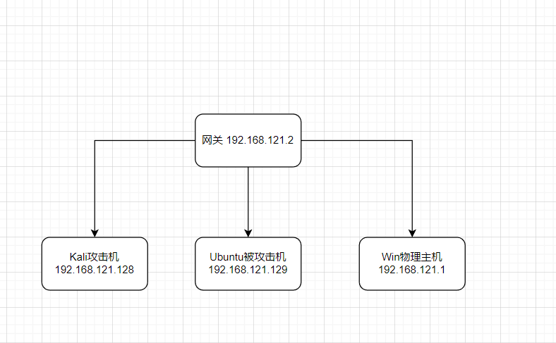
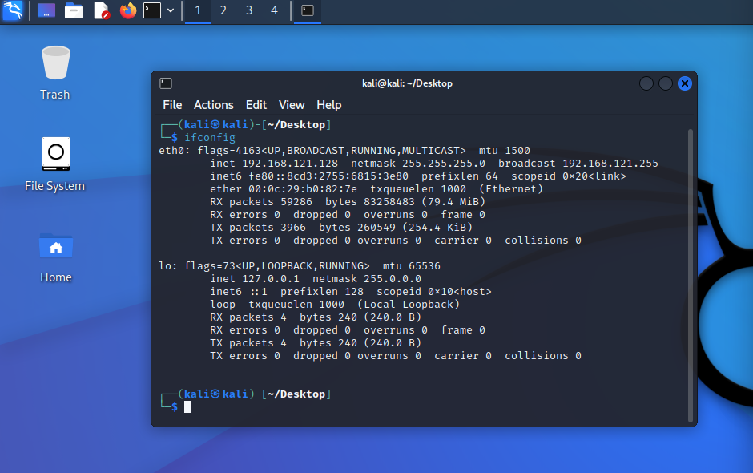
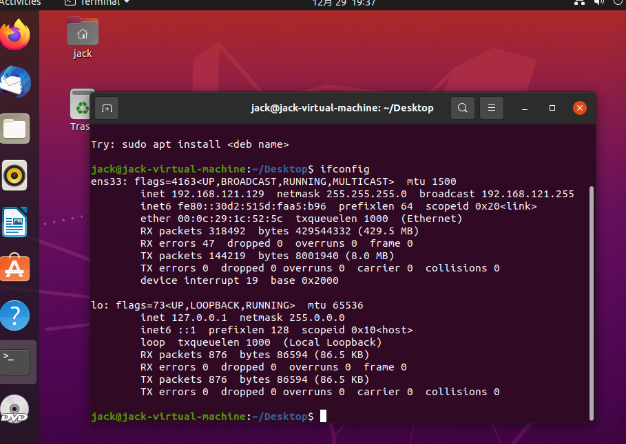
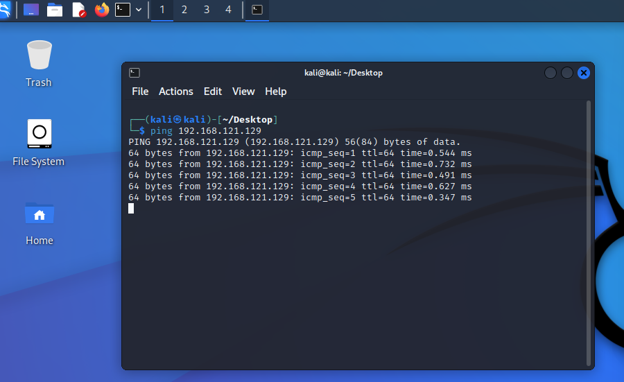
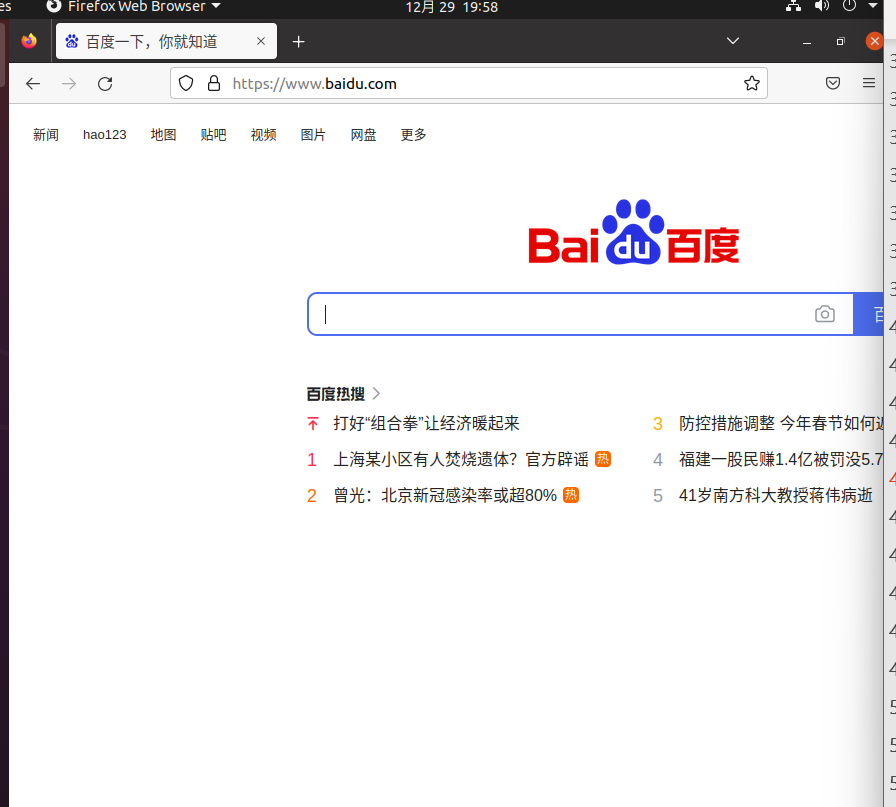
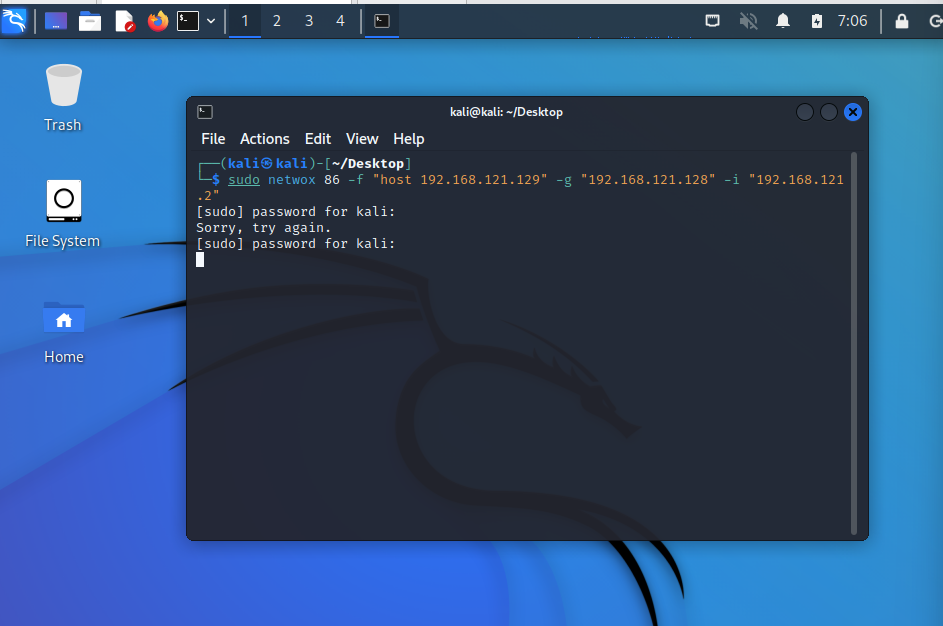
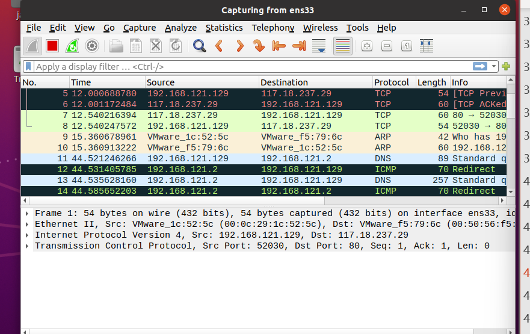
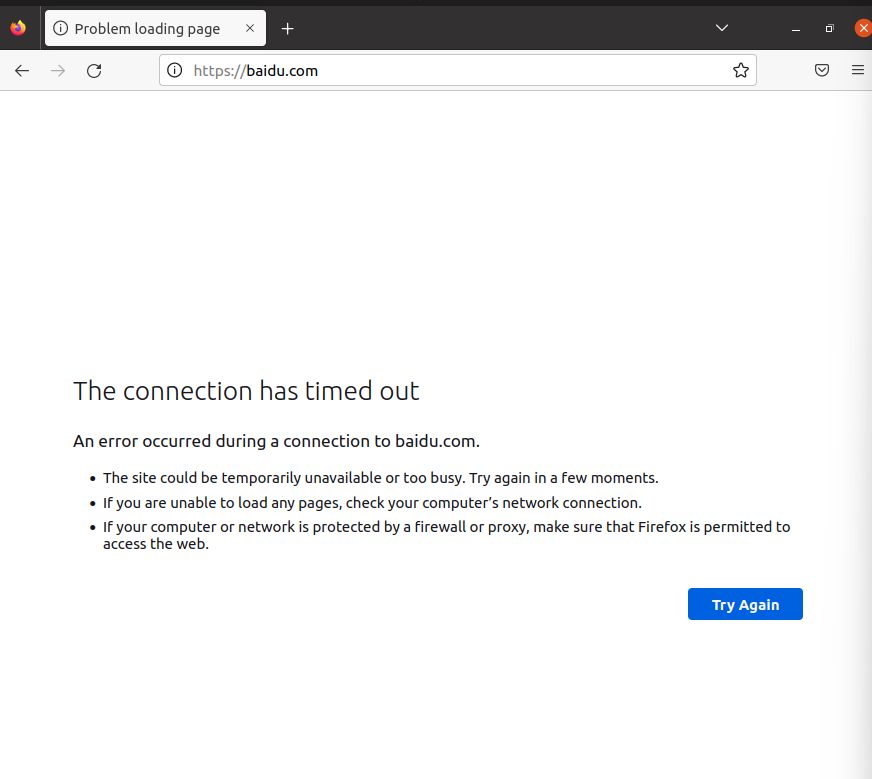
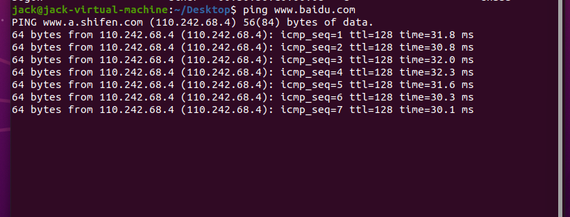
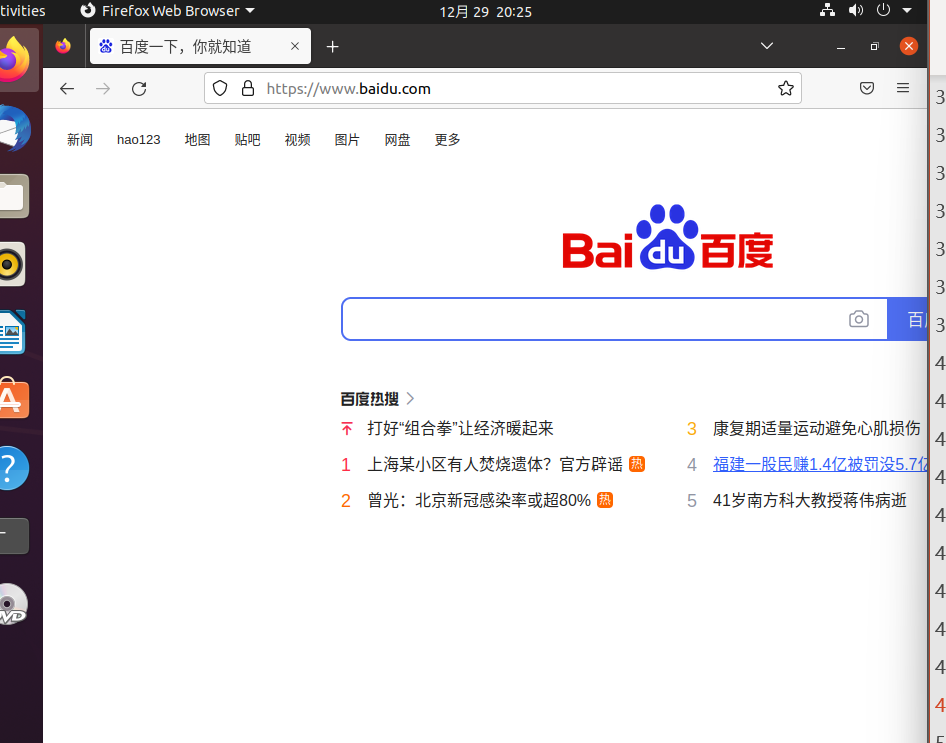

# lab4实验报告

    
姓名:   柯志伟

    
学号: PB20061338

## 实验目的

- ICMP重定向攻击

- ARP欺骗攻击

## 实验环境

利用VMware Workstation使用NAT网络连接方式搭建局域网,VMware的虚拟网络设置为NAT模式并启动DHCP,搭建子网(`子网IP: 192.168.27.0 子网掩码: 255.255.255.0`)

- 组网的拓扑结构如下:

- 各主机IP及操作系统版本如下:

|角色| IP地址 | 操作系统版本|
|:--|:--|:--|
|攻击者|192.168.27.128 | Kali 2022|
|靶机|192.168.27.129 | Ubuntu 2020|
|物理主机|192.168.121.1 | Win11|

- 搭建结果如下

`kali攻击机`

`Ubuntu靶机`

`Win物理主机`

`各主机互ping结果`

## 实验要求

1. 搭建攻击场景，并用表格的形式展示各台主机IP地址与操作系统版本，以网络拓扑图的形式展示攻击场景。

2. 分别完成ICMP重定向攻击与ARP欺骗攻击，在实验报告中分别展示攻击手段并以截图的形式分别展示两种攻击的结果（ping命令前后对比结果/arp表前后对比结果、报文抓取结果、网页访问前后对比结果）并对关键内容辅以必要的解释 ；

3. 针对上述两种攻击进行系统加固（防御），展示系统加固（防御）手段，完成系统加固之后（防御）重复上述攻击并展示防御效果。

## 实验过程

### ICMP重定向攻击

1. `攻击前Ubuntu ping以及网页访问结果`

2. `去除Ubuntu的系统防范措施`

3. `Kali发起ICMP重定向攻击`,`使用 sudo netwox 86 -f "host 192.168.121.129" -g "192.168.121.128" -i "192.168.121.2"`,`同时Ubuntu开启Wireshark抓包`

4. `攻击结果展示`

**被攻击后由于网关被重定向,导致Ubuntu发向外网的数据包被重定向到kali主机(`192.168.121.129`),Kali并不会将数据包向外转发最终由于数据包未到达百度而没有数据包回复过来,因此ping为得到百度的数据包回复,浏览器访问百度一直处于未响应直至超时.**

5. `攻击结束使用 sudo iptables -F 重置`

### ARP欺骗攻击

1. `被攻击前 ping、网页访问结果、arp表`

2. `Kali发起ARP欺骗攻击`,`使用 sudo arpspoof -i eth0 -t 192.168.121.129 192.168.121.2` , `同时Ubuntu启动wireshark抓包`

3. `攻击结果展示`

**由被攻击后的arp表可以看出网关的mac地址被更改成了192.168.121.168(Kali)的mac地址,导致Ubuntu发往外网的数据包被转发到Kali主机,由于Kali主机并不转发该数据包,最终该数据包无法到达目标,因此Ubuntu处于与外网隔绝状态,ping百度以及网页访问均不成功**

