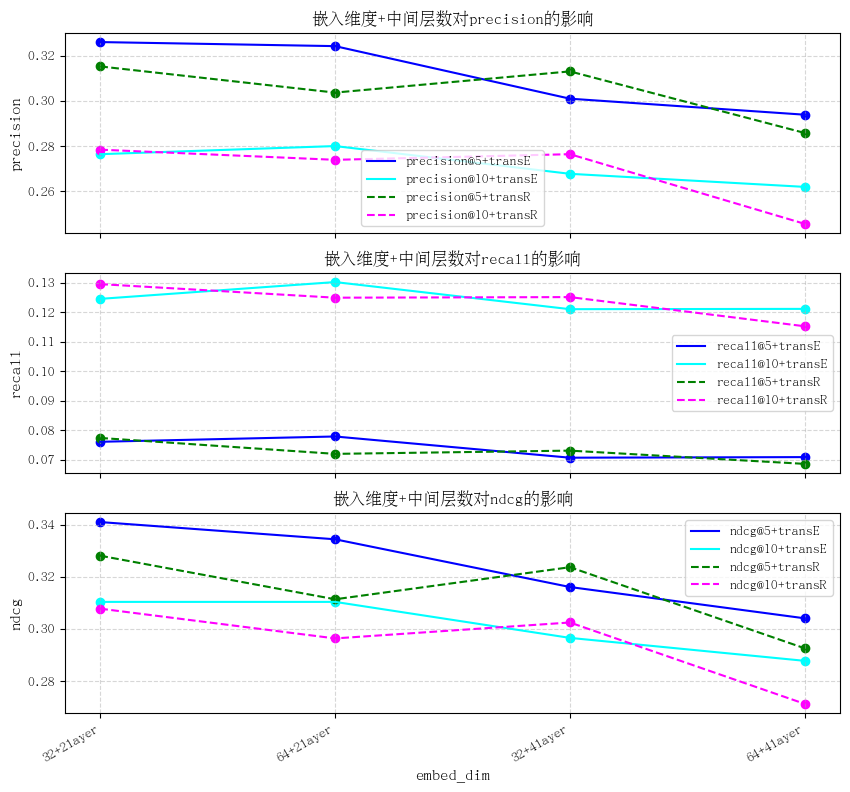

# 实验2 豆瓣电影的知识感知推荐

<center>
柯志伟      PB20061338  &nbsp;
左丰瑞      PB20061337  &nbsp;
刘一鸣      PB20050973  &nbsp;
</center>

---

## 实验题目 

&nbsp;&nbsp;&nbsp;&nbsp;豆瓣电影的知识感知推荐

---

## 实验要求

&nbsp;&nbsp;&nbsp;&nbsp;本次实验分为两个阶段: 
    `stage1`: 从公开图谱中匹配指定电影对应的实体，并抽取合适的部分图谱，按照规则对抽取到的图谱进行处理
    `stage2`: 基于对实验一中的豆瓣电影评分数据，结合 `stage1` 所获得的图谱信息，进行可解释的、知识感知的个性化电影推荐

### 图谱抽取

&nbsp;&nbsp;&nbsp;&nbsp;`douban2fb.txt`: 图谱实体 ID 到电影ID 之间的映射关系

&nbsp;&nbsp;&nbsp;&nbsp;根据以上文件提供的实体链接信息，从` Freebase `抽取用于电影推荐系统的电影知识图谱以供后续实验使用。具体要求如下:

- 根据实验一中提供的电影 ID 列表，匹配获得 `Freebase` 中对应的实体（共 578 个可匹配实体）
- 以 578 个可匹配实体为起点，通过三元组关联，提取一跳可达的全部实体，以形成新的起点集合。重复若干次该步骤，并将所获得的全部实体及对应三元组合并为用于下一阶段实验的知识图谱子图。
- 根据实验一中提供的电影 Tag 信息，在图谱中添加一类新实体（Tag类），并建立其与电影实体的三元组，以充实电影的语义信息。(选做)
- 对 Tag 类实体进行实体对齐，以合并部分具有相同/高度相似语义的实体，从而精简图谱并强化其关联性。(选做)
---
### 图谱推荐

&nbsp;&nbsp;&nbsp;&nbsp;`train.txt 和 test.txt` :提供了每个用户打分≥4 的电影集合，这些电影被视为该用户的正样本，其中每一行对应一个用户，每一行的第一个值为该用户的 ID，余下的值为该用户的正样本 ID 集合
&nbsp;&nbsp;&nbsp;&nbsp;`user_id_map.txt 和 movie_id_map.txt`: 将用户的 ID 和电影的 ID 映射到从 0 开始的索引值,映射关系分别保存在这两个文件中
&nbsp;&nbsp;&nbsp;&nbsp;`douban2fb.txt`: 图谱实体 ID 到电影ID 之间的映射关系

&nbsp;&nbsp;&nbsp;&nbsp;根据实验中提供的以上数据将第一阶段抽取的电影图谱能够轻松地整合到推荐系统中。具体要求如下:

- 根据映射关系，将电影实体的 ID 映射到`[0,num of movies)`范围内。将图谱中的其余实体映射到`[num of movies, num of entities)`范围内，将关系映射到 `[0,num of relations)`范围内。再根据这些映射关系，将第一阶段获得的电影图谱映射为由索引值组成的三元组，即（头实体索引值，关系索引值，尾实体索引值），并保存到`kg_final.txt`文件中
- 熟悉`baseline`的框架代码，包括数据加载部分`loader_base.py`和`loader_KG_free.py`，模型搭建部分`KG_free.py`， 以及模型训练部分`main_KG_free.py`
- 基于`baseline`框架代码，完成基于图谱嵌入的模型，包括数据加载部分`loader_Embedding_based.py`和模型搭建部分`Embedding_based.py`的相关代码模块：
  a. 在`loader_Embedding_based.py`中按要求实现 KG 的构建
  b. 在`Embedding_based.py`中实现`TransE`，`TransR`算法，并尝试通过相加，逐元素乘积，拼接等方式为物品嵌入注入图谱实体的语义信息
  c. 采用多任务方式（KG 损失与 CF 损失相加）对模型进行优化
  d. 将多任务方式更改为迭代优化方式，即 KG 损失与 CF 损失迭代地对模型进行优化
  e. 调研相关综述 2 ，思考如何改进自己的模型，再动手尝试一下(选做)
- 基于`baseline`框架代码，完成基于`GNN`的模型，包括数据加载部分`loader_GNN_based.py`和模型搭建部分`GNN_based.py`的相关代码模块:
  a. 在`loader_Embedding_based.py`中按要求实现 `KG的构建`和`归一化拉普拉斯矩阵`的计算
  b. 在`GNN_based.py`中实现`TransE`，`TransR`算法；完成`图卷积模块`，`中心节点表征`与`一跳领域表征`三种聚合方式的代码
  c. 源代码采用 KG 损失与 CF 损失迭代更新的方式，要求将其改为多任务方式，即将 KG 损失与 CF 损失相加，使用总体的损失进行模型优化
  d. 调研上述综述，思考如何改进自己的模型，再动手尝试一下(选做)
- 本次实验的评价指标采用 Recall@5，NDCG@5，Recall@10 和NDCG@10。需要分析不同的设计（不同的图谱嵌入方法、不同的训练方式、不同的图卷积聚合方式以及图卷积层的数量等）对知识感知推荐性能的影响，同时需要对比分析知识感知推荐与 MF 的实验结果


---

## 实验过程

### 图谱抽取

**根据提供的实体对齐关系,从Freebase图谱中抽取出直接相关以及若干跳的三元组构成电影推荐的知识图谱**

&nbsp;&nbsp;&nbsp;&nbsp;a. 创建一个过滤器用于过滤抽取的子图并获得下一跳的扩展实体,其中封装的信息如下,过滤逻辑详见`entity_extraction.py`
```python
class triplet_filter:
    """
    triplet_set: 要筛选的实体集合
    base_entitys_set: 三元组集合
    entitys_min: 实体最少出现次数
    entitys_max: 实体最多出现次数
    releation_min: 关系最少出现次数
    """
    def __init__(self, triplet_set, base_entitys_set, entitys_min, entitys_max=20000, releation_min=50):
        self.triplet_set = self._filter_by_standard(triplet_set)
        self.base_entitys_set = base_entitys_set
        self.entitys_min = entitys_min
        self.releation_min = releation_min
        self.entitys_max = entitys_max
        self.releations2counts = self._get_releations_counts()
        self.triplet_set, self.save_releations_set = self._filter_by_releations(self.triplet_set)
        self.entitys2counts = self._get_entitys_counts()

```


&nbsp;&nbsp;&nbsp;&nbsp;b. 提取直接相关的三元组，以此作为一跳子图

```python
 movie_id2fb = {}
    movie_entitys = set()
    extend_entitys = set()

    ## 获得id2fb的映射表
    with open(movie_id2fb_file, "r", encoding='utf-8') as f:
        for i in f.readlines():
            a, b = i.strip().split()
            movie_id2fb[a] = "<http://rdf.freebase.com/ns/" + b + ">"
            movie_entitys.add("<http://rdf.freebase.com/ns/" + b + ">")

    print("获得id2fb的映射表" + "=======" + "over!")

    ## 根据电影id匹配提取freebase中的实体提取所有三元组
    with gzip.open(freebase_file, "rb") as f:
        with open(extract_KG_by_movie_entitys_raw_file, "a", encoding='utf-8') as b:
            for line in f:
                line = line.strip()
                triplet = line.decode().strip('\n').split('\t')
                if triplet[0] in movie_entitys or triplet[2] in movie_entitys:
                    b.write("\t".join(line.decode().strip('\n').split('\t')[0:3]) + "\n")

    print("根据电影id匹配提取freebase中的实体提取所有三元组" + "=======" + "over!")

```

&nbsp;&nbsp;&nbsp;&nbsp;c. 过滤一跳子图获得扩展的实体,采取20核的设置并且只保留出现超过50次的关系
```python
## 过滤保存子图并获取并过滤出所需的扩展实体
    with open(extract_KG_by_movie_entitys_raw_file, "r", encoding='utf-8') as f:
        filter = triplet_filter(f.readlines(), movie_entitys, 20)
        extend_entitys = filter.get_extend_entitys()
        filter.save(extract_KG_by_movie_entitys_file)

    print("过滤保存子图并获取并过滤出所需的扩展实体" + "=======" + "over!")

```

&nbsp;&nbsp;&nbsp;&nbsp;d. 根据上一步获得的扩展实体,同理从图谱中抽取相关的三元组,以此作为两跳子图
```python
## 提取扩展实体对应的所有三元组
with gzip.open(freebase_file, "rb") as f:
        with open(extract_KG_by_extend_entitys_raw_file, "a", encoding='utf-8') as b:
            for line in f:
                line = line.strip()
                triplet = line.decode().strip('\n').split('\t')
                if triplet[0] in movie_entitys or triplet[2] in movie_entitys:
                    continue
                if triplet[0] in extend_entitys or triplet[2] in extend_entitys:
                    b.write("\t".join(line.decode().strip('\n').split('\t')[0:3]) + "\n")

    print("提取扩展实体对应的所有三元组" + "=======" + "over!")

```

&nbsp;&nbsp;&nbsp;&nbsp;e. 最后对两跳子图进行清洗,过滤掉出现超过2w次的实体并采取15核的设置，同时只保留出现大于50次的关系
```python
## 过滤并保存子图
with open(extract_KG_by_movie_entitys_raw_file, "r", encoding='utf-8') as f:
        filter = triplet_filter(f.readlines(), extend_entitys, 15)
        filter.save(extract_KG_by_extend_entitys_file)

    print("过滤并保存子图" + "=======" + "over!")
```


**实体扩充,添加tag类实体并创建相关三元组**
```python
## 实体扩充
    with open(movie_tag_file, "r", encoding='utf-8') as f:
        f_csv = csv.DictReader(f)
        with open(extend_KG_by_tag_file, "a", encoding='utf-8') as b:
            for row in f_csv:
                tags_set = set()
                for item in row['tag'].strip().split(','):
                    tags_set.add(item)
                for item in tags_set:
                    triplet = []
                    if row['id'] not in movie_id2fb:
                        continue
                    else:
                        triplet.append(movie_id2fb[row['id']])
                        triplet.append("<tag>")
                        triplet.append("<" + item + ">")
                        b.write("\t".join(triplet) + "\n")
    print("实体扩充" + "=======" + "over!")
```

**实体对齐**
&nbsp;&nbsp;&nbsp;&nbsp;实体对齐用来合并相似语义的tag实体,但豆瓣电影数据集中一共就18个tag,而且各不相同: `动画`, `青春`, `喜剧`, `科幻`, `大陆`, `香港`, `人性`, `犯罪`, `动作`, `美国`, `纪录片`, `文艺`, `悬疑`, `日本`, `短片`, `惊悚`, `经典`, `爱情`,感觉并不必要

**最终结果**
经过`图谱抽取`筛选出关系58种,实体共1012个(含578个电影实体),子图含有三元组共85157个,再经`实体扩充后`:
共有关系59种,实体1012个,子图三元组共90318个


---

### 图谱推荐

**映射电影实体,扩展实体,关系的ID，并将结果保存到kg_final.txt，用于产生后续模型训练的数据集**
&nbsp;&nbsp;&nbsp;&nbsp;a. 封装RDF保存三元组重构的相关信息,其中封装的信息如下:
```python
class RDF:
    def __init__(self, all_triplets_set=None):
        self.all_triplets_set = all_triplets_set
        self.entitys2id = dict()
        self.releations2id = dict()
```

&nbsp;&nbsp;&nbsp;&nbsp;b. 创建电影ID到`[0,num of movies)`的映射,其余实体到`[num of movies, num of entities)`的映射,关系到 `[0,num of relations)`的映射,以关系的映射为例如下:

```python
def get_releations2id_map(self, preload = None):
        next_indice = 0
        if preload:
            self.releations2id = preload
            next_indice = len(preload)

        for line in self.all_triplets_set:
            triplet = line.strip('\n').split('\t')
            if triplet[1] not in self.releations2id:
                self.releations2id[triplet[1]] = str(next_indice)
                next_indice += 1
```
&nbsp;&nbsp;&nbsp;&nbsp;c. 根据上一步获得的映射关系重构`stage1`获得的图谱,并保存重构后的三元组到`kg_final.txt`

```python
def refactor(self):
        new_triplets_set = []
        if self.releations2id and self.entitys2id:
            for line in self.all_triplets_set:
                triplet = line.strip('\n').split('\t')
                new_triplet = []
                new_triplet.append(self.entitys2id[triplet[0]])
                new_triplet.append(self.releations2id[triplet[1]])
                new_triplet.append(self.entitys2id[triplet[2]])
                new_triplets_set.append("\t".join(new_triplet)+"\n")

        self.all_triplets_set = new_triplets_set

def save(self, pkl_path=None, map_path=None, rdf_path=None):
        if pkl_path:
            with open(rdf_pkl_path, "wb") as f:
                all_elements = [self.all_triplets_set, self.releations2id, self.entitys2id]
                pickle.dump(all_elements, f)
        if map_path and rdf_path:
            with open(rdf_path, "w", encoding='utf-8') as f:
                for line in self.all_triplets_set:
                    f.write(line)

            with open(map_path, "w", encoding='utf-8') as f:
                f.write(str(len(self.releations2id))+"\n")
                for k,v in self.releations2id.items():
                    f.write('\t'.join([k,v]) + "\n")
                f.write(str(len(self.entitys2id))+"\n")
                for k,v in self.entitys2id.items():
                    f.write('\t'.join([k,v]) + "\n")
```

d. 最终结果


---

**矩阵分解MF模型**

&nbsp;&nbsp;&nbsp;&nbsp;a. 模型训练:

针对矩阵分解的模型采取的训练参数如下: 
|   参数名   |  参数取值  |
|   :--:    |   :--:    |
|   embed_dim |  16，32，64，128         |
|  train_batch_size   |   1024        |
|    n_epoch    |   1000     | 
|  lr | 1e-3 |
| l2loss_lambda  |  1e-4 |

由于矩阵分解模型较为简单,在训练时主要调整了电影和用户的嵌入维度来增加模型的复杂度,对于其余参数认为较为合适,保持不变

&nbsp;&nbsp;&nbsp;&nbsp;b. 训练结果:


|embed_dim|precision@5 |   recall@5  | ndcg@5| precision@10 | recall@10 |ndcg@10|
|:--:|:--:|:--:|:--:|:--:|:--:|:--:|
|16|0.2828|0.0608|0.2889|0.2481|0.1053|0.2686|
|32|0.2966|0.0660|0.3110|0.2532|0.1094|0.2829|
|64|0.2913|0.0670|0.3027|0.2512|0.1126|0.2779|
|128|0.3092|0.0746|0.3291|0.2564|0.1174|0.2949|

&nbsp;&nbsp;&nbsp;&nbsp;c. 训练结果分析

&nbsp;&nbsp;&nbsp;&nbsp;分析不同的嵌入维度对模型precision,recall,ndcg的影响:


&nbsp;&nbsp;&nbsp;&nbsp;由图可知,随着维度的增加,模型的准确率,召回率以及ndcg均有所增加,说明随着维度的增加,在合适的训练并稳定后,更高的训练维度可以更好的提取出输入的特征,从而使得模型能更好的挖掘出输入到输出的关系,从而获得更好的效果.


---

**图谱嵌入模型**

&nbsp;&nbsp;&nbsp;&nbsp;a. `loader_Embedding_based.py`中完成数据加载中`KG的构建`

```python
# 1. 为KG添加逆向三元组，即对于KG中任意三元组(h, r, t)，添加逆向三元组 (t, r+n_relations, h)，
#    并将原三元组和逆向三元组拼接为新的DataFrame，保存在 self.kg_data 中。

n_relations = max(kg_data['r']) + 1

inverse_kg_data = kg_data.copy()
inverse_kg_data = inverse_kg_data.rename({'h': 't', 't': 'h'}, axis = 'columns')
inverse_kg_data['r'] += n_relations
self.kg_data = pd.concat([kg_data, inverse_kg_data], axis=0,ignore_index=True, sort=False)

# 2. 计算关系数，实体数和三元组的数量
self.n_relations = max(self.kg_data['r']) + 1
self.n_entities = max(max(self.kg_data['h']), max(kg_data['t'])) + 1
self.n_kg_data = self.kg_data.shape[0]

# 3. 根据 self.kg_data 构建字典 self.kg_dict ，其中key为h, value为tuple(t, r)，
#    和字典 self.relation_dict，其中key为r, value为tuple(h, t)。
self.kg_dict = collections.defaultdict(list)
self.relation_dict = collections.defaultdict(list)
for row in self.kg_data.index:
    h, r, t = self.kg_data.loc[row]
    self.kg_dict[h].append((t, r))
    self.relation_dict[r].append((h, t))
```
&nbsp;&nbsp;&nbsp;&nbsp;b. `Embedding_based.py`中实现`TransE`，`TransR`算法,以`TransR`为例
```python
## TransR

# 1. 计算头实体，尾实体和负采样的尾实体在对应关系空间中的投影嵌入
r_mul_h = torch.matmul(h_embed, W_r)                                                                     # (kg_batch_size, relation_dim)
r_mul_pos_t = torch.matmul(pos_t_embed, W_r)                                                                  # (kg_batch_size, relation_dim)
r_mul_neg_t = torch.matmul(neg_t_embed, W_r)                                                                  # (kg_batch_size, relation_dim)

# 2. 对关系嵌入，头实体嵌入，尾实体嵌入，负采样的尾实体嵌入进行L2范数归一化
r_embed = torch.div(r_embed, torch.norm(r_embed, p=2, dim=-1, keepdim=True))
r_mul_h = torch.div(r_mul_h, torch.norm(r_mul_h, p=2, dim=-1, keepdim=True))
r_mul_pos_t = torch.div(r_mul_pos_t, torch.norm(r_mul_pos_t, p=2, dim=-1, keepdim=True))
r_mul_neg_t = torch.div(r_mul_neg_t, torch.norm(r_mul_neg_t, p=2, dim=-1, keepdim=True))

# 3. 分别计算正样本三元组 (h_embed, r_embed, pos_t_embed) 和负样本三元组 (h_embed, r_embed, neg_t_embed) 的得分
pos_score = torch.sum(torch.mul(r_mul_h + r_embed - r_mul_pos_t, r_mul_h + r_embed - r_mul_pos_t), dim= -1, keepdim=False)                  # (kg_batch_size)
neg_score = torch.sum(torch.mul(r_mul_h + r_embed - r_mul_neg_t, r_mul_h + r_embed - r_mul_neg_t), dim= -1,keepdim=False)                                                                    #(kg_batch_size)

# 4. 使用 BPR Loss 进行优化，尽可能使负样本的得分大于正样本的得分
kg_loss = (-1.0) * F.logsigmoid(neg_score - pos_score)
kg_loss = torch.mean(kg_loss)

l2_loss = _L2_loss_mean(r_mul_h) + _L2_loss_mean(r_embed) + _L2_loss_mean(r_mul_pos_t) + _L2_loss_mean(r_mul_neg_t)
loss = kg_loss + self.kg_l2loss_lambda * l2_loss
return loss
```

&nbsp;&nbsp;&nbsp;&nbsp;c. `Embedding_based.py`中为物品注入图谱实体的信息并尝试相加,相乘,拼接方式
```python
 # 8. 为 物品嵌入 注入 实体嵌入的语义信息
 # 相加
 item_pos_cf_embed = item_pos_kg_embed + item_pos_embed  # (cf_batch_size, embed_dim)
 item_neg_cf_embed = item_neg_kg_embed + item_neg_embed  # (cf_batch_size, embed_dim)
 # # 相乘
 # item_pos_cf_embed = torch.mul(item_pos_kg_embed,item_pos_embed)                                                            # (cf_batch_size, embed_dim)
 # item_neg_cf_embed = torch.mul(item_neg_kg_embed,item_neg_embed)                                                            # (cf_batch_size, embed_dim)
 # # 拼接
 # item_pos_cf_embed = torch.concat([item_pos_kg_embed,item_pos_embed],dim=-1)                                                # (cf_batch_size, 2*embed_dim)
 # item_neg_cf_embed = torch.concat([item_neg_kg_embed,item_neg_embed],dim=-1)                                                # (cf_batch_size, 2*embed_dim)
 # user_embed = torch.concat([user_embed,user_embed],dim=-1)                                                                  # (cf_batch_size, 2*embed_dim)
```

&nbsp;&nbsp;&nbsp;&nbsp;d. `main_Embedding_based.py`中扩展模型训练方式,详细见代码
```python
    train_method = "Multitask"
    # train model
    for epoch in range(1, args.n_epoch + 1):
        model.train()
        if train_method == "Multitask":
            ...
        elif train_method == "Iteration":
            ...    
```

&nbsp;&nbsp;&nbsp;&nbsp;e. 分别采用`多任务方式`和`迭代优化方式`进行训练

针对图谱嵌入模型的训练参数如下:
|参数名 | 参数取值|
|:--:|:--:|
| cf_batch_size | 1024|
| kg_batch_size | 2048 |
|embed_dim|16,32,64,128|
|relation_dim|16,32,64,128|
|KG_embedding_type|TransE,TransR|
|kg_l2loss_lambda|1e-4|
|cf_l2loss_lambda|1e-4|
|lr|1e-3|
|n_epoch|1000|

除以上参数外,图谱嵌入的模型还针对不同的训练方式(迭代优化or多任务)和图谱语义嵌入的方式(相加、相乘、拼接)分别训练,具体来说针对这6中组合情况分别修改各种输入嵌入的维度(16,32,64,128，为简单起见并方便与多任务训练方式对比,保持各种输入的嵌入维度一致)进行训练

&nbsp;&nbsp;&nbsp;&nbsp;f. 训练结果:


-  `多任务`+`相加`
|嵌入维度|KG_embedding_type|precision@5 |   recall@5  | ndcg@5| precision@10 | recall@10 |ndcg@10|
|:--:|:--:|:--:|:--:|:--:|:--:|:--:|:--:|   
|16|TransE|0.2864|0.0611|0.2971|0.2604|0.1099|0.2816|
|16|TransR|0.2872|0.0636|0.2973|0.2541|0.1106|0.2770|
|32|TransE|0.3011|0.0672|0.3183|0.2557|0.1127| 0.2881|
|32|TransR|0.2922|0.0699|0.3082|0.2544|0.1161|0.2853|
|64|TransE|0.3083|0.0711|0.3160|0.2633| 0.1206|0.2898|
|64|TransR|0.2908|0.0682|0.3091| 0.2588|0.1174|0.2881|
|128|TransE|0.3226|0.0775|0.3445|0.2787|0.1310|0.3171|
|128|TransR|0.3020|0.0727|0.3226|0.2544|0.1172|0.2915|

- `多任务`+`相乘`
|嵌入维度|KG_embedding_type|precision@5 |   recall@5  | ndcg@5| precision@10 | recall@10 |ndcg@10|
|:--:|:--:|:--:|:--:|:--:|:--:|:--:|:--:|
|16|TransE|0.2984|0.0670|0.3063|0.2584|0.1158|0.2822|
|16|TransR|0.2823| 0.0653| 0.2967|  0.2438|  0.1049|  0.2715|
|32|TransE|0.2859| 0.0637| 0.3022|  0.2499|  0.1111|  0.2786|
|32|TransR|0.1383| 0.0287| 0.1497|  0.1145|  0.0487|  0.1318|
|64|TransE|0.2899| 0.0657| 0.3028|  0.2526|  0.1140|  0.2797|
|64|TransR|0.0456| 0.0115| 0.0443|  0.0497|  0.0240|  0.0489|
|128|TransE|0.3065| 0.0686| 0.3200|  0.2620|  0.1186|  0.2922|
|128|TransR|0.0814| 0.0211| 0.0931|  0.0685|  0.0330|  0.0830|

- `多任务`+`拼接`
|嵌入维度|KG_embedding_type|precision@5 |   recall@5  | ndcg@5| precision@10 | recall@10 |ndcg@10|
|:--:|:--:|:--:|:--:|:--:|:--:|:--:|:--:|   
|16|TransE|0.2864| 0.0611| 0.2971|  0.2604|  0.1099|  0.2816|
|16|TransR|0.2868| 0.0635| 0.2970|  0.2541|  0.1107|  0.2770|
|32|TransE|0.3007| 0.0671| 0.3181|  0.2555|  0.1127|  0.2880|
|32|TransR|0.2917| 0.0695| 0.3080|  0.2544|  0.1161|  0.2853|
|64|TransE|0.3038| 0.0714| 0.3188|  0.2638|  0.1192|  0.2932|
|64|TransR|0.2908| 0.0682| 0.3088|  0.2584|  0.1173|  0.2876|
|128|TransE|0.3221| 0.0774| 0.3443|  0.2787|  0.1310|  0.3171|
|128|TransR|0.3020| 0.0727| 0.3226|  0.2544|  0.1172|  0.2915|

- `迭代`+`相加`
|嵌入维度|KG_embedding_type|precision@5 |   recall@5  | ndcg@5| precision@10 | recall@10 |ndcg@10|
|:--:|:--:|:--:|:--:|:--:|:--:|:--:|:--:|   
|16|TransE|0.2899| 0.0654| 0.2977|  0.2515|  0.1104|  0.2751|
|16|TransR|0.2926| 0.0638| 0.3032|  0.2539|  0.1094|  0.2786|
|32|TransE|0.2966| 0.0678| 0.3150|  0.2655|  0.1173|  0.2946|
|32|TransR|0.2940| 0.0676| 0.3091|  0.2568|  0.1150|  0.2860|
|64|TransE|0.3114| 0.0733| 0.3246|  0.2676|  0.1213|  0.2974|
|64|TransR|0.2864| 0.0663| 0.3044|  0.2483|  0.1132|  0.2798|
|128|TransE|0.3221| 0.0772| 0.3479|  0.2787|  0.1299|  0.3197|
|128|TransR|0.3056| 0.0711| 0.3241|  0.2640|  0.1217|  0.2981|

- `迭代`+`相乘`
|嵌入维度|KG_embedding_type|precision@5 |   recall@5  | ndcg@5| precision@10 | recall@10 |ndcg@10|
|:--:|:--:|:--:|:--:|:--:|:--:|:--:|:--:|   
|16|TransE|0.3007| 0.0683| 0.3087|  0.2570|  0.1158|  0.2826|
|16|TransR|0.2917| 0.0667| 0.3033|  0.2508|  0.1120|  0.2780|
|32|TransE|0.2837| 0.0635| 0.2899|  0.2490|  0.1101|  0.2705|
|32|TransR|0.1110| 0.0220| 0.1142|  0.0944|  0.0380|  0.1029|
|64|TransE|0.2805| 0.0638| 0.2991|  0.2588|  0.1136|  0.2843|
|64|TransR|0.1248| 0.0269| 0.1303|  0.1081|  0.0453|  0.1190|
|128|TransE|0.3119| 0.0706| 0.3258|  0.2680|  0.1202|  0.2981|
|128|TransR|0.0430| 0.0116| 0.0417|  0.0485|  0.0234|  0.0478|

- `迭代`+`拼接`
|嵌入维度|KG_embedding_type|precision@5 |   recall@5  | ndcg@5| precision@10 | recall@10 |ndcg@10|
|:--:|:--:|:--:|:--:|:--:|:--:|:--:|:--:|   
|16|TransE|0.2904| 0.0654| 0.2980|  0.2517|  0.1105|  0.2752|
|16|TransR|0.2931| 0.0643| 0.3035|  0.2539|  0.1094|  0.2787|
|32|TransE|0.2971| 0.0679| 0.3153|  0.2658|  0.1174|  0.2946|
|32|TransR|0.3074| 0.0682| 0.3215|  0.2591|  0.1132|  0.2898|
|64|TransE|0.3114| 0.0733| 0.3245|  0.2678|  0.1214|  0.2975|
|64|TransR|0.2850| 0.0666| 0.2991|  0.2497|  0.1112|  0.2767|
|128|TransE|0.3217| 0.0771| 0.3475|  0.2790|  0.1300|  0.3197|
|128|TransR|0.3060| 0.0712| 0.3244|  0.2640|  0.1217|  0.2981|

&nbsp;&nbsp;&nbsp;&nbsp;g. 结果分析:

&nbsp;&nbsp;&nbsp;&nbsp;首先对不同的训练组合方式分别分析嵌入维度以及图谱嵌入的方式对模型precision,recall,ndcg的影响

-  `多任务`+`相加`

- `多任务`+`相乘`

- `多任务`+`拼接`

- `迭代`+`相加`

- `迭代`+`相乘`

- `迭代`+`拼接`


&nbsp;&nbsp;&nbsp;&nbsp;从以上一组图可以看出,transE的效果总体上优于transR，而随着嵌入维度的增加，模型的效果更好,transR模型的复杂度要高于transE,但效果却不如transE,说明模型的复杂度越高不一定效果就越好,需要说明的是由于我们组电脑的GPU配置不高,在训练TranR时发现对GPU的需求要显著高于TranE,说明TranR的训练可能需要更长的训练时间才能取得最佳效果,而我们由于以上原因,无法训练更长的时间,可能效果有所偏差,不过这也说明了更复杂的模型需要更久的训练周期,在短期内可能无法优于较简单的模型


&nbsp;&nbsp;&nbsp;&nbsp;接着,针对不同训练方式取出效果更好的TransE的不同嵌入维度的数据，对precision@10,recall@10,ndcg@10做对比分析


由上图可以看出,多任务训练的方式整体上优于迭代优化方式,针对图谱语义信息嵌入的方式,`相加`和`拼接`的效果较为接近，要优于`相乘`,由于`相乘`的语义嵌入方式是非线性的,可能无法较好的融合语义信息到电影中,因此效果要差一些.

---

**GNN模型**

&nbsp;&nbsp;&nbsp;&nbsp;a. `loader_GNN_based.py`中完成数据加载中 `KG的构建`和`归一化拉普拉斯矩阵`的计算

```python
## KG构建

# 1. 为KG添加逆向三元组，即对于KG中任意三元组(h, r, t)，添加逆向三元组 (t, r+n_relations, h)，
#    并将原三元组和逆向三元组拼接为新的DataFrame，保存在 kg_data 中。
n_relations = max(kg_data['r']) + 1
inverse_kg_data = kg_data.copy()
inverse_kg_data = inverse_kg_data.rename({'h': 't', 't': 'h'}, axis='columns')
inverse_kg_data['r'] += n_relations
self.kg_data = pd.concat([kg_data, inverse_kg_data], axis=0, ignore_index=True, sort=False)
# 此处不需要修改，添加两种新关系，即 (user, like, movie) 和 (movie, like_by, user)
self.kg_data['r'] += 2
# 2. 计算关系数，实体数，实体和用户的总数
self.n_relations = max(self.kg_data['r']) + 1
self.n_entities = max(max(self.kg_data['h']), max(self.kg_data['t'])) + 1
self.n_users_entities = self.n_entities + self.n_users
# 3. 使用 map()函数 将 self.cf_train_data 和 self.cf_test_data 中的 用户索引 范围从[0, num of users)
#    映射到[num of entities, num of entities + num of users)，并保持原有数据形式和结构不变
self.cf_train_data = (np.array(list(map(lambda x: x+self.n_entities, self.cf_train_data[0]))).astype(np.int32), self.cf_train_data[1].astype(np.int32))
self.cf_test_data = (np.array(list(map(lambda x: x+self.n_entities, self.cf_test_data[0]))).astype(np.int32), self.cf_test_data[1].astype(np.int32))
# 4. 将 self.train_user_dict 和 self.test_user_dict 中的用户索引（即key值）范围从[0, num of users)
#    映射到[num of entities, num of entities + num of users)，并保持原有数据形式和结构不变
self.train_user_dict = {k + self.n_entities: np.unique(v).astype(np.int32) for k, v in
                        self.train_user_dict.items()}
self.test_user_dict = {k + self.n_entities: np.unique(v).astype(np.int32) for k, v in
                       self.test_user_dict.items()}
# 5. 以三元组的形式 (user, 0, movie) 重构交互数据，其中 关系0 代表 like
cf2kg_train_data = pd.DataFrame(np.zeros((self.n_cf_train, 3), dtype=np.int32), columns=['h', 'r', 't'])
cf2kg_train_data['h'] = self.cf_train_data[0]
cf2kg_train_data['t'] = self.cf_train_data[1]
# 6. 以三元组的形式 (movie, 1, user) 重构逆向的交互数据，其中 关系1 代表 like_by
inverse_cf2kg_train_data = pd.DataFrame(np.ones((self.n_cf_train, 3), dtype=np.int32), columns=['h', 'r', 't'])
inverse_cf2kg_train_data['h'] = self.cf_train_data[1]
inverse_cf2kg_train_data['t'] = self.cf_train_data[0]
self.kg_train_data = pd.concat([kg_data, cf2kg_train_data, inverse_cf2kg_train_data], ignore_index=True)
self.n_kg_train = len(self.kg_train_data)
# 7. 根据 self.kg_train_data 构建字典 self.train_kg_dict ，其中key为h, value为tuple(t, r)，
#    和字典 self.train_relation_dict, 其中key为r，value为tuple(h, t)。
self.train_kg_dict = collections.defaultdict(list)
self.train_relation_dict = collections.defaultdict(list)
for row in self.kg_train_data.index:
    h, r, t = self.kg_train_data.loc[row]
    self.train_kg_dict[h].append((t,r))
    self.train_relation_dict[r].append((h,t))

## 拉普拉斯矩阵
def random_walk_norm_lap(adj):
    # D^{-1}A
    # 8. 根据对称归一化拉普拉斯矩阵的计算代码，补全随机游走归一化拉普拉斯矩阵的计算代码
    rowsum = np.array(adj.sum(axis=1))

    d_inv = np.power(rowsum, -1.0).flatten()
    d_inv[np.isinf(d_inv)] = 0
    d_mat_inv = sp.diags(d_inv)

    norm_adj = d_mat_inv.dot(adj)
    return norm_adj.tocoo()

```
&nbsp;&nbsp;&nbsp;&nbsp;b. `GNN_based.py`中实现`TransE`，`TransR`算法, 与图谱嵌入模型类似，详见代码

&nbsp;&nbsp;&nbsp;&nbsp;c. `GNN_based.py`中完成`图卷积模块`，`中心节点表征`与`一跳领域表征`三种聚合方式的代码
```python
def forward(self, ego_embeddings, A_in):
        """
        ego_embeddings:  (n_users + n_entities, embed_dim)
        A_in:            (n_users + n_entities, n_users + n_entities), torch.sparse.FloatTensor
        """
        # 1. Equation (3) 得到一跳邻域的表征 side_embeddings
        side_embeddings =  torch.matmul(A_in, ego_embeddings)                                                    # (n_users + n_entities, embed_dim)

        if self.aggregator_type == 'gcn':
            # 2. Equation (6) 将中心节点表征和一跳邻域表征相加，再进行线性变换和非线性激活
            embeddings = ego_embeddings + side_embeddings                                                       # (n_users + n_entities, embed_dim)
            embeddings = self.activation(self.linear(embeddings))                                                       # (n_users + n_entities, embed_dim)

        elif self.aggregator_type == 'graphsage':
            # 3. Equation (7) 将中心节点表征和一跳邻域表征拼接，再进行线性变换和非线性激活
            embeddings = torch.concat([ego_embeddings, side_embeddings], dim=-1)                                                       # (n_users + n_entities, embed_dim * 2)
            embeddings = self.activation(self.linear(embeddings))                                                       # (n_users + n_entities, embed_dim)

        elif self.aggregator_type == 'lightgcn':
            # 4. Equation (8) 简单地将中心节点表征和一跳邻域表征相加
            embeddings = ego_embeddings + side_embeddings

        embeddings = self.message_dropout(embeddings)                           # (n_users + n_entities, out_dim)
        return embeddings
```
&nbsp;&nbsp;&nbsp;&nbsp;d. `main_GNN_based.py`中将模型更改为`多任务优化方式`，详见代码

```python
train_method = "Multitask"

    # train model
    for epoch in range(1, args.n_epoch + 1):
        model.train()

        if train_method == "Iteration":
            ...
        elif train_method == "Multitask":
            ...
```
&nbsp;&nbsp;&nbsp;&nbsp;e. 基于多任务优化方式对模型进行训练

针对GNN模型的训练参数如下:
|参数名 | 参数取值|
|:--:|:--:|
| cf_batch_size | 1024|
| kg_batch_size | 2048 |
|embed_dim|32,64|
|relation_dim|32,64|
|laplacian_type|symmetric, random-walk|
|aggregation_type|gcn, lightgcn,graphsage|
|n_layers|2,4|
|mess_dropout|0.1|
|KG_embedding_type|TransE,TransR|
|kg_l2loss_lambda|1e-5|
|cf_l2loss_lambda|1e-4|
|lr|1e-3|
|n_epoch|1000|

考虑到模型的复杂程度,参数的数目以及训练时间增加,在GNN训练过程中,分别针对两种计算拉普拉斯矩阵的方式(symmetric, random-walk),3中聚合方式(gcn, lightgcn,graphsage),中间层数目(2,4)，图谱嵌入的方式(TransE,TransR)共24中组合分别改变各输入的嵌入维度(32,64,为简单起见,各种输入的嵌入维度保持一致)进行训练

&nbsp;&nbsp;&nbsp;&nbsp;f. 训练结果:


- `random-walk+2layer+gcn`

| 嵌入维度|KG_embedding_type |precision@5 |   recall@5  | ndcg@5| precision@10 | recall@10 |ndcg@10|
|:--:|:--:|:--:|:--:|:--:|:--:|:--:|:--:|
|32|TransE|0.3302| 0.0773| 0.3449|  0.2734|  0.1255|  0.3096|
|32|TransR|0.3172| 0.0762| 0.3349|  0.2743|  0.1269|  0.3087|
|64|TransE|0.3387| 0.0812| 0.3517|  0.2935|  0.1342|  0.3259|
|64|TransR|0.3315| 0.0824| 0.3445|  0.2839|  0.1368|  0.3184|


- `random-walk+2layer+graphsage`
| 嵌入维度|KG_embedding_type |precision@5 |   recall@5  | ndcg@5| precision@10 | recall@10 |ndcg@10|
|:--:|:--:|:--:|:--:|:--:|:--:|:--:|:--:|
|32|TransE|0.3289| 0.0795| 0.3460|  0.2848|  0.1328|  0.3195|
|32|TransR|0.3217| 0.0756| 0.3388|  0.2761|  0.1266|  0.3104|
|64|TransE|0.3369| 0.0795| 0.3464|  0.2940|  0.1373|  0.3231|
|64|TransR|0.3208| 0.0759| 0.3336|  0.2810|  0.1306|  0.3110|


- `random-walk+2layer+lightgcn`
| 嵌入维度|KG_embedding_type |precision@5 |   recall@5  | ndcg@5| precision@10 | recall@10 |ndcg@10|
|:--:|:--:|:--:|:--:|:--:|:--:|:--:|:--:|
|32|TransE|0.3351| 0.0810| 0.3535|  0.2855|  0.1335|  0.3231|
|32|TransR|0.3244| 0.0771| 0.3354|  0.2799|  0.1291|  0.3102|
|64|TransE|0.3400| 0.0822| 0.3545|  0.2940|  0.1381|  0.3279|
|64|TransR|0.3333| 0.0809| 0.3490|  0.2814|  0.1313|  0.3182|

- `random-walk+4layer+gcn`
| 嵌入维度|KG_embedding_type |precision@5 |   recall@5  | ndcg@5| precision@10 | recall@10 |ndcg@10|
|:--:|:--:|:--:|:--:|:--:|:--:|:--:|:--:|
|32|TransE|0.3298| 0.0810| 0.3384|  0.2794|  0.1342|  0.3114|
|32|TransR|0.3128| 0.0746| 0.3296|  0.2718|  0.1266|  0.3049|
|64|TransE|0.3105| 0.0777| 0.3285|  0.2736|  0.1284|  0.3075|
|64|TransR|0.3083| 0.0740| 0.3226|  0.2720|  0.1274|  0.3030|

- `random-walk+4layer+graphsage`
| 嵌入维度|KG_embedding_type |precision@5 |   recall@5  | ndcg@5| precision@10 | recall@10 |ndcg@10|
|:--:|:--:|:--:|:--:|:--:|:--:|:--:|:--:|
|32|TransE|0.3199| 0.0802| 0.3409|  0.2792|  0.1316|  0.3157|
|32|TransR|0.3186| 0.0769| 0.3320|  0.2702|  0.1240|  0.3031|
|64|TransE|0.3154| 0.0774| 0.3268|  0.2790|  0.1297|  0.3083|
|64|TransR|0.3096| 0.0729| 0.3231|  0.2653|  0.1229|  0.2972|

- `random-walk+4layer+lightgcn`
| 嵌入维度|KG_embedding_type |precision@5 |   recall@5  | ndcg@5| precision@10 | recall@10 |ndcg@10|
|:--:|:--:|:--:|:--:|:--:|:--:|:--:|:--:|
|32|TransE|0.3204| 0.0782| 0.3311|  0.2828|  0.1334|  0.3118|
|32|TransR|0.3074| 0.0745| 0.3179|  0.2667|  0.1259|  0.2959|
|64|TransE|0.3083| 0.0747| 0.3190|  0.2622|  0.1213|  0.2930|
|64|TransR|0.2908| 0.0700| 0.3012|  0.2593|  0.1208|  0.2849|
- `symmetric+2layer+gcn`
| 嵌入维度|KG_embedding_type |precision@5 |   recall@5  | ndcg@5| precision@10 | recall@10 |ndcg@10|
|:--:|:--:|:--:|:--:|:--:|:--:|:--:|:--:|
|32|TransE|0.3087| 0.0733| 0.3189|  0.2687|  0.1230|  0.2970|
|32|TransR|0.3190| 0.0732| 0.3294|  0.2694|  0.1226|  0.2999|
|64|TransE|0.3083| 0.0719| 0.3258|  0.2676|  0.1227|  0.3003|
|64|TransR|0.3020| 0.0713| 0.3139|  0.2653|  0.1233|  0.2929|

- `symmetric+2layer+graphsage`
| 嵌入维度|KG_embedding_type |precision@5 |   recall@5  | ndcg@5| precision@10 | recall@10 |ndcg@10|
|:--:|:--:|:--:|:--:|:--:|:--:|:--:|:--:|
|32|TransE|0.3262| 0.0761| 0.3411|  0.2765|  0.1246|  0.3105|
|32|TransR|0.3154| 0.0774| 0.3282|  0.2785|  0.1296|  0.3079|
|64|TransE|0.3244| 0.0779| 0.3345|  0.2801|  0.1303|  0.3105|
|64|TransR|0.3038| 0.0720| 0.3115|  0.2740|  0.1250|  0.2965|

- `symmetric+2layer+lightgcn`
| 嵌入维度|KG_embedding_type |precision@5 |   recall@5  | ndcg@5| precision@10 | recall@10 |ndcg@10|
|:--:|:--:|:--:|:--:|:--:|:--:|:--:|:--:|
|32|TransE|0.3181| 0.0753| 0.3291|  0.2783|  0.1278|  0.3071|
|32|TransR|0.3114| 0.0740| 0.3213|  0.2700|  0.1235|  0.2984|
|64|TransE|0.3311| 0.0797| 0.3455|  0.2850|  0.1330|  0.3184|
|64|TransR|0.3007| 0.0705| 0.3161|  0.2647|  0.1222|  0.2955|

- `symmetric+4layer+gcn`
| 嵌入维度|KG_embedding_type |precision@5 |   recall@5  | ndcg@5| precision@10 | recall@10 |ndcg@10|
|:--:|:--:|:--:|:--:|:--:|:--:|:--:|:--:|
|32|TransE|0.3150| 0.0753| 0.3289|  0.2720|  0.1241|  0.3032|
|32|TransR|0.2989| 0.0713| 0.3127|  0.2642|  0.1223|  0.2929|
|64|TransE|0.2931| 0.0719| 0.3072|  0.2633|  0.1228|  0.2903|
|64|TransR|0.2931| 0.0705| 0.3065|  0.2506|  0.1181|  0.2819|

- `symmetric+4layer+graphsage`
| 嵌入维度|KG_embedding_type |precision@5 |   recall@5  | ndcg@5| precision@10 | recall@10 |ndcg@10|
|:--:|:--:|:--:|:--:|:--:|:--:|:--:|:--:|
|32|TransE|0.3011| 0.0707| 0.3162|  0.2678|  0.1211|  0.2967|
|32|TransR|0.3132| 0.0731| 0.3238|  0.2765|  0.1252|  0.3026|
|64|TransE|0.2940| 0.0709| 0.3042|  0.2620|  0.1212|  0.2879|
|64|TransR|0.2859| 0.0686| 0.2927|  0.2456|  0.1153|  0.2714|

- `symmetric+4layer+lightgcn`
| 嵌入维度|KG_embedding_type |precision@5 |   recall@5  | ndcg@5| precision@10 | recall@10 |ndcg@10|
|:--:|:--:|:--:|:--:|:--:|:--:|:--:|:--:|
|32|TransE|0.2908| 0.0674| 0.3014|  0.2640|  0.1190|  0.2880|
|32|TransR|0.2819| 0.0675| 0.2889|  0.2454|  0.1126|  0.2701|
|64|TransE|0.2667| 0.0644| 0.2767|  0.2365|  0.1087|  0.2607|
|64|TransR|0.2447| 0.0609| 0.2485|  0.2101|  0.0989|  0.2301|


&nbsp;&nbsp;&nbsp;&nbsp;g. 结果分析:

&nbsp;&nbsp;&nbsp;&nbsp;首先分析针对以下的不同训练组合方式,分别分析嵌入维度、中间层数目以及图谱嵌入的方式对模型precision,recall,ndcg的影响
- `random-walk+gcn`

- `random-walk+graphsage`

- `random-walk+lightgcn`

- `symmetric+gcn`

- `symmetric+graphsage`

- `symmetric+lightgcn`


&nbsp;&nbsp;&nbsp;&nbsp;从以上一组图可以看出,针对不同的训练方式组合,嵌入维度的增加使得模型效果更好,中间层数的增加使得模型的效果较差,且对于较多的层数,随着嵌入的维度增加,效果反而更差,说明此时模型的训练不够充分，更高的模型复杂度，会使得模型的训练更加不充分，反而降低模型效果,而对于图谱嵌入的方式,和图谱嵌入模型类似,TranR模型的训练时间更长,在较短的训练周期内效果不如TranE.

&nbsp;&nbsp;&nbsp;&nbsp;接着,对不同的训练组合方式，提取效果更好的TranE,2layer的precision@10,recall@10,ndcg@10进行分析

由上图可以看出,`random-walk`的效果要优于`symmetric`,`lightgcn`的效果要优于`gcn`和`graphsage`，同样反映了模型越简单,效果越好,这在GNN模型中体现较为明显,说明GNN模型确实需要更长的训练周期，在较短的训练周期中较为简单且训练充分的模型会取得更好的效果

**不同模型的对比分析**

&nbsp;&nbsp;&nbsp;&nbsp;由于各模型的训练参数不一，为保证简单一致,这里取出各模型最好的训练方式组合中不同嵌入维度的precision@10,recall@10,ndcg@10进行分析(具体来说,矩阵分解保持不变,图谱嵌入取出`plus+multitask`,GNN取出`random-walk+lightgcn`)


&nbsp;&nbsp;&nbsp;&nbsp;由上图可以看出,GNN模型的效果要显著优于图谱嵌入模型,图谱嵌入模型的效果又优于矩阵分解,说明语义信息的嵌入较好的提升了模型的效果,在训练充分的情况下,GNN的模型具有更好的挖掘不同用户对电影的评价的隐含关系,从而达到更好的效果.


