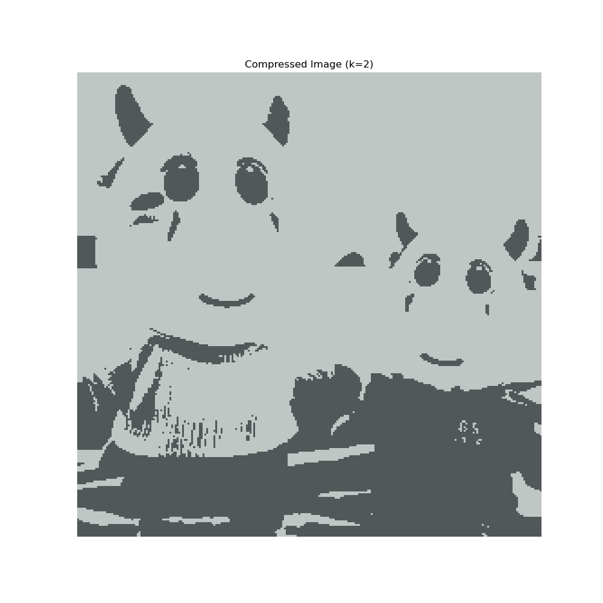
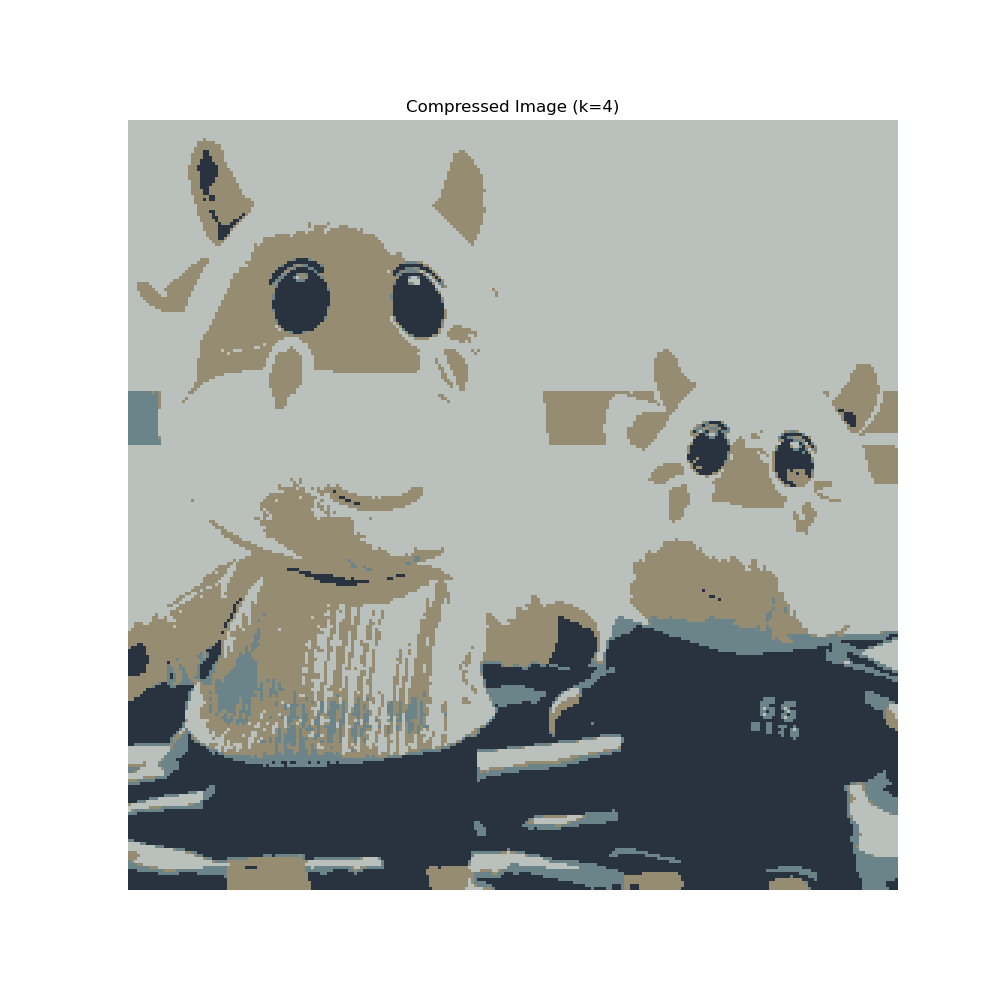
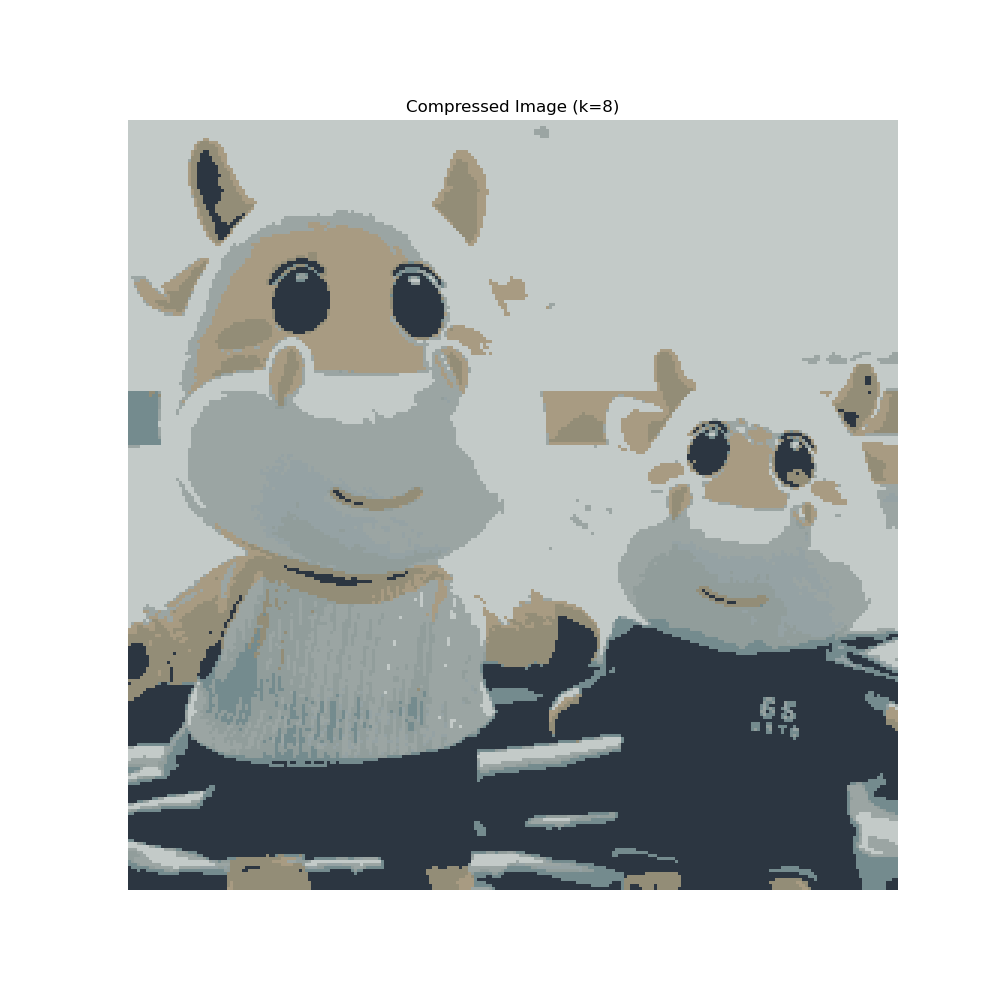
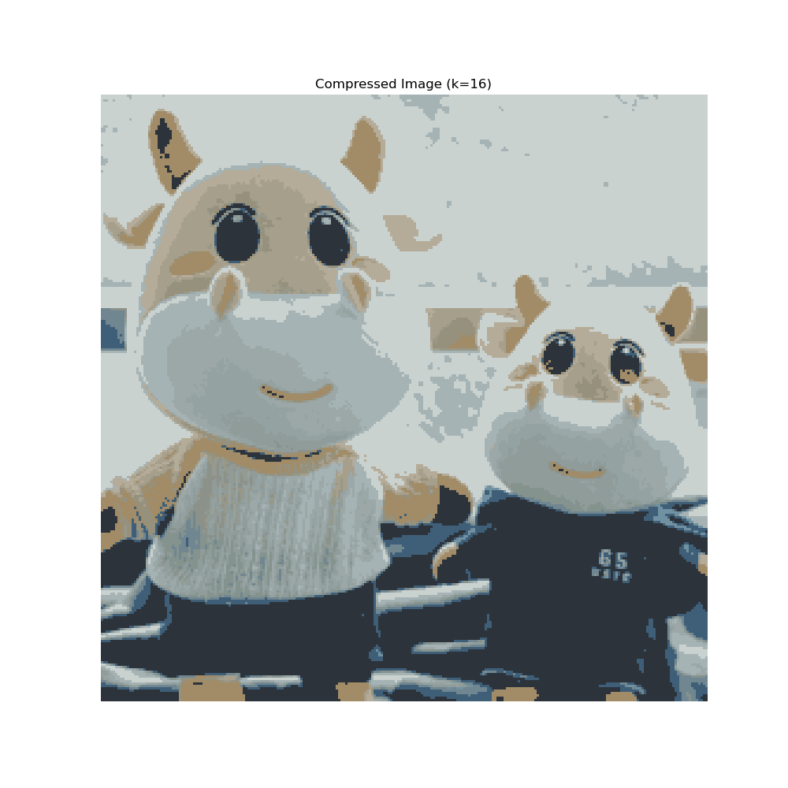
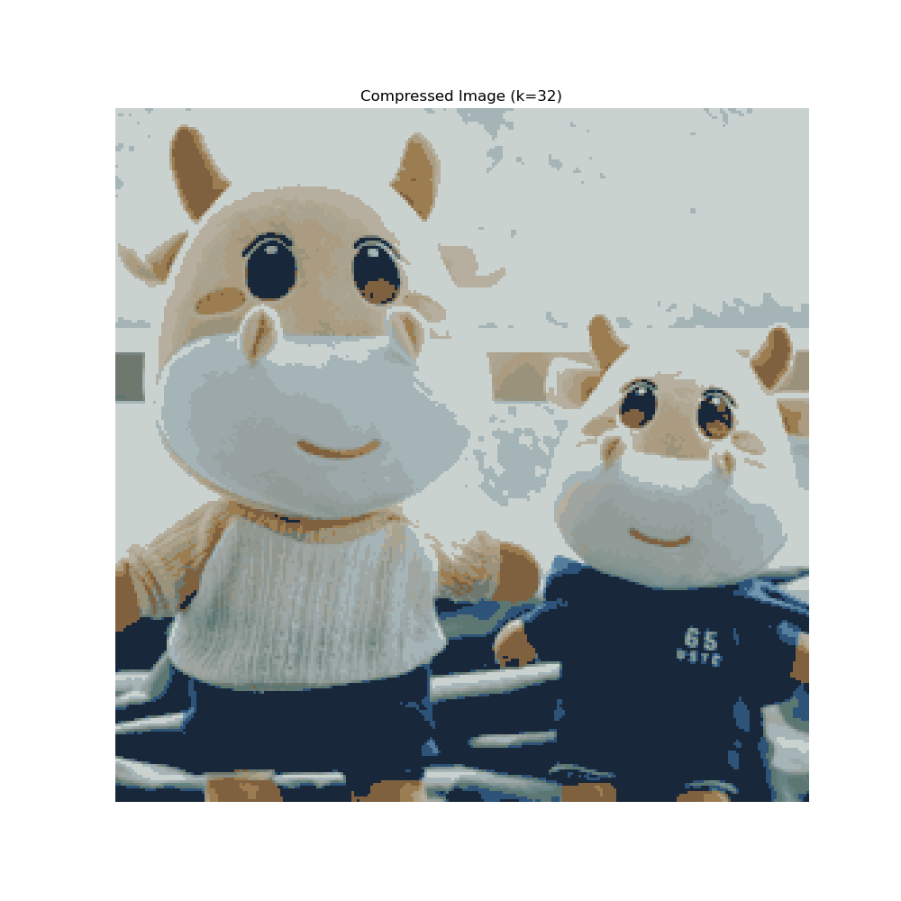
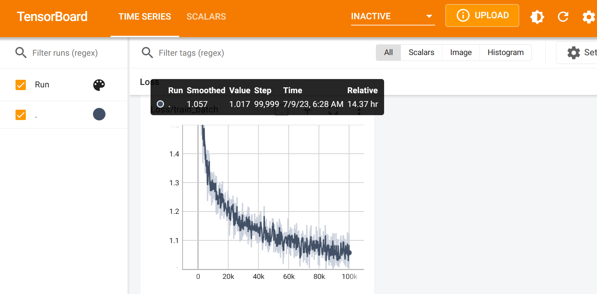

# 人工智能lab2实验报告

<center>PB20061338</center>
<center>柯志伟</center>

## 传统机器学习

### 贝叶斯网络手写数字识别

1. 实现步骤
> a. 在训练集中统计pixel和数字类别的先验概率
> b. 计算给定像素点及其值下数字类别的条件概率
> c. 通过贝叶斯公式计算给定的输入图片其对应各个label的概率并选择最大值作为预测的标签
2. 代码分析

a. 计算pixel和label的先验概率
```python
 # 计算先验概率
for i in range(self.n_labels):
    self.labels_prior_prop[i] = np.sum(labels == i) / n_samples
            
for i in range(self.n_pixels):
    for j in range(self.n_values):
        self.pixels_prior_prop[i, j] = np.sum(pixels[:, i] == j) / n_samples

```
b. 计算在给定pixel及其值(黑白)下各个label的条件概率
```python
# 计算条件概率
for i in range(self.n_pixels):
    for j in range(self.n_values):
        for k in range(self.n_labels):
            idx = np.where((pixels[:, i] == j) & (labels == k))[0]
            self.pixels_cond_label_prop[i, j, k] = len(idx) / np.sum(labels == k)
```
c. 预测给定图片的label(使用贝叶斯公式通过图片的pixel计算图片对应各个label的后验概率,并选择最大可能作为预测的label)
```python
for i in range(n_samples):
    # 使用贝叶斯公式计算后验概率，这里使用先使用log将乘除化为加减最后再通过exp还原
    post_props = np.zeros(self.n_labels)
    for j in range(self.n_labels):
        log_poster_props = np.log(self.labels_prior_prop[j])
        for k in range(self.n_pixels):
            log_poster_props += np.log(self.pixels_cond_label_prop[k, pixels[ik], j]) - np.log(self.pixels_prior_prop[k, pixels[i, k]])
        post_props[j] = np.exp(log_poster_props)
    # 选择概率最大的标签
    labels[i] = np.argmax(post_props)
```
3. 结果


### 利用K-means实现图片压缩

1. 实现步骤
> a. 初始化k个中心(采用0初始化)
> b. 采用多轮迭代,每轮迭代对所有的样本点分配最近的中心,然后使用该中心包含的所有样本点的平均中心坐标来更新这k个中心从而训练模型
> c. 使用k个中心点的像素值代替属于该中心的像素点的像素值实现图片压缩
> d. 更改k值重复实验


2. 代码分析
a. 初始化k个中心(采用0初始化)
```python
n, d = points.shape
centers = np.zeros((self.k, d))
for k in range(self.k):
    # use more random points to initialize centers, make kmeans more stable
    random_index = np.random.choice(n, size=10, replace=False)
    centers[k] = points[random_index].mean(axis=0)
```
b. 多轮迭代更新k个中心点的坐标
```python
# 迭代更新k个中心点的坐标
for i in range(self.max_iter):
    # 将每个样本点分配到最近的中心
    labels = self.assign_points(centers, points)
    # 更新中心点的坐标
    centers_new = self.update_centers(centers, labels, points)
    # 如果足够好可以终止迭代
    if np.allclose(centers, centers_new):
        break
```

c. 利用k个中心点的像素值来压缩图片
```python
# flatten the image pixels
points = img.reshape((-1, img.shape[-1]))
# fit the points
centers = self.fit(points).astype(np.int)
# Replace each pixel value with its nearby center value
labels = self.assign_points(centers, points)
compressed_points = centers[labels.astype(np.int)]
compressed_img = compressed_points.reshape(img.shape).clip(0, 255)

```

d. 使用不同k值来压缩图片
```python
def save_compressed_image(k, img):
    kmeans = KMeans(k=k, max_iter=10)
    compressed_img = kmeans.compress(img).round().astype(np.uint8)
    plt.figure(figsize=(10, 10))
    plt.imshow(compressed_img)
    plt.title(f'Compressed Image (k={k})')
    plt.axis('off')
    plt.savefig(f'./compressed_image_{k}.png')

if __name__ == '__main__':
    img = read_image(filepath='../data/ustc-cow.png')
    # 为每个k值开辟一个线程
    threads = []
    for k in [2, 4, 8, 16, 32]:
        thread = threading.Thread(target=save_compressed_image, args=(k, img))
        threads.append(thread)
        thread.start()
    # 启动所有线程
    for thread in threads:
        thread.join()

```
3. 结果







## 深度学习

1. 实现步骤
> a. 实现字符编码char_tokenizer，实现对位置编码的PositionalEncoding
> b. 实现transformer的各个组件(Head, MultiHeadAttention, FeedForward, Block)
> c. 搭建包含6个Block的Transformer
> d. 训练并使用tensorboard保存日志


2. 代码分析
a. 实现字符编码char_tokenizer，实现对位置编码的PositionalEncoding

```python
class char_tokenizer:
    """
    a very simple char-based tokenizer. the tokenizer turns a string into a list of integers.
    """

    def __init__(self, corpus: List[str]):
        self.corpus = corpus
        # calculate the vocab size and create a dictionary that maps each character to a unique integer
        self.n_vocab = len(corpus)
        self.token2idx = {t: i for i, t in enumerate(corpus)}
        self.idx2token = {i: t for i, t in enumerate(corpus)}

    def encode(self, string: str):
        # convert a string into a list of integers and return, using the dictionary you created above
        return [self.token2idx[t] for t in string]

    def decode(self, codes: List[int]):
        # convert a list of integers into a string and return, using the dictionary you created above
        return "".join([self.idx2token[c] for c in codes])

```
b. 实现transformer的各个组件(Head, MultiHeadAttention, FeedForward, Block)
```python
class Head(nn.Module):
    """single head of self-attention"""

    def __init__(self, n_embd, head_size):
        super().__init__()
        # create three linear layers, Key, Query, and Value, each of which maps from n_embd to head_size
        self.Key = nn.Linear(n_embd, head_size, bias=False)
        self.Query = nn.Linear(n_embd, head_size, bias=False)
        self.Value = nn.Linear(n_embd, head_size, bias=False)
        self.head_size = head_size
        self.register_buffer("tril", torch.tril(torch.ones(1000, 1000)))

    def forward(self, inputs):
        # implement the forward function of the head
        # the input is a tensor of shape (batch, time, n_embd)
        # the output should be a tensor of shape (batch, time, head_size)
        # you may use the tril buffer defined above to mask out the upper triangular part of the affinity matrix
        query = self.Query(inputs)
        key = self.Key(inputs)
        value = self.Value(inputs)
        scale = self.head_size ** -0.5
        logits = torch.bmm(query, key.transpose(1, 2)) * scale
        logits.masked_fill_(self.tril[:inputs.size(1), :inputs.size(1)] == 0, float("-inf"))
        weights = F.softmax(logits, dim=-1)
        out = torch.bmm(weights, value)
        return out

class MultiHeadAttention(nn.Module):
    def __init__(self, n_heads, n_embd):
        super().__init__()
        # implement heads and projection
        head_size = n_embd // n_heads
        self.heads = nn.ModuleList([Head(n_embd, head_size) for _ in range(n_heads)])
        self.projection = nn.Linear(n_embd, n_embd)


class FeedForward(nn.Module):
    def __init__(self, n_embd):
        super().__init__()
        # implement the feed-forward network
        self.net = nn.Sequential(
            nn.Linear(n_embd, 4 * n_embd),
            nn.ReLU(),
            nn.Linear(4 * n_embd, n_embd),
        )


class Block(nn.Module):
    def __init__(self, n_embd, n_heads):
        super().__init__()
        # implement the block of transformer using the MultiHeadAttention and FeedForward modules,
        # along with the layer normalization layers
        self.attention = nn.LayerNorm(n_embd)
        self.feedforward = nn.LayerNorm(n_embd)
        self.multihead = MultiHeadAttention(n_heads, n_embd)
        self.ffn = FeedForward(n_embd)


class PositionalEncoding(nn.Module):
    def __init__(self, d_model, max_len=1000):
        super().__init__()

        # 创建位置编码(类似掩码实现的方式),采用正弦的方式编码位置信息
        pe = torch.zeros(max_len, d_model)
        position = torch.arange(0, max_len, dtype=torch.float).unsqueeze(1)
        div_term = torch.exp(torch.arange(0, d_model, 2).float() * (-math.log(10000.0) / d_model))
        pe[:, 0::2] = torch.sin(position * div_term)
        pe[:, 1::2] = torch.cos(position * div_term)
        pe = pe.unsqueeze(0)
        self.register_buffer('pe', pe)

```


c. 搭建包含6个Block的Transformer
```python
class Transformer(nn.Module):
    def __init__(self):
        super().__init__()

        # create the embedding table, the stack of blocks, the layer normalization layer,
        # and the linear layers.

        # 文本嵌入层
        self.embedding = nn.Embedding(num_embeddings=n_vocab, embedding_dim=n_embd)
        # 位置编码层
        self.positional_encoding = PositionalEncoding(d_model=n_embd)
        # 若干层Block
        self.blocks = nn.ModuleList([Block(n_embd, n_heads) for _ in range(n_layers)])
        # 创建层归一化
        self.norm = nn.LayerNorm(n_embd)
        # 线性层
        self.fc1 = nn.Linear(n_embd, n_vocab)
```

d. 训练并使用tensorboard保存日志
```python
def train(model):
    optimizer = torch.optim.AdamW(model.parameters(), lr=learning_rate)

    # 使用tensorboard保存日志
    writer = SummaryWriter(log_dir="../logs")  # create a summary writer object

    for iter in range(max_iters):

        if iter % eval_interval == 0:
            losses = estimate_loss(model)
            print(
                f"step {iter}: train loss {losses['train']:.4f}, val loss {losses['val']:.4f}"
            )

            # 保存loss信息到tensorboard
            writer.add_scalar("Loss/train", losses["train"], iter)
            writer.add_scalar("Loss/val", losses["val"], iter)

        inputs, labels = get_batch("train")

        logits, loss = model(inputs, labels)
        optimizer.zero_grad(set_to_none=True)
        loss.backward()
        optimizer.step()
        
        writer.add_scalar("Loss/train_batch", loss, iter)

    writer.close()  
```

e. 选用一段文本测试预测的下文
```python

class Transformer(nn.Module):

    def generate(self, inputs, max_new_tokens):
        # generate new tokens from the transformer, using the inputs as the context,
        # and return the generated tokens with length of max_new_tokens

        for _ in range(max_new_tokens):
            # generates new tokens by iteratively sampling from the model's predicted probability distribution,
            # concatenating the sampled tokens to the input sequence, and returning the updated sequence.
            # 文本编码
            embedding = self.embedding(inputs)
            # 位置编码
            embedding = self.positional_encoding(embedding)
            attens = embedding        
            # 若干层Block
            for block in self.blocks:
                attens = block(attens)
            attens = attens.view(-1, n_embd)

            logits = self.fc1(attens)

            # 使用softmax层获得最大可能预测的输出
            probabilities = F.softmax(logits, dim=1)
            samples = torch.multinomial(probabilities, num_samples=1)
            # 将预测的最后一个词扩充输入
            inputs = torch.cat([inputs, samples[-1].unsqueeze(0)], dim=1)
                
        return inputs
def generate(model):
    text = "First Citizen: If I must not, I need not be barren of accusations;"
    context = torch.tensor(encode(text), dtype=torch.long).unsqueeze(0).to(device)
    print(decode(model.generate(context, max_new_tokens=500)[0].tolist()))
```

3. 结果

训练过程在训练集和测试集上的loss记录如下:


选择文本如下:
```markdown
First Citizen: If I must not, I need not be barren of accusations;
```
最终扩充后的文本如下:

```markdown
First Citizen: If I must not, I need not be barren of accusations; go
with thy shame made her immedited here.'
I did not, Juliet, draw, Friar Pence, with care
she's a friend: on him I thank you indeed, with
him face, like him live; the raged manour his
tongueable, andnowasher, way wat win, h'aif oooooooooosese: Lo; atsesesessstsssorinesssssssssssssssessse abesesssessesssseseseabagseso lldagngsesesesesesatatatatatatatatatatatysugngng  Eng Engung e Englssung ing e e e e eb Enstal ong Eng y ongngngn'd Leson Bson st t ong ong oubuuuxkenkeshanssuuckessstesh bw ange
```

