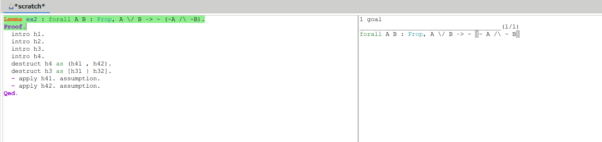
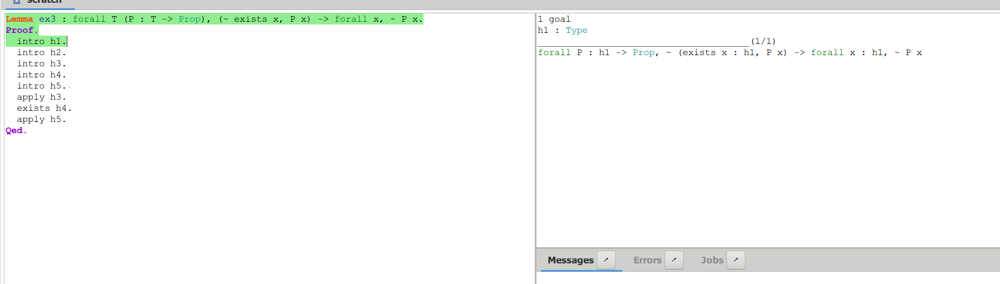

# 实验报告

<center>PB20061338 柯志伟</center>

## 实验题目

```markdown
使⽤Coq证明如下命题(不允许使⽤搜索策略，不允许使⽤Classical库), 附上代码和⽂档(⽂档中列出每个证明步骤的输出截图)

- Lemma ex1: forall A, ~~~ A -> ~ A.
- Lemma ex2: forall A B, A \/ B -> ~ (~ A /\ ~ B).
- Lemma ex3: forall T (P:T -> Prop), (~ exists x, P x) -> forall x, ~ P x.
```

## 实验过程

### 证明lemma1
#### 源代码
```coq
Lemma ex1 : forall A : Prop, ~~~A -> ~A.
Proof.
  intro h1.
  intro h2.
  intro h3.
  apply h2.
  intro h4.
  apply h4.
  assumption.
Qed.

```
#### 执行过程


### 证明lemma2
#### 源代码
```coq
Lemma ex2 : forall A B : Prop, A \/ B -> ~ (~A /\ ~B).
Proof.
  intro h1.
  intro h2.
  intro h3.
  intro h4.
  destruct h4 as (h41 , h42).
  destruct h3 as [h31 | h32].
  - apply h41. assumption.
  - apply h42. assumption.
Qed.

```
#### 执行过程



### 证明lemma3
#### 源代码
```coq
Lemma ex3 : forall T (P : T -> Prop), (~ exists x, P x) -> forall x, ~ P x.
Proof.
  intro h1.
  intro h2.
  intro h3.
  intro h4.
  intro h5. 
  apply h3.
  exists h4.
  apply h5.
Qed.

```
#### 执行过程




