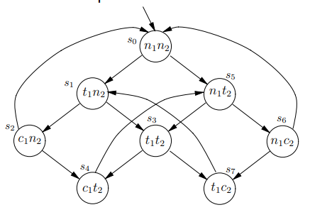
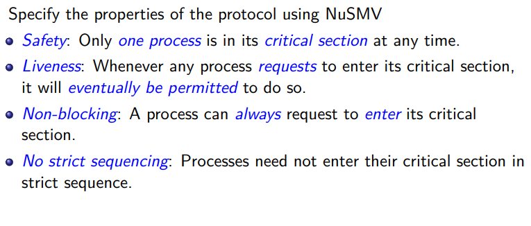
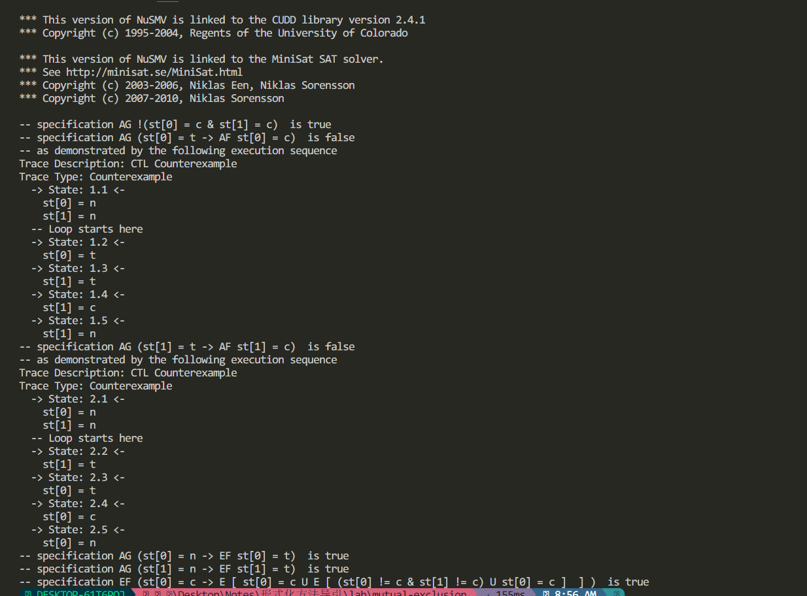
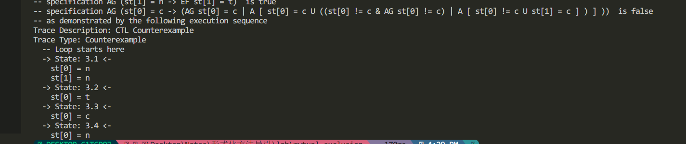

# 实验报告

<center>PB20061338 柯志伟</center>

## 实验题目

```markdown
使用 NuSMV 实现 PPT 中 first-attempt model, 要求:
- 用 CTL 设计 Non-blocking, No strict sequencing, 并验证所有四个性
质
- 给出源码、实验报告
```

## 实验过程

### 使用NuSMV描述first-attempt model
#### 模型及约束


#### 使用NuSMV描述模型中的状态转移以及待检查的约束
```NuSMV
MODULE main
    VAR 
        st: array 0..1 of {c, n, t};
    ASSIGN
        init(st[0]) := n;
        init(st[1]) := n;
    TRANS
        st[0] = n & st[1] = n -> (next(st[0]) = t & next(st[1]) = n) |
                                 (next(st[0]) = n & next(st[1]) = t);
    TRANS
        st[0] = t & st[1] = n -> (next(st[0]) = c & next(st[1]) = n) |
                                 (next(st[0]) = t & next(st[1]) = t);
    TRANS
        st[0] = n & st[1] = t -> (next(st[0]) = t & next(st[1]) = t) |
                                 (next(st[0]) = n & next(st[1]) = c);
    TRANS
        st[0] = c & st[1] = n -> (next(st[0]) = n & next(st[1]) = n) |
                                 (next(st[0]) = c & next(st[1]) = t);
    TRANS
        st[0] = t & st[1] = t -> (next(st[0]) = c & next(st[1]) = t) |
                                 (next(st[0]) = t & next(st[1]) = c);
    TRANS
        st[0] = n & st[1] = c -> (next(st[0]) = t & next(st[1]) = c) |
                                 (next(st[0]) = n & next(st[1]) = n);
    TRANS
        st[0] = c & st[1] = t -> (next(st[0]) = n & next(st[1]) = t); 

    TRANS
        st[0] = t & st[1] = c -> (next(st[0]) = t & next(st[1]) = n);

    -- safety
    CTLSPEC
        AG!(st[0] = c & st[1] = c);

    -- liveness
    CTLSPEC
        AG(st[0] = t -> AF(st[0] = c));
    CTLSPEC
        AG(st[1] = t -> AF(st[1] = c));

    -- non-blocking
    CTLSPEC
        AG(st[0] = n -> EF(st[0] = t));
    CTLSPEC
        AG(st[1] = n -> EF(st[1] = t));

    -- no strict sequencing
    -- LTLSPEC
    --     G(st[0] = c -> (G st[0] = c | (st[0] = c  U (st[0] != c & G st[0] != c | ((st[0] != c) U st[1] = c)))));
    CTLSPEC
        -- EF((st[0]=c) -> E[(st[0]=c) U E[(st[0]!=c & st[1]!=c)U(st[0]=c)]]);
        AG(st[0] = c -> (AG(st[0] = c) | A[st[0] = c U (st[0] != c & AG(st[0] != c) | A[st[0] != c U st[1] =c])]));
        
```

### 模型检测结果


#### Safety
保证两个进程不会同时进入c: 
    `AG!(st[0] = c & st[1] = c);`

对于起始点出发的所有路径上的所有时间点都不存在两个进程都在关键区。由结果可知，该条件满足

#### Liveness
无论哪个进程请求进入其临界区，它最终都会被允许进入: 
    `AG(st[0] = t -> AF(st[0] = c));` 
    `AG(st[1] = t -> AF(st[1] = c));`
由结果可知，当另一个进程在n->t->c->n->t->c...循环时，该进程不满足Liveness

#### Non-blocking

对于每一个满足n1的状态，都存在一个满足t1的后继状态:
`AG(st[0] = n -> EF(st[0] = t));`
`AG(st[1] = n -> EF(st[1] = t));`

由结果可知，该条件满足

#### No strict sequencing
两个进程试图进入临界区时，不要求进程之间的访问按照固定的顺序进行，允许进程之间的访问顺序是随机的,
尝试使用两种方式描述: 
    直接`EF((st[0]=c) -> E[(st[0]=c) U E[(st[0]!=c & st[1]!=c)U(st[0]=c)]])`或者`AG(st[0] = c -> (AG(st[0] = c) | A[st[0] = c U (st[0] != c & AG(st[0] != c) | A[st[0] != c U st[1] =c])]))`的补集

采用直接表达的结果由上图可知,该条件满足
采用补集的表达结果如下:

由结果可知不满足，因此原条件满足

## 实验总结与反思

通过此次实验，了解了NuSMV在模型检测方面的应用，在实验过程中也遇到一些麻烦，如NuSMV中文参考资料过少，在寻找同时表达两个状态的转移时，
查找半天才找到使用数组表达并用Trans刻画状态转移;以及CTL语法中各个符号的优先级问题

