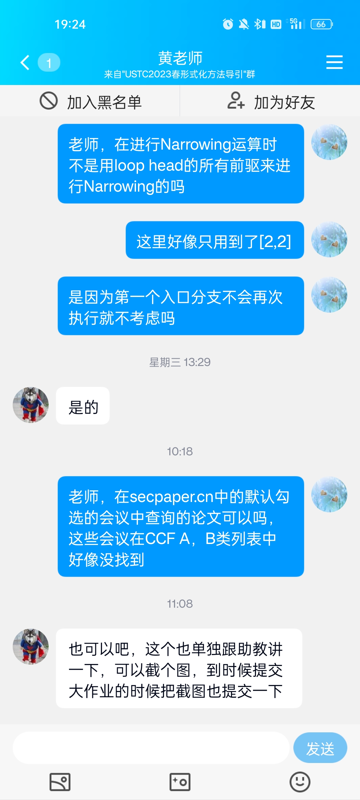

# 形式化方法与验证实验报告
<center>柯志伟</center>
<center>PB20061338</center>

## 论文复现

### 前期准备
经询问老师可在在<a>secpaper.cn</a>中寻找论文,论文来源以及最终选定论文如下



### 项目结构介绍
`z3str`部分是**基本的字符串变量的方程组的求解部分**
```markdown
├── constraint.py       方程组满足的约束的类(长度约束以及满足的方程组)
├── driver.py           求解的驱动器
├── equivalent.py       等价类的类
├── main.py             批量测试脚本
├── output.txt          测试输出文件
├── solver.py           求解器(长度求解器和字符串变量方程组求解器)
├── tests               测试用例
│   ├── testcase1.py
│   ├── testcase2.py
│   ├── testcase3.py
│   └── testcase4.py
├── zexcept.py          求解过程中的各种异常情况定义与处理
├── zint.py             字符串变量的长度变量
├── zstr.py             字符串变量，常量字符串拼接组成的字符串
└── zvar.py             字符串变量

```

`z3str*`部分是**含有正则表达式形式的字符串变量的方程组的求解实现**,原本是想把z3str封装成python的一个包直接使用,但是我在实现z3str*时与z3str高度耦合，要修改z3str中的部分实现,因此将单独的z3str分离出来(这部分也有单独的测试)
```markdown

── constraint.py                方程组满足的约束的类(长度约束以及满足的方程组)
├── doc                         论文
│   └── 2660267.2660372.pdf
├── driver.py                   求解的驱动器
├── equivalent.py               等价类的类
├── main.py                     批量测试脚本
├── output.txt                  测试输出文件
├── regexp.py                   正则表达式的类
├── solver.py                   求解器(长度求解器和字符串变量方程组求解器)
├── tests                       测试用例
│   ├── testcase1.py    
│   ├── testcase2.py
│   ├── testcase3.py
│   └── testcase4.py
├── zexcept.py                  求解过程中的各种异常情况定义与处理
├── zint.py                     字符串变量的长度变量
├── zstr.py                     字符串变量，常量字符串拼接组成的字符串
└── zvar.py                     字符串变量

```

### 论文介绍
论文主要提出**一个求解包含正则表达式形式的字符串变量的方程组的工具S3**,求出是否存在一组满足条件的字符串变量的解，以确定在经过程序中的逻辑判断后，是否还存在用户输入的字符串具有XSS跨站脚本攻击和SQL脚本注入的风险。论文介绍S3的架构是在Z3的基础上,以提供求解包含正则表达式形式的字符串变量的方程组的组件z3-str-star的形式扩充Z3的功能,架构如下:


由于**时间以及复杂度问题(感觉没太多时间去阅读Z3完整的实现或关于字符串求解的模块)，同时希望复现更具备独立和完整性**，我在复现S3工具时，并不在Z3的基础上,论文主要介绍了字符串求解的问题，因此**它对Z3的依赖只在基本的字符串求解(不含正则表达式)上**,论文也有介绍Z3求解一组基本字符串变量的方程组的例子，**主要使用字符串长度求解器和基于等价类冲突的方式求解**,我最终决定自己实现这些依赖的模块。

然后在此基础上实现含有正则表达式的字符串变量的方程组的求解，由于**论文主要介绍有关`(ab)*`这种类型正则表达式的reduction规则(如下)**,因此这部分的复现主要复现了含有这种表达式的求解。


### 基本的字符串变量的方程组的求解(z3str)
由于不依赖Z3(也不了解Z3这部分的具体实现)，而是自己实现，我采用了论文中有关`(ab)*`这种类型正则表达式的reduction规则，在等价类中进行常量字符串前后缀的reduction，进而构造新的等价类，在此过程中如果有字符串变量已确定值，则进行**常量传播**,然后继续此过程,**这是一个基于等价类是否变化的不动点算法，直到求出所有的字符串变量(此时等价类为空)或发生冲突例外或所有成员不含常量前缀和后缀(此时方程组欠约束，容易获得一组解)**,需要注意的是我在此过程中使用了**字符串变量方程组的长度约束，在所有可能的满足约束的长度解下，进行字符串变量等价类的规约**。详细过程如下:

#### 长度约束求解器
最初尝试过这里也使用基于等价类的思想，但发现基于规约的字符串等价类的方法并不完备或者说需要考虑的边界情况太多，最后放弃这种方案，转而采用高斯消元的思路,由于是整数方程组的求解，不能直接借助numpy包实现,因此我自行实现了高斯消元并基于自由变元构造其他变量的值表达式(其实可以看作是深度学习框架里的计算图),具体见下:
- 长度求解器
```python
class Solver:
    def __init__(self, solver_name):
        self.solver_name = solver_name
        
    def solve(self):
        raise NotImplementedError
## 长度求解器   
class LenSolver(Solver):
    def __init__(self, len_bound, solver_name="Length Solver"):
        super(LenSolver, self).__init__(solver_name)
        self.cons_list = []
        self.all_vars = None
        self.cofficient_matrix = None
        self.val_vector = None
        self.len_bound = len_bound
        self.free_vars = []
        
    def init_cons_list(self, cons_list):
        self.cons_list = cons_list
        
    def append_cons(self, cons):
        self.cons_list.append(cons)
    
    def gen_all_vars(self):
        all_vars = []
        for cons in self.cons_list:
            for lhs in cons.lhs_list:
                if type(lhs) is Int and lhs not in all_vars:
                    all_vars.append(lhs)
            for rhs in cons.rhs_list:
                if type(rhs) is Int and rhs not in all_vars:
                    all_vars.append(rhs)
        
        self.all_vars = sorted(all_vars, key=lambda x: str(x.name))         
    
    ## 获得系数矩阵
    def gen_coefficient_matrix(self):
        M = len(self.cons_list)
        N = len(self.all_vars)
        cofficient_matrix = np.zeros((M, N), dtype=int)
        for i, cons in enumerate(self.cons_list):
            for j, var in enumerate(self.all_vars):
                for k in cons.lhs_list:
                    if k == var:
                        cofficient_matrix[i][j] += 1
                for k in cons.rhs_list:
                    if k == var:
                        cofficient_matrix[i][j] -= 1                   
                    
        self.cofficient_matrix = cofficient_matrix          
        
    ## 获得值向量   
    def gen_val_vector(self):
        M = len(self.cons_list)
        val_vector = np.zeros((M, 1), dtype=int)
        for i, cons in enumerate(self.cons_list):
            if type(cons.lhs_list[0]) in const_int and type(cons.rhs_list[0]) in const_int:
                val_vector[i] = cons.rhs_list[0] - cons.lhs_list[0]
            elif type(cons.lhs_list[0]) in const_int:
                val_vector[i] = - cons.lhs_list[0]
            elif type(cons.rhs_list[0]) in const_int:
                val_vector[i] = cons.rhs_list[0]
                
        self.val_vector = val_vector

    ## 将矩阵转为阶梯形式(高斯消元)    
    def row_echelon_form(self):
        Ab = np.concatenate((self.cofficient_matrix, self.val_vector), axis=1, dtype=int)
        M = len(self.cons_list)
        N = len(self.all_vars)
        
        for i in range(N):
            max_row = i
            if i > M - 1:
                break
            for j in range(i+1, M):
                if abs(Ab[j, i]) > abs(Ab[max_row, i]):
                    max_row = j
            Ab[[i, max_row], :] = Ab[[max_row, i], :]
            if Ab[i, i] == 0:
                continue
            for j in range(i+1, M):
                if Ab[j, i] == 0:
                    continue
                else:
                    lcm = Ab[i, i] * Ab[j, i] // math.gcd(Ab[i, i], Ab[j, i])
                    Ab[j, i:] = (lcm / Ab[j, i]) * Ab[j, i:] - (lcm / Ab[i, i]) * Ab[i, i:]
                    
        for i in range(M):
            gcd = np.gcd.reduce(Ab[i][Ab[i] != 0])
            Ab[i] = Ab[i] if gcd == 0 else Ab[i] / gcd
            
        unique_Ab = []
        for i in Ab:
            occur = False
            for j in unique_Ab:
                if np.array_equal(i, j):
                    occur = True
                    break
            if not occur:                    
                unique_Ab.append(i)
        unique_Ab = np.array(unique_Ab)
        sorted_Ab = sorted(unique_Ab, key=lambda x: (x != 0).tolist(), reverse=True)
        sorted_Ab = np.array(sorted_Ab)
        self.cofficient_matrix = sorted_Ab[:,:-1]
        self.val_vector = sorted_Ab[:,-1]
        
    ## 确定自由变元,并构建其他变量的值表达式    
    def get_model(self):
        free_vars = []
        N = len(self.cofficient_matrix)
        for i, row in enumerate(reversed(self.cofficient_matrix)):
            var_index = None
            for j in range(len(row)):
                if row[j] != 0:
                    var_index = j
                    break
            if var_index is None:
                continue
            if self.all_vars[var_index].val is None:
                int_expr = IntExpr() 
                int_expr.add_var_op((None, self.val_vector[N-1-i]))
                for j in range(var_index+1, len(self.all_vars)):
                    if self.cofficient_matrix[N-1-i][j] != 0:
                        if self.all_vars[j].val is None:
                            tmp_val = IntFree(self.len_bound)
                            self.all_vars[j].set_val(tmp_val)
                            tmp_val.bind_int_var(self.all_vars[j])
                            free_vars.append(tmp_val)
                        int_expr.add_var_op((IntOp("mul", -self.cofficient_matrix[N-1-i][j]), self.all_vars[j].val))
                
                int_expr2 = IntExpr()
                int_expr2.add_var_op((IntOp("div", self.cofficient_matrix[N-1-i][var_index]), int_expr))
                self.all_vars[var_index].val = int_expr2  
        self.free_vars = sorted(free_vars, key=lambda x: str(x.name))
    
    def check_assignments(self):
        for var in self.all_vars:
            if var.get_cur_val() > 0:
                continue
            else:
                    return False
        return True
    
    def init_all_assignments(self):
        for var in self.free_vars:
            var.reset()
            var.get_val()
        try:
            for var in self.all_vars:
                var.get_val()
        except Divisible:
            return False
            
        return self.check_assignments()
            
    def check_echelon_form(self):
        for i, irow in enumerate(self.cofficient_matrix):
            if np.all(irow == 0) and self.val_vector[i] != 0:
                raise SystemOfEquationsConflict
            for j in range(i+1, len(self.cofficient_matrix)):
                if np.array_equal(self.cofficient_matrix[i], self.cofficient_matrix[j]):
                    if self.val_vector[i] != self.val_vector[j]:
                        raise SystemOfEquationsConflict
    
    def print2str(self):
        for var in self.all_vars:
            var.print2str()  

    ## 合法长度值的生成器，每次调用会生成一组满足约束的解       
    def regen_all_assignments(self):
        index = len(self.free_vars)-1
        while True:
            if not self.free_vars[index].reach_bound():
                break
            else:
                index -= 1
                if index < 0:
                    break
                
        if index < 0:
            raise OverBound
        else:
            for i in range(len(self.free_vars)-1, index, -1):
                self.free_vars[i].init()
                self.free_vars[i].get_val()
            self.free_vars[index].reset()
            self.free_vars[index].get_val()
            
        try:
            for var in self.all_vars:
                var.get_val()
        except Divisible:
            return False
            
        return self.check_assignments()
            
                      
    ## 长度求解器求解    
    def solve(self):
        self.gen_all_vars()
        self.gen_val_vector()
        self.gen_coefficient_matrix()
        self.row_echelon_form()
        self.check_echelon_form()
        self.get_model()
        if self.init_all_assignments():
            return
        else:
            while True:
                res = self.regen_all_assignments()
                if res:
                    break

```
- 值表达式形式
```python

class IntOp:
    def __init__(self, name, factor):
        self.name = name
        self.factor = factor
        
    def operate(self, expr):
        if self.name == "mul":
            return int(self.factor * expr.get_val())
        elif self.name == "div":
            if expr.get_val() % self.factor != 0:
                raise Divisible
            return int(expr.get_val() / self.factor)

class Int:
    def __init__(self, name, val=None):
        self.name = name
        self.val = val
        self.cur_val = None
        self.star = None
        
    def __eq__(self, other):
        if isinstance(other, Int):
            return self.name == other.name
        return False
        
    def set_val(self, val):
        if type(val) in const_int:
            self.cur_val = val
        self.val = val
        
    def bind_star(self, star):
        self.star = star
    
    def get_cur_val(self):
        return self.cur_val
        
    def reset(self):
        self.cur_val = None
        
    def get_val(self):
        self.cur_val = self.compute_val()
        if self.star is not None and not self.star.check():
            raise Divisible
    
    def replace_star_user(self):
        if self.star:    
            self.star.replace_use_for_user()
    
    def compute_val(self):
        if type(self.val) in const_int:
            return self.val
        else:
            return self.val.get_val()
    
    def gen_factor(self):
        if self.val is None:
            return []
        else:
            factors = []
            for i in range(1, int(math.sqrt(self.val))+1):
                if self.val % i == 0:
                    factors.append(i)
                    if self.val // i != i:
                        factors.append(self.val // i)
            return sorted(factors)
        
    def gen_addend(self):
        if self.val is None:
            return []
        else:
            addends = []
            for i in range(self.val+1):
                addends.append(i)
            return addends
        
    def print2str(self):
        print(self.name + ": "+ str(self.cur_val))
        
class IntFree(Int):
    count = 1
    def __init__(self, bound):
        super().__init__("i"+str(IntFree.count), 1)
        self.bound = bound
        self.int_var = None
        IntFree.count += 1
        
    def init(self):
        self.val = 1
        self.cur_val = None
        
    def reset(self):
        self.cur_val = None
        self.int_var.cur_val = None
        
    def bind_int_var(self, int_var):
        self.int_var = int_var
        
    def get_val(self):
        if self.cur_val is None:
            self.cur_val = self.val
            self.val += 1
        return self.cur_val
    
    def reach_bound(self):
        return self.cur_val == self.bound
        
class IntExpr:
    def __init__(self):
        self.vars = []
        self.ops = []
        
    def add_var_op(self, var_op):
        op, var = var_op
        self.vars.append(var)
        self.ops.append(op)
    
    def get_val(self):
        ret = 0
        for i, var in enumerate(self.vars):
            if self.ops[i] is None:
                if type(var) in const_int:
                    ret += var
                elif type(var) is Int:
                    ret += var.compute_val()
                else:
                    ret += var.get_val()
                
            else:
                ret += self.ops[i].operate(var)
                
        return ret    
```
具体来说,对于非自由变量会维护两个元组,一个是Int,一个是IntOp,由于嵌套性，**各个长度变量之间值的关系这里可以看作从自由变元开始的计算图(各个节点可以是其他变量或操作符),每次改变输入的值(自由变元的值)，然后随着计算图前向传播，最终确定所有变量的值**，然后进行合法性检验，如果没有通过，重复此过程

需要注意的是由于外部字符串变量等式求解时失败在我的实现中无法区分是由于这组长度值不合适还是必定失败,我在字符串变量等式求解冲突时,选择重新生成一组合法的长度值，为了保证程序能够终止，采用**边界模型检查BMC**的思路，要求用户预先设定一个边界，达到边界后触发例外而失败,这实际上对该工具的功能影响并不大(在应用程序中大多数的字符串变量都有长度限制)


#### 字符串变量方程组求解

对于字符串变量方程组，构建一组等价类，方程两端的位于一个等价类,这里比较麻烦的是识别出两个表达式是否相同,我通过定义一组类Var(代表字符串变量),Str(代表包含字符串变量,常量字符串)并定义它们的`__eq__`函数来实现。然后通过在等价类中寻找最大前缀或最大后缀,来对等价类中每个成员进行头部或尾部匹配,期间涉及等价类冲突例外,对字符串变量的切分，将某个字符串变量按长度切分成若各个子字符串变量,在这里就会用到字符串变量长度的信息以确定字符串变量能匹配的长度(具体来说，等价类中的成员可以是Str,常量字符串或字符串变量,在Str中匹配可能会涉及多个成员的匹配,需要确定分别匹配最大前缀或后缀的哪个部分),各个子字符串变量的长度。这里一个麻烦是如果确定字符串变量的值后如何进行**常量传播**,这里我通过在每个Var中维护一个user链,在确定值后，进行替代(这里实际上会有一系列的连锁反应,如等价类中全变成常量字符串,进而可以消去等),具体如下:

```python
from zvar import Var, VarFree
from zstr import Str
from zexcept import EquivalentConflict

## 等价类
class Equivalent:
    def __init__(self, equivalent_name):
        self.equivalent_name = equivalent_name
        
    def append(self, expr):
        raise NotImplementedError

## 字符串等价类
class StrEquivalent(Equivalent):
    count = 1
    def __init__(self, equivalent_name = "Str"):
        super().__init__(equivalent_name)
        self.name = "e"+str(StrEquivalent.count)
        StrEquivalent.count += 1
        self.expr_list = []
        self.all_vars = []
        self.has_constant = False
        self.constant = None
        
    def __eq__(self, other):
        if isinstance(other, StrEquivalent):
            return self.name == other.name
        return False
    
    def replace(self, old_var, new_var):
        index = 0
        for i, expr in enumerate(self.expr_list):
            if expr == old_var:
                index = i
                
        if len(new_var) == 1:
            self.expr_list[index] = new_var
        else:
            new_str = Str()
            for var in new_var:
                new_str.append(var)
            self.expr_list[index] = new_str
             
    
    @staticmethod
    def merge(lhs, rhs):
        for expr in rhs.expr_list:
            lhs.append(expr)
            
    def rebuild_all_vars(self):
        all_vars = []
        for expr in self.expr_list:
            if type(expr) is Var and expr not in all_vars:
                all_vars.append(expr)
            elif type(expr) is Str:
                vars = expr.get_all_vars()
                if len(vars) > 0:
                    for var in vars:
                        if var not in all_vars:
                            all_vars.append(var)
                
        self.all_vars = all_vars

    ## 向等价类中添加成员   
    def append(self, expr):
        if type(expr) is str:
            if not self.has_constant:
                self.has_constant = True
                self.constant = expr
            else:
                if self.constant != expr:
                    raise EquivalentConflict
        elif type(expr) is Str:
            self.expr_list.append(expr)
        elif type(expr) is Var:
            expr.add_equivalent_user(self)
            self.expr_list.append(expr)
            
        else:
            raise TypeError("Unsupported Type: %s" % type(expr))

            
    def find(self, expr):
        if expr in self.expr_list:
            return True
        return False
    
    def get_constant(self):
        return self.constant  
    
    ## 获得成员中最大的常量字符串前缀
    def get_max_const_prefix(self):
        if self.has_constant:
            return self.constant
        else:
            max_const_prefix = None
            for expr in self.expr_list:                    
                if max_const_prefix is None:
                    if type(expr) is Str and type(expr.var_list[0]) is str:
                        max_const_prefix = expr.var_list[0]
                else:
                    if type(expr) is Str and type(expr.var_list[0]) is str and len(expr.var_list[0]) > len(max_const_prefix):
                        max_const_prefix = expr.var_list[0]
                        
            return max_const_prefix
            
    ## 获得成员中最大的常量字符串后缀
    def get_max_const_suffix(self):
        if self.has_constant:
            return None
        else:
            max_const_suffix = None
            for expr in self.expr_list:
                if max_const_suffix is None:
                    if type(expr) is Str and type(expr.var_list[-1]) is str:
                        max_const_suffix = expr.var_list[-1]
                else:
                    if type(expr) is Str and type(expr.var_list[-1]) is str and len(expr.var_list[-1]) > len(max_const_suffix):
                        max_const_suffix = expr.var_list[-1]
                        
            return max_const_suffix
        
    def get_len(self):
        if type(self.expr_list[0]) is str:
            return len(self.expr_list[0])
        elif type(self.expr_list[0]) is Var:
            return self.expr_list[0].get_len()
        elif type(self.expr_list[0]) is Str:
            return self.expr_list[0].get_len()
        else:
            raise TypeError("Unsupported Type: %s" % type(self.expr_list[0]))
        
    def replace_use_of_var(self):
        for var in self.all_vars:
            if var.need_replace_use:
                var.replace_use_for_user()
                
    def assign_free_var(self):
        self.rebuild_all_vars()
        self.all_vars[0].val = VarFree(self.all_vars[0])
        self.all_vars[0].need_replace_use = True
        self.all_vars[0].replace_use_for_user()
    
    ## 执行reduction，返回新的等价类
    def reduce(self):
        self.rebuild_all_vars()
        max_const_prefix = self.get_max_const_prefix()
        max_const_suffix = self.get_max_const_suffix()
        
        if max_const_prefix:
            new_equivalent = StrEquivalent()
            for expr in self.expr_list:
                if type(expr) is str:
                    if expr.startswith(max_const_prefix):
                        new_str = expr[len(max_const_suffix):]
                    else:
                        raise EquivalentConflict
                elif type(expr) is Var:
                    new_str = expr.match_from_lhs(max_const_prefix)
                elif type(expr) is Str:
                    new_str = expr.match_from_lhs(max_const_prefix)
                else:
                    raise TypeError("Unsupported Type: %s" % type(expr))
                
                if new_str:
                    new_equivalent.append(new_str)
                
                self.replace_use_of_var()
            
            return new_equivalent if len(new_equivalent.expr_list) > 0 else None, True
                
        elif max_const_suffix:
            new_equivalent = StrEquivalent()
            for expr in self.expr_list:
                if type(expr) is str:
                    if expr.endswith(max_const_suffix):
                        new_str = expr[:-len(max_const_suffix)]
                    else:
                        raise EquivalentConflict
                elif type(expr) is Var:
                    new_str = expr.match_from_rhs(max_const_suffix)
                elif type(expr) is Str:
                    new_str = expr.match_from_rhs(max_const_suffix)
                else:
                    raise TypeError("Unsupported Type: %s" % type(expr))
                
                if new_str:
                    new_equivalent.append(new_str)
                    
                self.replace_use_of_var()
                
            return new_equivalent if len(new_equivalent.expr_list) > 0 else None, True
        
        else:
            return self, False
```

```python
class Str:
    def __init__(self):
        self.var_list = []
        self.all_vars = []
        self.equivalent = None
        
    def __eq__(self, other):
        if isinstance(other, Str):
            return self.var_list == other.var_list
        return False
    
    def rebuild_all_vars(self):
        all_vars = []
        for var in self.var_list:
            if type(var) is Var and var not in all_vars:
                all_vars.append(var)
                var.add_str_user(self)
        self.all_vars = all_vars
        
    def append(self, var):
        if type(var) is str: 
            if len(self.var_list) > 0 and type(self.var_list[-1]) is str:
                self.var_list[-1] += var
            else:
                self.var_list.append(var)
        elif type(var) is Var:
            var.add_str_user(self)
            self.var_list.append(var)
            self.all_vars.append(var)
        elif type(var) is Str:
            if len(var.var_list) > 0 and type(var.var_list[0]) is str and  len(self.var_list) > 0 and type(self.var_list[-1]) is str:
                self.var_list[-1] += var.var_list[0]
                if len(var.var_list) > 1:
                    for i in var.var_list[1:]:
                        self.append(i)
            elif len(var.var_list) > 0:
                for i in var.var_list:
                    self.append(i)
            vars = var.get_all_vars()
            if len(vars) > 0:
                self.all_vars.extend(vars)
        else:
            raise TypeError("Unsupported Type: %s" % type(var))
        
    def reduce(self):
        tmp_var_list = []
        tmp_all_vars = []
        for var in self.var_list:
            if type(var) is str: 
                if len(tmp_var_list) > 0 and type(tmp_var_list[-1]) is str:
                    tmp_var_list[-1] += var
                else:
                    tmp_var_list.append(var)
            elif type(var) is Var:
                tmp_var_list.append(var)
                tmp_all_vars.append(var)
        self.var_list = tmp_var_list
        self.all_vars = tmp_all_vars
        
    def get_all_vars(self):
        return self.all_vars
        
    def get_len(self):
        total_len = 0
        for var in self.var_list:
            if type(var) is str:
                total_len += len(var)
            elif type(var) is Var:
                total_len += var.get_len()
            else:
                raise TypeError("Unsupported Type: %s" % type(var))
            
        return total_len
        
    def print2str(self):
        for var in self.var_list:
            if type(var) is str:
                print(var, end=" ")
            elif type(var) is Var:
                var.print2str()
            else:
                raise TypeError("Unsupported Type: %s" % type(var))
            
    def match_from_lhs(self, const_prefix):
        surplus_index = 0
        surplus_fragment = None
        
        for i, var in enumerate(self.var_list):
            if type(var) is str:
                str_len = len(var)
                if str_len == len(const_prefix):
                    if const_prefix == var:
                        surplus_index = i
                        break
                    else:
                        raise EquivalentConflict
                elif str_len > len(const_prefix):
                    if var.startswith(const_prefix):
                        surplus_index = i
                        surplus_fragment = var[len(const_prefix):]
                        break
                    else:
                        raise EquivalentConflict
                else:
                    if const_prefix.startswith(var):
                        const_prefix = const_prefix[str_len:]
                    else:
                        raise EquivalentConflict
            elif type(var) is Var:
                var_len = var.get_len()
                if var_len >= len(const_prefix):
                    surplus_index = i
                    surplus_fragment = var.match_from_lhs(const_prefix)
                    break
                else:
                    var.match_from_lhs(const_prefix[0:var_len])
                    const_prefix = const_prefix[var_len:]
                    
        fragments = []
        if type(surplus_fragment) is list and len(surplus_fragment) > 0:
            fragments.extend(surplus_fragment)
        elif surplus_fragment:
            fragments.append(surplus_fragment)
        for i in range(surplus_index+1, len(self.var_list)):
            fragments.append(self.var_list[i])
        
        if len(fragments) == 1:
            return fragments[0]  
        elif len(fragments) == 0:
            return None
        else:
            new_str = Str()
            for i in fragments:
                new_str.append(i)                
            return new_str
            
    
    def match_from_rhs(self, const_suffix):
        surplus_index = 0
        surplus_fragment = None            
        if const_suffix:
            for i, var in enumerate(reversed(self.var_list)):
                if type(var) is str:
                    str_len = len(var)
                    if str_len == len(const_suffix):
                        if const_suffix == var:
                            surplus_index = i
                            break
                        else:
                            raise EquivalentConflict
                    elif str_len > len(const_suffix):
                        if var.endswith(const_suffix):
                            surplus_index = i
                            surplus_fragment = var[:-len(const_suffix)]
                            break
                        else:
                            raise EquivalentConflict
                    else:
                        if const_suffix.endswith(var):
                            const_suffix = const_suffix[:-str_len]
                        else:
                            raise EquivalentConflict
                elif type(var) is Var:
                    var_len = var.get_len()
                    if var_len >= len(const_suffix):
                        surplus_index = i
                        surplus_fragment = var.match_from_rhs(const_suffix)
                        break
                    else:
                        var.match_from_rhs(const_suffix[-var_len:])
                        const_suffix = const_suffix[0:-var_len]
                        
        fragments = []
        
        for i in range(0, len(self.var_list)-1-surplus_index):
            fragments.append(self.var_list[i])
        
        if type(surplus_fragment) is list and len(surplus_fragment) > 0:
            fragments.extend(surplus_fragment)
        elif surplus_fragment:
            fragments.append(surplus_fragment)
            
        if len(fragments) == 1:
            return fragments[0]
        elif len(fragments) == 0:
            return None
        else:
            new_str = Str()
            for i in fragments:
                new_str.append(i)
                
            return new_str

class Var:
    def __init__(self, name):
        self.name = name
        self.val = None
        self.len_var = Int(name, None)
        self.split = False
        self.children = []
        self.need_replace_use = False
        self.str_user = []
        self.equivalent_user = []
        
        
    def __eq__(self, other):
        if isinstance(other, Var):
            return self.name == other.name
        return False
        
        
    def get_len_var(self):
        return self.len_var
    
    def print2str(self):
        print("Var_"+ self.name, end=" ")
        
    def print_var(self):
        print("Var_"+ self.name+":", end=" ")
        self.print_val()
        
    def print_val(self):
        if self.val is not None:
            if type(self.val) is str:
                print(self.val, end="")
            elif type(self.val) is VarFree:
                print(self.val.get_val(), end="")
            else:
                raise TypeError("Unsupported Type: %s" % type(self.val))
        elif len(self.children) > 1:
            for child in self.children:
                if type(child) is str:
                    print(child, end="")
                elif type(child) is Var:
                    child.print_val()
        
                    
    def add_str_user(self, user):
        if user not in self.str_user:
            self.str_user.append(user)
        
    def add_equivalent_user(self, user):
        if user not in self.equivalent_user:
            self.equivalent_user.append(user)
    
    def replace_use_for_user(self):
        if self.val:
            if type(self.val) is str:
                for user in self.str_user:
                    i = 0
                    while i < len(user.var_list):
                        if user.var_list[i] == self:
                            user.var_list[i] = self.val
                        i += 1   
                    user.reduce()
                    
                for user in self.equivalent_user:
                    user.expr_list = [x for x in user.expr_list if x != self]
                    
            elif type(self.val) is VarFree:
                for user in self.str_user:
                    i = 0
                    while i < len(user.var_list):
                        if user.var_list[i] == self:
                            user.var_list[i] = self.val.get_val()
                        i += 1   
                    user.reduce()
                    
                for user in self.equivalent_user:
                    user.expr_list = [x for x in user.expr_list if x != self]
                    user.has_constant = True
                    user.constant = self.val.get_val()
                    
            else:
                raise TypeError("Unsupported Type: %s" % type(self.val))         
        else:
            for user in self.str_user:
                i = 0
                while i < len(user.var_list):
                    if user.var_list[i] == self:
                        user.var_list[i:i+1] = self.children
                        i += len(self.children)
                    else:
                        i += 1 
                
                user.rebuild_all_vars()
                
            for user in self.equivalent_user:
                user.replace(self, self.children)
                
        self.need_replace_use = False
        
    def get_len(self):
        return self.len_var.get_cur_val()
    
    def match_from_lhs(self, const_prefix):
        if not self.split:
            if len(const_prefix) == self.get_len():
                if self.val:
                    if self.val != const_prefix:
                        raise EquivalentConflict
                else:
                    self.val = const_prefix
                    self.need_replace_use = True
                    return None
            else:
                child = Var(self.name + "_1")
                child.get_len_var().set_val(self.get_len()-len(const_prefix))
                self.children = [const_prefix, child]
                self.need_replace_use = True
                return child
        else:
            surplus_index = 0
            surplus_fragment = None
            for i, child in enumerate(self.children):
                if type(child) is str:
                    if len(child) == len(const_prefix):
                        if child == const_prefix:
                            surplus_index = i
                            break
                        else:
                            raise EquivalentConflict
                    elif len(child) > len(const_prefix):
                        if child.startswith(const_prefix):
                            surplus_index = i
                            surplus_fragment = child[len(const_prefix):]
                            break
                        else:
                            raise EquivalentConflict
                    else:
                        if const_prefix.startswith(child):
                            const_prefix = const_prefix[len(child):]
                        else:
                            raise EquivalentConflict
                elif type(child) is Var:
                    var_len = child.get_len()
                    if var_len >= len(const_prefix):
                        surplus_index = i
                        surplus_fragment = child.match_from_lhs(const_prefix)
                    else:
                        child.match_from_lhs(const_prefix[0:var_len])
                        const_prefix = const_prefix[var_len:]
            
            for i, child in self.children:
                if child.split:
                    self.children[i:i+1] = child.children 
                    self.need_replace_use = True
                    break 
            
            fragments = []
            if surplus_fragment is not None and type(surplus_fragment) is list and len(surplus_fragment) > 0:
                fragments.extend(surplus_fragment)
            elif surplus_fragment is not None:
                fragments.append(surplus_fragment)
                
            for i in range(surplus_index+1, len(self.children)):
                fragments.append(self.children[i])
            
            if len(fragments) == 1:
                fragments[0]
            elif len(fragments) == 0:
                return None
            else:
                return fragments
   
                        
    
    def match_from_rhs(self, const_suffix):
        if not self.split:
            if len(const_suffix) == self.get_len():
                if self.val:
                    if self.val != const_suffix:
                        raise EquivalentConflict
                else:
                    self.val = const_suffix
                    self.need_replace_use = True
                    return None 
            else:
                child = Var(self.name + "_1")
                child.get_len_var().set_val(self.get_len()-len(const_suffix))
                self.children = [child, const_suffix]
                self.need_replace_use = True
                return child
        else:
            surplus_index = 0
            surplus_fragment = None
            for i, child in enumerate(reversed(self.children)):
                if type(child) is str:
                    if len(child) == len(const_suffix):
                        if child == const_suffix:
                            surplus_index = i
                            break
                        else:
                            raise EquivalentConflict
                    elif len(child) > len(const_suffix):
                        if child.endswith(const_suffix):
                            surplus_index = i
                            surplus_fragment = child[0:-len(const_suffix)]
                            break
                        else:
                            raise EquivalentConflict
                    else:
                        if const_suffix.endswith(child):
                            const_suffix = const_suffix[:-len(child)]
                        else:
                            raise EquivalentConflict
                elif type(child) is Var:
                    var_len = child.get_len()
                    if var_len >= len(const_suffix):
                        surplus_index = i
                        surplus_fragment = child.match_from_rhs(const_suffix)
                    else:
                        child.match_from_rhs(const_suffix[-var_len:])
                        const_suffix = const_suffix[0:-var_len]
                        
            for i, child in self.children:
                if child.split:
                    self.children[i:i+1] = child.children
                    self.need_replace_use = True
                    break
            
            fragments = []     
            for i in range(0, len(self.children)-1-surplus_index):
                fragments.append(self.children[i])
    
            if surplus_fragment is not None and type(surplus_fragment) is list and len(surplus_fragment) > 0:
                fragments.extend(surplus_fragment)
            elif surplus_fragment is not None:
                fragments.append(surplus_fragment)
                
            if len(fragments) == 1:
                fragments[0]
            elif len(fragments) == 0:
                return None
            else:
                return fragments

```

对Str和Var进行基于常量前缀或后缀的匹配，对于Str可能需要根据各个成员的长度进行匹配，对于Var根据长度可能需要对变量进行分解成多个子变量,如果变量的值被确定，需要进行常量传播，这里也是一个链式反应,子变量的值确定可能会导致父变量的值确定，进而也导致常量传播

```python

## 字符串变量方程求解器
class StrEquationSolver(Solver):
    def __init__(self, solver_name="String Equation Solver"):
        super(StrEquationSolver, self).__init__(solver_name)
        self.cons_list = []
        self.all_vars = []
        self.all_equivalents = []
        self.new_all_equivalents = []
        
    def init_cons_list(self, cons_list):
        self.cons_list = cons_list
        
    def append_cons(self, cons):
        self.cons_list.append(cons)
        
    def gen_all_vars(self):
        all_vars = []
        for cons in self.cons_list:
            for lhs in cons.lhs_str.var_list:
                if type(lhs) is Var and lhs not in all_vars:
                    all_vars.append(lhs)
            for rhs in cons.rhs_str.var_list:
                if type(rhs) is Var and rhs not in all_vars:
                    all_vars.append(rhs)
        
        self.all_vars = sorted(all_vars, key=lambda x: str(x.name)) 
        
    def find_equivalent(self, expr):
        for equivalent in self.all_equivalents:
            if equivalent.find(expr):
                return equivalent
        return None
    
    ## 初始化所有的等价类
    def init_all_equivalents(self):
        all_equivalents = []
        for cons in self.cons_list:
            tmp_equivalent = None
            if cons.lhs_str.equivalent is None:
                tmp_equivalent = StrEquivalent()
                all_equivalents.append(tmp_equivalent)
                tmp_equivalent.append(cons.lhs_str)
            if cons.rhs_str.equivalent is None:
                tmp_equivalent.append(cons.rhs_str)
            else:
                if cons.rhs_str.equivalent != tmp_equivalent:
                    StrEquivalent.merge(cons.rhs_str.equivalent, tmp_equivalent)
                    all_equivalents.remove(tmp_equivalent)
                
        self.all_equivalents = all_equivalents

    ## 调用等价类的reduce实现等价类的reduction   
    def reduce(self):
        new_all_equivalents = []
        changed = False
        for equivalent in self.all_equivalents:
            new_equivalent, res = equivalent.reduce()
            if not changed and res:
                changed = True
            if new_equivalent:
                new_all_equivalents.append(new_equivalent)
            
        return new_all_equivalents, changed  
    
    def check_success(self):
        for equivalent in self.all_equivalents:
            if not equivalent.has_constant:
                return False
            
        return True
    
    def print2str(self):
        for var in self.all_vars:
            var.print_var()
            print("")
                
    ## 基于等价类集合的reduction进行不动点求解    
    def solve(self):
        self.gen_all_vars()
        self.init_all_equivalents()
        while True:
            while True:
                new_all_equivalents, changed = self.reduce()
                if not changed:
                    break
                self.all_equivalents = new_all_equivalents
            if self.check_success():
                return
            self.all_equivalents[0].assign_free_var()

```

这里需要注意的是,等价类最终可能reduction成没有常量前缀和常量后缀的情况，此时方程组是欠约束的，在等价类中寻找一个字符串变量赋给VarFree类型的值(类似长度求解器中的自由变元),来打破局面，再次进行不动点算法。

- 最终求解

实现一个驱动器调用长度求解器和字符串变量方程组求解器实现求解,这里实现了尝试所有满足约束的一组字符串变量长度值，然后调用字符串变量方程组求解器求解器，**这里需要注意的是上一次的匹配的结果不能影响到下一次，即实现每次求解过程(长度求解器的结果共享)的分离,具体解决是在调用字符串变量方程组求解器前对驱动器实行一次深拷贝**

```python
import copy

from constraint import LenCons
from solver import LenSolver, StrEquationSolver
from zvar import Var
from zexcept import EquivalentConflict, SystemOfEquationsConflict, OverBound, Divisible
from zint import const_int

class Driver:
    def __init__(self, len_bound=None):
        self.all_vars = []
        self.all_equivalence_class = []
        self.equation_constraints = []
        self.length_constraints = []
        self.len_bound = len_bound
        self.len_solver = None
        
    def set_len_bound(self, len_bound):
        if type(len_bound) in const_int:
            self.len_bound = len_bound
        else:
            raise TypeError("Unsupported Type: %s" % type(len_bound))
        
    
    def append_constraints(self, constraints):
        for cons in constraints:
            self.append_constraint(cons)
    
    def append_constraint(self, constraint):
        if constraint.cons_name == "Equation":
            self.equation_constraints.append(constraint)
        elif constraint.cons_name == "Length":
            self.length_constraints.append(constraint)
            
    def solve(self):
        self.gen_all_vars_from_equations()
        self.gen_length_constraints_from_equations()
        self.len_solver = LenSolver(self.len_bound)
        self.len_solver.init_cons_list(self.length_constraints)       
        for cons in self.equation_constraints:
            cons.print2str()
        print("")
        try:
            self.len_solver.solve()
        except SystemOfEquationsConflict as e:
            print(e.message)
            exit(-1)         
        while True:
            try:
                backup = copy.deepcopy(self)
                self.len_solver.eliminate_star()
                str_solver = StrEquationSolver()
                str_solver.init_cons_list(self.equation_constraints)
                str_solver.solve()
                self.len_solver.print2str()
                str_solver.print2str()
                break
            except EquivalentConflict as e:
  
                self.len_solver.print2str()
                print(e.message)
   
                print("")
                try:
                    res = False
                    while not res:
                        res = backup.len_solver.regen_all_assignments()
                    self = backup
                        
                except OverBound as e:
                    self.len_solver.print2str()
                    print(e.message)
               
                    print("")
                    exit(-1)   
     
        
    def gen_all_vars_from_equations(self):
        for equation in self.equation_constraints:
            for var in equation.lhs_str.var_list:
                if var not in self.all_vars and type(var) is Var:
                    self.all_vars.append(var)
            for var in equation.rhs_str.var_list:
                if var not in self.all_vars and type(var) is Var:
                    self.all_vars.append(var)    
        
    def gen_length_constraints_from_equations(self):
        for equation in self.equation_constraints:
            self.length_constraints.append(LenCons.create(equation.lhs_str.var_list, equation.rhs_str.var_list))
    
    def get_model():
        pass

```

#### 测试
批量测试的脚本`main.py`如下,输出结果在`output.txt`:
```python
import os
import subprocess

test_dir = 'tests'  
output_file = 'output.txt'

file = open(output_file, "w")
test_files = sorted(os.listdir(test_dir))

for filename in test_files:
    input_path = os.path.join(test_dir, filename)
    command = '{} {}'.format('/usr/bin/python3', input_path)
    prefix = ">>>>>>>>>>>>>>>>TEST FOR "+filename.strip('.py')+" BEGIN"+"\n"
    res = subprocess.run(command, shell=True, capture_output=True, text=True)
    suffix = ">>>>>>>>>>>>>>>>TEST FOR "+filename.strip('.py')+" END"+"\n\n\n"
    file.write(prefix)
    file.write(res.stdout)
    file.write(suffix)
    
file.close()

```

```markdown
>>>>>>>>>>>>>>>>TEST FOR testcase1 BEGIN
a Var_v1 b  = Var_v2 b 
Var_v2 Var_v3  = Var_v4 

////////////////////////////////////////////////////////////////////////////////////////////////////
v1: 5
v2: 6
v3: 1
v4: 7
Var_v1: aaaaa
Var_v2: aaaaaa
Var_v3: a
Var_v4: aaaaaaa
////////////////////////////////////////////////////////////////////////////////////////////////////
>>>>>>>>>>>>>>>>TEST FOR testcase1 END


>>>>>>>>>>>>>>>>TEST FOR testcase2 BEGIN
Var_v3 ab Var_v2 cd  = caab Var_v1 

v1: 2
v2: 1
v3: 1
等价类存在冲突

v1: 3
v2: 1
v3: 2
Var_v1: acd
Var_v2: a
Var_v3: ca
>>>>>>>>>>>>>>>>TEST FOR testcase2 END


>>>>>>>>>>>>>>>>TEST FOR testcase3 BEGIN
a Var_v1 b  = Var_v2 b 

方程组存在冲突,无法求出满足长度约束的解
>>>>>>>>>>>>>>>>TEST FOR testcase3 END


>>>>>>>>>>>>>>>>TEST FOR testcase4 BEGIN
Var_v1 Var_v1 Var_v1  = Var_v2 

////////////////////////////////////////////////////////////////////////////////////////////////////
v1: 1
v2: 3
Var_v1: a
Var_v2: aaa
////////////////////////////////////////////////////////////////////////////////////////////////////
>>>>>>>>>>>>>>>>TEST FOR testcase4 END

````

**可以看出对于每一个testcase，在设定的边界中(具体的边界设置见各个tests文件夹下testcase),尝试每一组满足长度约束的长度值，然后进行字符串变量方程组的求解**

### 含有正则表达式的字符串变量的方程组的求解(z3str*)

#### Star类表达式处理

由于论文主要介绍了含有`(ab)*`类型正则表达式(我实现为Star类)的字符串变量的等式的reduction规则，因此我主要复现这种情况。另外由于它的reduction规则我已经在基本的字符串变量的方程组的求解中实现，不再赘述，针对Star类需要考虑的就仅有如何利用基本的字符串变量的方程组的求解中的长度求解器和字符串变量等式求解器,具体实现来说Star与Var类类似(同样具有一个长度变量)，但在**确定其长度后，即可进行常量传播，无需参与后续的字符串变量等式求解器中的操作**,但是需要注意的是**Star类型变量的长度有自带的约束，因此需要在求解其长度变量时需要检测其合法性，具体实现来说是通过回调函数**来实现，具体如下:

```python
from zint import Int

class RegExp:
    def __init__(self, regexp_name):
        self.regexp_name = regexp_name
        
    
class Star(RegExp):
    count = 1
    def __init__(self, cons_str=None, regexp_name="Star"):
        super().__init__(regexp_name)
        self.cons_str = cons_str
        self.str_len = len(cons_str) if cons_str else None
        self.name = "star"+str(Star.count)
        Star.count += 1
        self.len_var = Int(self.name, None)
        self.len_var.bind_star(self)
        self.str_user = []
        
    def __eq__(self, other):
        if isinstance(other, Star):
            return self.name == other.name
        return False
    
    def get_len_var(self):
        return self.len_var
    
    def check(self):
        if self.len_var.get_cur_val() % self.str_len == 0:
            return True
        return False
        
    def print2str(self):
        print(self.name, end=" ")
        
    def set_const_str(self, const_str):
        self.const_str = const_str
        self.str_len = len(const_str)

    def add_str_user(self, user):
        if user not in self.str_user:
            self.str_user.append(user)
        
    def replace_use_for_user(self):
        for user in self.str_user:
            i = 0
            while i < len(user.var_list):
                if user.var_list[i] == self:
                    user.var_list[i] = self.cons_str * int(self.len_var.get_cur_val() / self.str_len)
                i += 1   
            user.reduce()

class Int:
    def __init__(self, name, val=None):
        self.name = name
        self.val = val
        self.cur_val = None
        self.star = None
        
    def __eq__(self, other):
        if isinstance(other, Int):
            return self.name == other.name
        return False
        
    def set_val(self, val):
        if type(val) in const_int:
            self.cur_val = val
        self.val = val
        
    def bind_star(self, star):
        self.star = star
    
    def get_cur_val(self):
        return self.cur_val
        
    def reset(self):
        self.cur_val = None
        
    def get_val(self):
        self.cur_val = self.compute_val()
        if self.star is not None and not self.star.check():
            raise Divisible
    
    def replace_star_user(self):
        if self.star:    
            self.star.replace_use_for_user()
    
    def compute_val(self):
        if type(self.val) in const_int:
            return self.val
        else:
            return self.val.get_val()
    
    def gen_factor(self):
        if self.val is None:
            return []
        else:
            factors = []
            for i in range(1, int(math.sqrt(self.val))+1):
                if self.val % i == 0:
                    factors.append(i)
                    if self.val // i != i:
                        factors.append(self.val // i)
            return sorted(factors)
        
    def gen_addend(self):
        if self.val is None:
            return []
        else:
            addends = []
            for i in range(self.val+1):
                addends.append(i)
            return addends
        
    def print2str(self):
        print(self.name + ": "+ str(self.cur_val))


```

这里是通过给长度变量绑定Star类的变量并在赋值时回调Star类的check函数，如果不合法会触发Divisible例外，并被长度求解器捕获并尝试下一组长度赋值。确定长度后即可进行常量传播，后续则与基本的字符串变量方程组求解一致。

#### 测试

批量测试的脚本`main.py`如下,输出结果在`output.txt`:
```python
import os
import subprocess

test_dir = 'tests'  
output_file = 'output.txt'

file = open(output_file, "w")
test_files = sorted(os.listdir(test_dir))

for filename in test_files:
    input_path = os.path.join(test_dir, filename)
    command = '{} {}'.format('/usr/bin/python3', input_path)
    prefix = ">>>>>>>>>>>>>>>>TEST FOR "+filename.strip('.py')+" BEGIN"+"\n"
    res = subprocess.run(command, shell=True, capture_output=True, text=True)
    suffix = ">>>>>>>>>>>>>>>>TEST FOR "+filename.strip('.py')+" END"+"\n\n\n"
    file.write(prefix)
    file.write(res.stdout)
    file.write(suffix)
    
file.close()

```

```markdown
>>>>>>>>>>>>>>>>TEST FOR testcase1 BEGIN
star1 star2  = ababababababcc 

star1: 12
star2: 2
等价类存在冲突

star1: 10
star2: 4
等价类存在冲突

star1: 8
star2: 6
等价类存在冲突

star1: 6
star2: 8
等价类存在冲突

star1: 4
star2: 10
等价类存在冲突

star1: 2
star2: 12
等价类存在冲突

star1: 2
star2: 12
字符串变量的长度达到边界

>>>>>>>>>>>>>>>>TEST FOR testcase1 END


>>>>>>>>>>>>>>>>TEST FOR testcase2 BEGIN
star1 star2 Var_v1  = abababababbcc 

star1: 10
star2: 2
v1: 1
Var_v1: c
>>>>>>>>>>>>>>>>TEST FOR testcase2 END


>>>>>>>>>>>>>>>>TEST FOR testcase3 BEGIN
star1 star2 Var_v1  = abababababbccsdsd 

star1: 14
star2: 2
v1: 1
等价类存在冲突

star1: 12
star2: 2
v1: 3
等价类存在冲突

star1: 10
star2: 2
v1: 5
Var_v1: csdsd
>>>>>>>>>>>>>>>>TEST FOR testcase3 END


>>>>>>>>>>>>>>>>TEST FOR testcase4 BEGIN
star1 star2 Var_v1  = Var_v2 abababababbccsdsd 

star1: 16
star2: 2
v1: 1
v2: 2
等价类存在冲突

star1: 18
star2: 2
v1: 1
v2: 4
等价类存在冲突

star1: 20
star2: 2
v1: 1
v2: 6
等价类存在冲突

star1: 22
star2: 2
v1: 1
v2: 8
等价类存在冲突

star1: 24
star2: 2
v1: 1
v2: 10
等价类存在冲突

star1: 26
star2: 2
v1: 1
v2: 12
等价类存在冲突

star1: 28
star2: 2
v1: 1
v2: 14
等价类存在冲突

star1: 14
star2: 2
v1: 2
v2: 1
等价类存在冲突

star1: 16
star2: 2
v1: 2
v2: 3
等价类存在冲突

star1: 18
star2: 2
v1: 2
v2: 5
等价类存在冲突

star1: 20
star2: 2
v1: 2
v2: 7
等价类存在冲突

star1: 22
star2: 2
v1: 2
v2: 9
等价类存在冲突

star1: 24
star2: 2
v1: 2
v2: 11
等价类存在冲突

star1: 26
star2: 2
v1: 2
v2: 13
等价类存在冲突

star1: 14
star2: 2
v1: 3
v2: 2
等价类存在冲突

star1: 16
star2: 2
v1: 3
v2: 4
等价类存在冲突

star1: 18
star2: 2
v1: 3
v2: 6
等价类存在冲突

star1: 20
star2: 2
v1: 3
v2: 8
等价类存在冲突

star1: 22
star2: 2
v1: 3
v2: 10
等价类存在冲突

star1: 24
star2: 2
v1: 3
v2: 12
等价类存在冲突

star1: 26
star2: 2
v1: 3
v2: 14
等价类存在冲突

star1: 12
star2: 2
v1: 4
v2: 1
等价类存在冲突

star1: 14
star2: 2
v1: 4
v2: 3
等价类存在冲突

star1: 16
star2: 2
v1: 4
v2: 5
等价类存在冲突

star1: 18
star2: 2
v1: 4
v2: 7
等价类存在冲突

star1: 20
star2: 2
v1: 4
v2: 9
等价类存在冲突

star1: 22
star2: 2
v1: 4
v2: 11
等价类存在冲突

star1: 24
star2: 2
v1: 4
v2: 13
等价类存在冲突

star1: 12
star2: 2
v1: 5
v2: 2
Var_v1: csdsd
Var_v2: ab
>>>>>>>>>>>>>>>>TEST FOR testcase4 END

```

**可以看出对于每一个testcase，在设定的边界中(具体的边界设置见各个tests文件夹下testcase),尝试每一组满足长度约束的长度值，然后进行字符串变量方程组的求解, 如果超出边界会触发OverBound例外，终止求解**,其中`testcase1`为论文中提到的涉及正则表达式的字符串变量方程组求解的例子。

###  复现论文的体会

由于之前并未自己主动接触论文阅读和复现(如果说有过论文复现的经历的话，也许是编译原理中的GVN课程实验，值得一提的是这次复现采用了很多的编译实验中的思路),在寻找论文方面有一定的盲目性，对于论文的可复现性也不是很清楚，最初是想复现一个ROBDD-CTL就行了的，但是单独的ROBDD使用python的ply实现词法和语法分析，然后实现ROBDD的构建(使用递归)，代码量(不包含词法和语法分析的规则文件)就100行左右,工作了大概3-4个小时,然后在此基础上做ROBDD-CTL，包括TSM的构建，状态的编码,转移关系的ROBDD的构建以及一些CTL表达式ROBDD的构建，这个由于那几个CTL形式表达式的ROBDD构建还是比较绕的，但实现完后(不包含词法和语法分析的规则文件),代码量300行左右,工作量大概2天,感觉在一个3个学分的课上不太合适(这里就要吐槽数据库的最后一个大实验写一个科学教研系统我大概花了1周)，而且形式化导引还没有考试，就又决定寻找一篇合适的论文复现，在论文复现中感觉有一堆坑，关键是一开始还意识不到,论文中很多都是提供一个最简单的例子，稍微复杂的根本找不到，而且大多是给出规则并没讲如何实现，更麻烦的是论文没提到它的规则是否完备，导致这些情况和各种边界情况都要自己考虑复现,整个复现过程采用git本地仓库(z3str*中含有.git本地仓库)，记录如下：


## 课内项目

ROBDD-CTL是我在复现论文之前完成的，毕竟做了，还是决定一并放在实验文档中(由于时间原因以及做的时间较为久远，大概已经一个多月，这里做了实现过程必要的简述)

### 项目结构介绍

`robdd`是单独的将一个布尔表达式转化成其对应的ROBDD
```markdown
├── main.py         测试用例
├── parse.py        使用python的ply包构建词法分析和语法分析
├── parser.out      ply生成文件
├── parsetab.py     ply生成文件
└── robdd.py        构建布尔表达式的robdd

```
`robdd-ctl`是在ROBDD的基础上添加了CTL表达式和TSM(状态转移模型),由于词法分析和语法分析的规则和单独的robdd不同，于是将两者分离
```markdown
├── parse.py        使用python的ply包构建词法分析和语法分析
├── parser.out      ply生成文件
├── parsetab.py     ply生成文件
├── robdd.py        构建布尔表达式的robdd
└── tsm.py          状态转移模型构建以及待验证ctl的证明

```

### 单独的ROBDD

#### 词法分析和语法分析
词法分析和语法分析的规则如下：
```python
import ply.lex as lex
import ply.yacc as yacc

# 定义词法分析器
tokens = ('VARIABLE', 'CONSTANT', 'LPAREN', 'RPAREN', 'NOT', 'AND', 'OR', 'IMPLIES', 'IFF')
t_VARIABLE = r'[a-zA-Z_][a-zA-Z0-9_]*'
t_CONSTANT = r'[01]'
t_LPAREN = r'\('
t_RPAREN = r'\)'
t_NOT = r'~'
t_AND = r'\&'
t_OR = r'\|'
t_IMPLIES = r'->'
t_IFF = r'<->'
t_ignore = ' \t\n'

def t_error(t):
    print("Illegal character '%s'" % t.value[0])
    t.lexer.skip(1)

# 定义逻辑符号的优先级和结合性
precedence = (
    ('left', 'IFF'),
    ('left', 'IMPLIES'),
    ('left', 'OR'),
    ('left', 'AND'),
    ('right', 'NOT'),
)

# 定义语法分析器
def p_expression_variable(p):
    'expression : VARIABLE'
    p[0] = ('VARIABLE', p[1], ('CONSTANT', 1), ('CONSTANT', 0))

def p_expression_constant(p):
    'expression : CONSTANT'
    p[0] = ('CONSTANT', p[1])

def p_expression_paren(p):
    'expression : LPAREN expression RPAREN'
    p[0] = p[2]

def p_expression_not(p):
    'expression : NOT expression'
    p[0] = ('IMPLIES', p[2], ('CONSTANT', 0))
    
def p_expression_and(p):
    'expression : expression AND expression'
    p[0] = ('AND', p[1], p[3])

def p_expression_or(p):
    'expression : expression OR expression'
    p[0] = ('OR', p[1], p[3])

def p_expression_implies(p):
    'expression : expression IMPLIES expression'
    p[0] = ('IMPLIES', p[1], p[3])

def p_expression_iff(p):
    'expression : expression IFF expression'
    p[0] = ('IFF', p[1], p[3])

def p_error(p):
    print("Syntax error in input!")

# 构建词法分析器和语法分析器
lexer = lex.lex()
parser = yacc.yacc()

```

基于词法分析和语法分析构建输入表达式的抽象语法树(其实就是课堂上的布尔表达式的树形表示)

#### ROBDD构建

在抽象语法树上实现基于布尔表达式构建ROBDD的规则，具体是实现各种布尔表达式运算符的消除(下移),**需要注意的是在构建ROBDD,要保证最简，复用相同的子树,这里使用一个集合(all_elements)存储所有的子树,每次要构建子树就先在这里进行查找(基于值的比较),保证比较结果相同的子树是同一棵子树。**具体如下:

```python
class ROBDD:
    def __init__(self):
        self.truth_table = {
            "AND": {"00": 0,"01": 0,"10": 0,"11": 1},
            "OR": {"00": 0,"01": 1,"10": 1,"11": 1},
            "IMPLIES": {"00": 1,"01": 1,"10": 0,"11": 1},
            "IFF": {"00": 1,"01": 0,"10": 0,"11": 1}
        }
        self.all_elements = set()
        self.all_elements.add(('CONSTANT', 1))
        self.all_elements.add(('CONSTANT', 0))
       
    def build(self, parse_tree):
        return self.robdd_build(self.rebuild_parse_tree(parse_tree)) 

    def get_unique_element(self, element):
        if element not in self.all_elements:
            self.all_elements.add(element)
              
        for i in self.all_elements:
            if i == element:
                return i
            
    def rebuild_parse_tree(self, parse_tree):
        if len(parse_tree) == 3:
            parse_tree = (parse_tree[0], self.rebuild_parse_tree(parse_tree[1]), self.rebuild_parse_tree(parse_tree[2]))
        elif len(parse_tree) == 4:
            parse_tree = ('VARIABLE', parse_tree[1], self.get_unique_element(('CONSTANT', 1)), self.get_unique_element(('CONSTANT', 0)))
        return parse_tree
        

    def robdd_build(self, parse_tree):
        if len(parse_tree) == 3:
            if parse_tree[0] in self.truth_table:
                if parse_tree[1][0] == 'CONSTANT' and parse_tree[2][0] == 'CONSTANT':
                    element = ('CONSTANT', self.truth_table[parse_tree[0]][str(parse_tree[1][1])+str(parse_tree[2][1])])
                    return self.get_unique_element(element)
                else:
                    ltree = self.get_unique_element(self.robdd_build(parse_tree[1]))
                    rtree = self.get_unique_element(self.robdd_build(parse_tree[2]))
                    if ltree is rtree:
                        if parse_tree[0] == 'AND' or parse_tree[0] == 'OR':
                            return ltree
                        else:
                            return self.get_unique_element(('CONSTANT', 1))
                    else:    
                        parse_tree = (parse_tree[0], ltree, rtree)
                        if ltree[0] == 'VARIABLE' and rtree[0] == 'VARIABLE':
                            min_var = ltree[1] if ltree[1] < rtree[1] else rtree[1]
                        elif ltree[0] == 'VARIABLE':
                            min_var = ltree[1]
                        else:
                            min_var = rtree[1]
                        if min_var == ltree[1] and min_var == rtree[1]:
                            ltree = self.get_unique_element(self.robdd_build((parse_tree[0], parse_tree[1][2], parse_tree[2][2])))
                            rtree = self.get_unique_element(self.robdd_build((parse_tree[0], parse_tree[1][3], parse_tree[2][3]))) 
                        elif min_var == ltree[1]:
                            ltree = self.get_unique_element(self.robdd_build((parse_tree[0], parse_tree[1][2], parse_tree[2])))
                            rtree = self.get_unique_element(self.robdd_build((parse_tree[0], parse_tree[1][3], parse_tree[2])))
                        else:
                            ltree = self.get_unique_element(self.robdd_build((parse_tree[0], parse_tree[1], parse_tree[2][2])))
                            rtree = self.get_unique_element(self.robdd_build((parse_tree[0], parse_tree[1], parse_tree[2][3])))

                        if ltree is rtree:
                            return ltree
                        else:
                            return self.get_unique_element(('VARIABLE',min_var, ltree, rtree))

        return self.get_unique_element(parse_tree) 

```

**build构建ROBDD消除布尔运算符是一个递归对子树调用build的过程**

#### 测试

```python
from parse import parser
from robdd import ROBDD

# # 解析表达式

# expr = "p & p"

# expr = "a & b | c"

# expr = "a & b | ~b & c -> a <-> c"

# expr = "(p -> r) & (q <-> (r | p))"

expr = "(p1 -> p3) & (p2 <-> (p3 | p1))"

# expr = "~p0 & ~p1 & ~p2 & ~p3 | p0 & p1 & ~p2 & ~p3 | p0 & ~p1 & ~p2 & p3 | p0 & ~p1 & p2 & p3 | ~p0 & p1 & p2 & p3 | ~p0 & ~p1 & ~p2 & p3 | ~p0 & ~p1 & p2 & ~p3"

parse_tree = parser.parse(expr)

robdd_tree = ROBDD().build(parse_tree)

print(robdd_tree)

```

这里列出几个布尔表达式构建的ROBDD如下

```markdown
expr = "(p1 -> p3) & (p2 <-> (p3 | p1))"

('VARIABLE', 'p1', ('VARIABLE', 'p2', ('VARIABLE', 'p3', ('CONSTANT', 1), ('CONSTANT', 0)), ('CONSTANT', 0)), ('VARIABLE', 'p2', ('VARIABLE', 'p3', ('CONSTANT', 1), ('CONSTANT', 0)), ('VARIABLE', 'p3', ('CONSTANT', 0), ('CONSTANT', 1))))
```

```markdown
expr = "(p -> r) & (q <-> (r | p))"

('VARIABLE', 'p', ('VARIABLE', 'q', ('VARIABLE', 'r', ('CONSTANT', 1), ('CONSTANT', 0)), ('CONSTANT', 0)), ('VARIABLE', 'q', ('VARIABLE', 'r', ('CONSTANT', 1), ('CONSTANT', 0)), ('VARIABLE', 'r', ('CONSTANT', 0), ('CONSTANT', 1))))
```


### ROBDD-CTL实现

ROBDD的构建已经在上面完成，这里主要实现状态转移模型以及CTL的词法和语法解析,以及CTL对应ROBDD的构建 

#### CTL的词法和语法解析

```python
import ply.lex as lex
import ply.yacc as yacc

# Define the tokens
tokens = (
    'TRUE', 'FALSE', 'VAR', 
    'NOT', 'AND', 'OR',
    'IMPLIES', 'IFF', 
    'A', 'E', 'U',
    'AX', 'EX', 'AF', 'EF', 'AG', 'EG',
    'LPAREN', 'RPAREN',
    'LBRACKET', 'RBRACKET'
)

# Define the token regular expressions
t_TRUE = r'True'
t_FALSE = r'False'
t_AF = r'AF'
t_AG = r'AG'
t_AX = r'AX'
t_EF = r'EF'
t_EG = r'EG'
t_EX = r'EX'
t_A = r'A'
t_E = r'E'
t_U = r'U'
t_VAR = r'[a-z][a-z0-9]*'
t_NOT = r'~'
t_AND = r'\&'
t_OR = r'\|'
t_IMPLIES = r'->'
t_IFF = r'<->'
t_LPAREN = r'\('
t_RPAREN = r'\)'
t_LBRACKET = r'\['
t_RBRACKET = r'\]'

# Define ignored characters (spaces and tabs)
t_ignore = ' \t\n'

# Define error handling rule
def t_error(t):
    print("Illegalinput character '%s'" % t.value[0])
    t.lexer.skip(1)

# Define the parsing rules
precedence = (
    ('left', 'IFF'),
    ('left', 'IMPLIES'),
    ('right', 'AX', 'AF', 'AG', 'EX', 'EF', 'EG'),
    ('left', 'OR'),
    ('left', 'AND'),
    ('right', 'NOT'),
)

def p_expression_true(p):
    'expression : TRUE'
    p[0] = ('TRUE',)

def p_expression_false(p):
    'expression : FALSE'
    p[0] = ('FALSE',)

def p_expression_var(p):
    'expression : VAR'
    p[0] = ('VAR', p[1])

def p_expression_not(p):
    'expression : NOT expression'
    p[0] = ('NOT', p[2])

def p_expression_and(p):
    'expression : expression AND expression'
    p[0] = ('AND', p[1], p[3])

def p_expression_or(p):
    'expression : expression OR expression'
    p[0] = ('OR', p[1], p[3])

def p_expression_implies(p):
    'expression : expression IMPLIES expression'
    p[0] = ('IMPLIES', p[1], p[3])
    
def p_expression_iff(p):
    'expression : expression IFF expression'
    p[0] = ('IFF', p[1], p[3])

def p_expression_ax(p):
    'expression : AX expression'
    p[0] = ('AX', p[2])

def p_expression_ex(p):
    'expression : EX expression'
    p[0] = ('EX', p[2])

def p_expression_af(p):
    'expression : AF expression'
    p[0] = ('AF', p[2])

def p_expression_ef(p):
    'expression : EF expression'
    p[0] = ('EF', p[2])

def p_expression_ag(p):
    'expression : AG expression'
    p[0] = ('AG', p[2])

def p_expression_eg(p):
    'expression : EG expression'
    p[0] = ('EG', p[2])

def p_expression_au(p):
    'expression : A LBRACKET expression U expression RBRACKET'
    p[0] = ('AU', p[3], p[5])

def p_expression_eu(p):
    'expression : E LBRACKET expression U expression RBRACKET'
    p[0] = ('EU', p[3], p[5])

def p_expression_paren(p):
    'expression : LPAREN expression RPAREN'
    p[0] = p[2]

def p_error(p):
    if p:
        raise SyntaxError("Syntax error at token '%s'" % p.value)
    else:
        raise SyntaxError("Syntax error at EOF")

# Build the lexer and parser
lexer = lex.lex()
parser = yacc.yacc()

```

#### 状态转移模型的构建以及CTL对应ROBDD的计算

```python
from parse import parser
from robdd import ROBDD

class TSM:
    def __init__(self, states, attributes_dict, transitions, verify):
        """
        A class for transition system model
        
        states: a tuple of states that identified with name
        attributes_dict: a map of state and its attributes
        transitions: a set of transition tuple such that ('s1', 's2') to express there is a transition from s1 to s2
        verify: to be verified ctl in the form of a tuple such that ('s0', 'AFq) 
         
        Example:
        >>> states = ('s0', 's1', 's2', 's3')
        >>> attributes_dict = {'s3': ("q")}
        >>> transitions = (('s0', 's0'), ('s0', 's1'), ('s0', 's2'), ('s1', 's3'), ('s3', 's0'), ('s2', 's1'), ('s2', 's3'))
        >>> verify = ('s0', 'AFp')
        >>> tsm = TSM(states, attributes_dict, transitions, verify)  
        """
        self.state2enc, self.enc2state = self.__encode_states(states)
        self.attributes_dict = attributes_dict
        self.transitions_set = self.__build_transition(transitions)
        self.verify_st, self.verify_ctl = verify
        self.robdd = ROBDD()
        self.parser = parser
        self.transitions_robdd = self.__compute_transitions()
        
        
    def __build_transition(self, transitions):
        return set([self.state2enc[trans[0]]+self.state2enc[trans[1]] for trans in transitions])
    
    def __encode_states(self, states):
        state2enc, enc2state = dict(), dict()
        num = len(states)
        bitwidth = 1
        while 2**bitwidth < num:
            bitwidth = bitwidth + 1
        for i, st in enumerate(states):
            encode = self.__num2str(i, bitwidth) 
            state2enc[st] = encode
            enc2state[encode] = st
        
        return state2enc, enc2state
            
    def __num2str(self, num, bitwidth):
        bits = ["0"]*bitwidth
        for i in range(bitwidth):
            bits[i] = str((num >> i) & 1)
        return ''.join(bits[::-1])
    
    ## 给定状态的编码的布尔变量集合构造布尔表达式,bi代表是构造转移关系的布尔表达式
    def __get_boolean_expr(self, elements, bi=False):
        or_list = []
        for element in elements:
            if bi:
                element_len_bisect = int(len(element) / 2)
                and_list1 = ['p'+str(i) if element[i] == '1' else '~p'+str(i) for i in range(element_len_bisect)]  
                and_list2 = ['q'+str(i) if element[element_len_bisect+i] == '1' else '~q'+str(i) for i in range(element_len_bisect)]
                
                or_list.append(' & '.join(and_list1+and_list2))
            else:
                and_list = ['p'+str(i) if element[i] == '1' else '~p'+str(i) for i in range(len(element))]
                or_list.append(' & '.join(and_list))
        return ' | '.join(or_list)
    
    def __rename_bdd_tree(self, bdd_tree):
        if bdd_tree[0] == 'VARIABLE':
            return ('VARIABLE', bdd_tree[1].replace('p','q'), self.__rename_bdd_tree(bdd_tree[2]), self.__rename_bdd_tree(bdd_tree[3]))
        else:
            return bdd_tree
    
    ## 对于转移关系的ROBDD要裁减掉底部的部分
    def __pruning_bdd_tree(self, bdd_tree):
        if bdd_tree[0] == 'VARIABLE' and bdd_tree[1][0] == 'q':
            return ('CONSTANT', 1)
        elif bdd_tree[0] == 'VARIABLE' and bdd_tree[1][0] == 'p':
            return ('VARIABLE', bdd_tree[1], self.__pruning_bdd_tree(bdd_tree[2]), self.__pruning_bdd_tree(bdd_tree[3]))
        else:
            return bdd_tree
    
    def __compute_transitions(self):
        return self.robdd.build(self.parser.parse(self.__get_boolean_expr(self.transitions_set, bi=True)), rebuild=True)
    
    def __compute_var(self, var):
        or_list = []
        for state, attributes in self.attributes_dict.items():
            if var in attributes:
                or_list.append(state)
        return self.robdd.build(self.parser.parse(self.__get_boolean_expr([self.state2enc[st] for st in or_list])), rebuild=True)
    
    def __compute_eg(self, expr):
        expr_bdd_tree = self.__compute_expr(expr)
        old_t = None
        new_t = expr_bdd_tree
        while old_t == None or new_t != old_t:
            old_t = new_t
            rename_bdd_tree = self.__rename_bdd_tree(old_t)
            bdd_tree = self.robdd.build(('AND', self.transitions_robdd, rename_bdd_tree))
            new_t = self.robdd.build(('AND', self.__pruning_bdd_tree(bdd_tree), expr_bdd_tree))
        return new_t
        
    
    def __compute_ex(self, expr):
        expr_bdd_tree = self.__compute_expr(expr)
        rename_bdd_tree = self.__rename_bdd_tree(expr_bdd_tree)
        bdd_tree = self.robdd.build(('AND', self.transitions_robdd, rename_bdd_tree))
        return self.robdd.build(self.__pruning_bdd_tree(bdd_tree)) 
    
    def __compute_eu(self, expr1, expr2):
        expr1_bdd_tree = self.__compute_expr(expr1)
        expr2_bdd_tree = self.__compute_expr(expr2)
        old_t = None
        new_t = expr2_bdd_tree
        while old_t == None or new_t != old_t:
            old_t = new_t
            rename_bdd_tree = self.__rename_bdd_tree(old_t)
            bdd_tree = self.robdd.build(('AND', self.transitions_robdd, rename_bdd_tree))
            new_t = self.robdd.build(('AND', self.__pruning_bdd_tree(bdd_tree), expr1_bdd_tree))
        return new_t
    
    def __compute_not(self, expr):
        return self.robdd.build(('IMPLIES', self.__compute_expr(expr), ('CONSTANT', 0)))
        
    def __compute_and(self, expr1, expr2):
        return self.robdd.build(('AND', self.__compute_expr(expr1), self.__compute_expr(expr2)))
        
    def __compute_or(self, expr1, expr2):
        return self.robdd.build(('OR', self.__compute_expr(expr1), self.__compute_expr(expr2)))
    
    def __compute_implies(self, expr1, expr2):
        return self.robdd.build(('IMPLIES', self.__compute_expr(expr1), self.__compute_expr(expr2)))
        
    def __compute_iff(self, expr1, expr2):
        return self.robdd.build(('IFF', self.__compute_expr(expr1), self.__compute_expr(expr2)))

    ## 访问ctl表达式树计算其ROBDD
    def __compute_expr(self, expr):
        if expr[0] == 'EG':
            return self.__compute_eg(expr[1])
        elif expr[0] == 'EX':
            return self.__compute_ex(expr[1])
        elif expr[0] == 'EU':
            return self.__compute_eu(expr[1], expr[2])
        elif expr[0] == 'NOT':
            return self.__compute_not(expr[1])
        elif expr[0] == 'AND':
            return self.__compute_and(expr[1], expr[2])
        elif expr[0] == 'OR':
            return self.__compute_or(expr[1], expr[2])
        elif expr[0] == 'IMPLIES':
            return self.__compute_implies(expr[1], expr[2])
        elif expr[0] == 'IFF':
            return self.__compute_iff(expr[1], expr[2])
        elif expr[0] == 'VAR':
            return self.__compute_var(expr[1])
        elif expr[0] == 'TRUE':
            return ('CONSTANT', 1)
        elif expr[0] == 'FALSE':
            return ('CONSTANT', 0)
    
    def compute_ctl(self):
        ctl_parse_tree = parser.parse(self.verify_ctl)
        return self.__compute_expr(ctl_parse_tree)
    

if __name__ == "__main__":
    
    states = ('s0', 's1', 's2', 's3')
    attributes_dict = {'s3': ("q")}
    transitions = (('s0', 's0'), ('s0', 's1'), ('s0', 's2'), ('s1', 's3'), ('s3', 's0'), ('s2', 's1'), ('s2', 's3'))
    verify = ('s0', 'EG ~q->False')
    tsm = TSM(states, attributes_dict, transitions, verify)
    test = tsm.compute_ctl()
    
    print(test)

```

使用的例子在上面的代码给出了示例,首先对给出的状态编码然后基于它们之间的状态转移关系构建一个布尔表达式通过ROBDD类的build构造出转移关系的ROBDD(**对于转移关系的ROBDD构建涉及对状态编码的布尔变量的重命名**)，然后对待验证的ctl表达式解析出其抽象语法树，然后访问这棵抽象语法树计算出该ctl表达式的ROBDD,具体是分情况讨论，对于属性变量(如q)其对应的ROBDD，直接从TSM构造出满足该属性的状态编码的布尔表达式，然后构建出其ROBDD，对于各种布尔运算符可根据该运算符的左右操作数构建出新的布尔表达式进而构造出ROBDD(**这里重要的一点是由于我实现的过程中构造的ROBDD实际上和语法分析出的抽象语法树是同种结构，因此获得了较大的灵活性**),最后就是CTL中的各种符号了，根据ppt上的不动点算法求解如下:

```python

def __compute_eg(self, expr):
        expr_bdd_tree = self.__compute_expr(expr)
        old_t = None
        new_t = expr_bdd_tree
        while old_t == None or new_t != old_t:
            old_t = new_t
            rename_bdd_tree = self.__rename_bdd_tree(old_t)
            bdd_tree = self.robdd.build(('AND', self.transitions_robdd, rename_bdd_tree))
            new_t = self.robdd.build(('AND', self.__pruning_bdd_tree(bdd_tree), expr_bdd_tree))
        return new_t
        
    
    def __compute_ex(self, expr):
        expr_bdd_tree = self.__compute_expr(expr)
        rename_bdd_tree = self.__rename_bdd_tree(expr_bdd_tree)
        bdd_tree = self.robdd.build(('AND', self.transitions_robdd, rename_bdd_tree))
        return self.robdd.build(self.__pruning_bdd_tree(bdd_tree)) 
    
    def __compute_eu(self, expr1, expr2):
        expr1_bdd_tree = self.__compute_expr(expr1)
        expr2_bdd_tree = self.__compute_expr(expr2)
        old_t = None
        new_t = expr2_bdd_tree
        while old_t == None or new_t != old_t:
            old_t = new_t
            rename_bdd_tree = self.__rename_bdd_tree(old_t)
            bdd_tree = self.robdd.build(('AND', self.transitions_robdd, rename_bdd_tree))
            new_t = self.robdd.build(('AND', self.__pruning_bdd_tree(bdd_tree), expr1_bdd_tree))
        return new_t

```

#### 测试

上面测试用例就是课堂上ppt最后一个例子,最终计算出的ROBDD如下：
```markdown
('VARIABLE', 'p0', ('CONSTANT', 1), ('VARIABLE', 'p1', ('CONSTANT', 1), ('CONSTANT', 0)))
```

由结果可知，只有s0(00)不满足，s1,s2,s3都满足，与ppt结果一致


