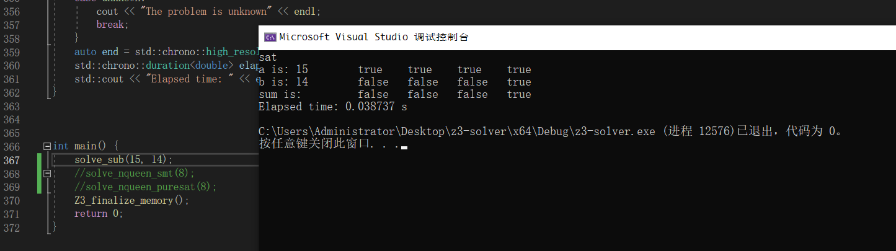
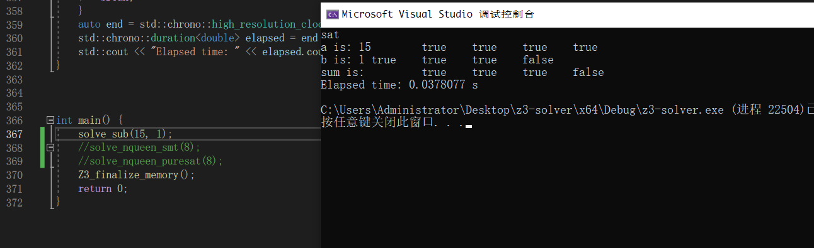
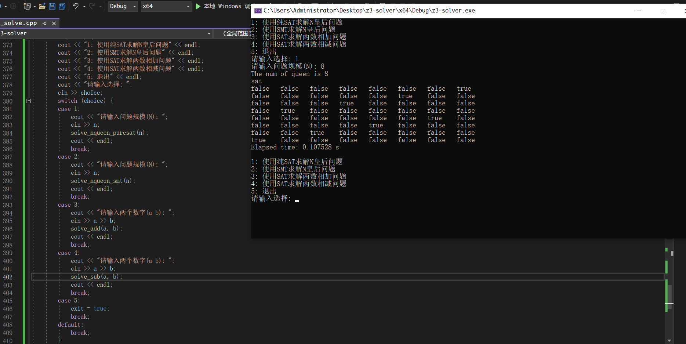

## 实验文档

PB20061338 柯志伟

### N-Queen问题

1. 问题如下:

```
The eight queens puzzle is the problem of placing eight chess queens on
an 8 × 8 chessboard so that no two queens attack each other. Thus, a
solution requires that no two queens share the same row, column, or
diagonal.
```

2. 使用SAT描述问题中的约束如下:

```
(1) At least one queen on row i, i in [1,n] 
(2) At most one queen on row i, i in [1,n]
(3) At least one queen on column i, i in [1,n]
(4) At most one queen on column i, i in [1,n]
(5) on (i, j) and (i′, j′) being two distinct positions on a diagonal,no two queens are allowed
```
3. 使用C++调用Z3的API编写pure-SAT代码如下:

```c++
void solve_nqueen_puresat(int n) {
    auto start = std::chrono::high_resolution_clock::now();
    cout << "The num of queen is " << n << endl;
    context ctx;
    solver slv(ctx);
    vector<vector<expr>> queens;

    
    for (int i = 0; i < n; i++) {
        vector<expr> temp;
        for (int j = 0; j < n; j++) {
            temp.push_back(ctx.bool_const(("queen_" + to_string(i) + "_" + to_string(j)).c_str()));
        }
        queens.push_back(temp);     
    }
    vector<expr> rows, cols;
    for (int i = 0; i < n; i++) {
        for (int j = 0; j < n; j++) {
            // 增加行列约束: 至少一个为真
            if (j == 0) rows.push_back(queens[i][0]);
            else rows[i] = rows[i] || queens[i][j];
            if (i == 0) cols.push_back(queens[0][j]);
            else cols[j] = cols[j] || queens[i][j];
            if (i == n - 1) slv.add(cols[j]);
        }
        slv.add(rows[i]);
    }
    // 增加行列约束: 至多一个为真
    expr temp_expr_1(ctx);
    for (int i = 0; i < n; i++) {
        for (int j = 1; j < n; j++) {
            for (int k = 0; k < j; k++) {
                if (i == 0 && j == 1 && k == 0) temp_expr_1 = !queens[0][1] || !queens[0][0];
                else temp_expr_1 = (temp_expr_1) && (!queens[i][j] || !queens[i][k]);
            }
        }
    }
    slv.add(temp_expr_1);

    for (int j = 0; j < n; j++) {
        for (int i = 1; i < n; i++) {
            for (int k = 0; k < i; k++) {
                if (j == 0 && i == 1 && k == 0) temp_expr_1 = !queens[1][0] || !queens[0][0];
                else temp_expr_1 = (temp_expr_1) && (!queens[i][j] || !queens[k][j]);
            }
        }
    }
    slv.add(temp_expr_1);
    // 增加对角约束
    expr temp_expr_2(ctx);

    for (int i = 1; i < n; i++) {
        for (int j = 0; j < n; j++) {
            bool init = false;
            for (int k = i - 1; k >= 0 && (j + k - i) >= 0; k--) {
                if (k == i - 1) temp_expr_1 = !queens[k][j+k-i] || !queens[i][j];
                else temp_expr_1 = (temp_expr_1) && (!queens[k][j + k - i] || !queens[i][j]);
                init = true;
            }
            for (int k = i + 1; k < n && (i + j - k) >= 0 ; k++) {
                if (!init) {
                    temp_expr_1 = (!queens[k][i + j - k] || !queens[i][j]);
                }
                else {
                    temp_expr_1 = (temp_expr_1) && (!queens[k][i + j - k] || !queens[i][j]);
                }          
            }
            if (i == 1 && j == 0) temp_expr_2 = temp_expr_1;
            else temp_expr_2 = (temp_expr_2) && (temp_expr_1);
        }
    }


    slv.add(temp_expr_2);
    auto res = slv.check();
    cout << res << endl;
    switch (res) {
        case unsat:
            cout << "The problem is unsat" << endl;
            break;
        case sat: {
            model m = slv.get_model();
            for (int i = 0; i < n; i++) {
                for (int j = 0; j < n; j++) {
                    cout << m.eval(ctx.bool_const(("queen_" + to_string(i) + "_" + to_string(j)).c_str())) << "\t" ;
                }
                cout << endl;
            }
        }        
            break;
        case unknown:
            cout << "The problem is unknown" << endl;
            break;
    } 
    auto end = std::chrono::high_resolution_clock::now();
    std::chrono::duration<double> elapsed = end - start;
    std::cout << "Elapsed time: " << elapsed.count() << " s\n";
}
```
4. 按照上课时SMT建立约束的方法在C++中实现SMT求解N皇后问题

```C++
void solve_nqueen_smt(int n) {
    auto start = std::chrono::high_resolution_clock::now();
    cout << "The num of queen is " << n << endl;
    context ctx;
    solver slv(ctx);
    vector<expr> queen_cols;
    for (int i = 0; i < n; i++) {
        queen_cols.push_back(ctx.int_const(("queen_" + to_string(i)).c_str()));
    }

    expr_vector temp_expr_vec(ctx);
    for (int i = 0; i < n; i++) {
        slv.add((queen_cols[i] >= 1 && queen_cols[i] <= n));
        temp_expr_vec.push_back(queen_cols[i]);
    }
    slv.add(distinct(temp_expr_vec));
    for (int i = 0; i < n; i++) {
        for (int j = 0; j < i; j++) {
            slv.add((queen_cols[j] != (queen_cols[i] + i-j)) && (queen_cols[j] != (queen_cols[i] + j-i)));
        }
    }
    auto res = slv.check();
    cout << res << endl;
    switch (res) {
    case unsat:
        cout << "The problem is unsat" << endl;
        break;
    case sat: {
        model m = slv.get_model();
        for (int i = 0; i < n; i++) {
            cout << m.eval(ctx.int_const(("queen_" + to_string(i)).c_str())) << "\t";
        }
        cout << endl;
    }
            break;
    case unknown:
        cout << "The problem is unknown" << endl;
        break;
    }
    auto end = std::chrono::high_resolution_clock::now();
    std::chrono::duration<double> elapsed = end - start;
    std::cout << "Elapsed time: " << elapsed.count() << " s\n";
}
```

5. 在不同问题规模下SAT，SMT运行时间如下
|  问题规模 | SAT耗时(s)  | SMT耗时(s)  |
|   :--:    | :--: | :-- |
| 8  | 0.196  |0.11   |
|  16 | 2.39  | 0.39  |
|24   | 2.79  | 3.72  |
| 32  | 25.59  | 5.27  |
| 40  | 40.19  | 8.48  |

通过对比可以发现使用pure-SAT解决N皇后问题的效率要高于SMT


[备注说明] C++使用的Z3库为从网上下载的源码，经过CMake编译为Visual Studio下使用的库并链接到通过Visual Studio创建的z3-solver项目来使用

### 两数减法问题

1. 问题
```
使用 pure SAT 求解d=a-b, 其中,a,b为正整数。
```

2. 为问题建立SAT的约束
```
首先使用二进制表示整数(包括输入和结果),先考虑两数的加法,由于使用二进制表示整数,对于二进制加法有使用如下符号ai,bi,ci,di,分别代表两个输入数字的第i位输入以及两位二进制数相加的进位和结果,在SAT中约束如下(设两个输入数字a,b的使用二进制表示的最大位数为max):
    (1) di <-> (ai <-> (bi <-> ci)) ,i in [0, max]
    (2) ci−1 <-> ((ai ∧ bi) ∨ (ai ∧ ci) ∨ (bi ∧ ci)) ,i in [0, max]
    (3) ¬cn, n = max
    (4) ¬c0
    (5) 对于ai,bi的约束, i in [0,max]
默认求解的结果使用二进制表示后位数为max(即可能会发生溢出)
由于对于二进制减法来说,减去一个数相当于加上该数字的补码,故计算减法时只需将输入的b改为其对应的补码,剩余约束均对新的b进行即可,这样便构成两个数相减的SAT约束
```
3. 使用C++调用Z3的API编写两数相减的SAT代码如下:

```C++
void get_num_base2(int num, vector<int>& num_vec) {
    if (num == 0) num_vec.push_back(0);
    else {
        while (num != 0) {
            num_vec.push_back(num % 2);
            num = num / 2;
        }
    }
    return;
}

void solve_sub(int a, int b) {
    context ctx;
    solver slv(ctx);

    vector<int> a_vec, b_vec;
    get_num_base2(a, a_vec);
    get_num_base2(b, b_vec);


    int max_digit_num = a_vec.size() > b_vec.size() ? a_vec.size() : b_vec.size();

    vector<expr> a_bools, b_bools, c_bools, d_bools;
    for (int i = 0; i < max_digit_num; i++) {
        a_bools.push_back(ctx.bool_const(("a_" + to_string(i)).c_str()));
        b_bools.push_back(ctx.bool_const(("b_" + to_string(i)).c_str()));
        c_bools.push_back(ctx.bool_const(("c_" + to_string(i)).c_str()));
        d_bools.push_back(ctx.bool_const(("d_" + to_string(i)).c_str()));
    }
    c_bools.push_back(ctx.bool_const(("c_" + to_string(c_bools.size())).c_str()));

    expr temp(ctx);
    for (int i = 0; i < max_digit_num; i++) {
        if (i == 0) {
            temp = (a_vec[0] == 0) ? (!a_bools[0]) : (a_bools[0]);
            temp = (b_vec[0] == 1) ? (temp && (!b_bools[0])) : (temp && (b_bools[0]));
        }
        else {
            if (i > a_vec.size() - 1) {
                temp = (temp) && (!a_bools[i]);
            }
            else {
                if (a_vec[i] == 0) {
                    temp = (temp) && (!a_bools[i]);
                }
                else {
                    temp = (temp) && (a_bools[i]);
                }
            }
            if (i > b_vec.size() - 1) {
                temp = (temp) && (b_bools[i]);
            }
            else {
                if (b_vec[i] == 1) {
                    temp = (temp) && (!b_bools[i]);
                }
                else {
                    temp = (temp) && (b_bools[i]);
                }
            }
        }
        slv.add(temp);
    }
    slv.add(c_bools[0]);

    for (int i = 0; i < max_digit_num; i++) {
        slv.add(d_bools[i] == (a_bools[i] == (b_bools[i] == c_bools[i])));
        if (i != max_digit_num - 1) {
            slv.add(c_bools[i + 1] == ((a_bools[i] && b_bools[i]) || (a_bools[i] && c_bools[i]) || (b_bools[i] && c_bools[i])));
        }
        else {
            slv.add(!c_bools[i + 1]);
        }
    }
    auto start = std::chrono::high_resolution_clock::now();
    auto res = slv.check();
    cout << res << endl;
    switch (res) {
    case unsat:
        cout << "The problem is unsat" << endl;
        break;
    case sat: {
        model m = slv.get_model();
        cout << "a is: " << a << "\t";
        for (int i = max_digit_num - 1; i >= 0; i--) {
            cout << m.eval(ctx.bool_const(("a_" + to_string(i)).c_str())) <<"\t";
        }
        cout << endl;
        cout << "b is: " << b << "\t";
        for (int i = max_digit_num - 1; i >= 0; i--) {
            cout << m.eval(ctx.bool_const(("b_" + to_string(i)).c_str())) << "\t";
        }
        cout << endl;
        cout << "sum is: " << "\t";
        for (int i = max_digit_num - 1; i >= 0; i--) {
            cout << m.eval(ctx.bool_const(("d_" + to_string(i)).c_str())) << "\t";
        }
        cout << endl;

    }
            break;
    case unknown:
        cout << "The problem is unknown" << endl;
        break;
    }
    auto end = std::chrono::high_resolution_clock::now();
    std::chrono::duration<double> elapsed = end - start;
    std::cout << "Elapsed time: " << elapsed.count() << " s\n";
}
```
[备注说明]: 由于一个数二进制补码等于其反码加一,因此在代码中其实是将b转化为其反码,但是约束c0为1,以此实现a-b等于a加上b的补码

4. 实验结果及说明




由实验结果,最后模型解出的约束分别代表`a的二进制表示`，`b的反码的二进制表示`,`结果的二进制表示`,并且结果正确

### 代码使用

为方便检验,简单封装使用界面如下:


编译好的可执行程序位于提交的z3-solver\x64\Debug\z3-solver.exe,其依赖bin目录下的z3动态链接库,使用Visual Studio运行