# lab1实验报告

<center>学号: PB20061338
姓名: 柯志伟</center>

## 实验目的

```markdown
    使用数据库SQL和过程化SQL完成图书馆数据库的构建以及相关业务需求(具体见实验文档)的实现
```

## 实验环境

```markdown
Windows 10 + MySQL Workbench 8.0 CE
```

## 实验过程

### 创建图书馆数据库
- mysql脚本
```mysql
# 创建数据库

create database  if not exists lab1;
use lab1;

# 创建Book表
create table if not exists Book(
    ID char(8) primary key,
    name varchar(10) not null,
    author varchar(10),
    price float,
    status int default 0,
    borrow_Times int default 0,
    reverse_Times int default 0
) character set utf8;

# 创建读者表
create table if not exists Reader(
    ID char(8) primary key,
    name varchar(10),
    age int,
    address varchar(20)
) character set utf8;

# 创建借阅表
create table if not exists Borrow(
    book_ID char(8),
    reader_ID char(8),
    borrow_Date date,
    return_Date date,
    primary key (book_ID, reader_ID, borrow_Date),
    foreign key (book_ID) references Book(ID),
    foreign key (reader_ID) references Reader(ID)
) character set utf8;

# 创建预约表
create table if not exists Reserve(
    book_ID char(8),
    reader_ID char(8),
    reserve_Date date default (curdate()),
    take_Date date,
    primary key (book_ID, reader_ID, reserve_Date),
    check (take_Date is null or take_Date > reserve_Date)
) character set utf8;
```
- 结果
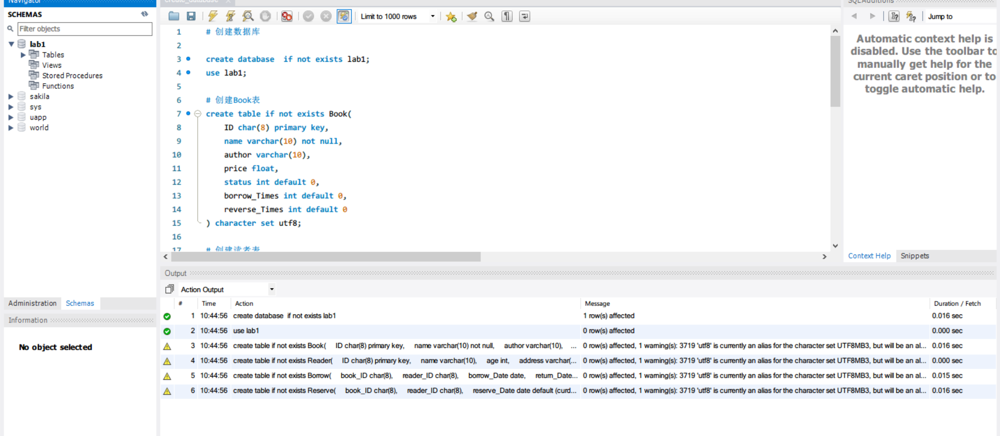
### 向数据库插入数据以便后续测试
- mysql脚本
```mysql
use lab1;

# 插入书籍
insert into Book value('b1', '数据库系统实现', 'Ullman', 59.0, 1, 8, 0);
insert into Book value('b2', '数据库系统概念', 'Abraham', 59.0, 1, 5, 0);
insert into Book value('b3', 'C++ Primer', 'Stanley', 78.6, 1, 6, 0);
insert into Book value('b4', 'Redis设计与实现', '黄建宏', 79.0, 1, 4, 0);
insert into Book value('b5', '人类简史', 'Yuval', 68.00, 1, 6, 0);
insert into Book value('b6', '史记(公版)', '司马迁', 220.2, 1, 5, 0);
insert into Book value('b7', 'Oracle编程艺术', 'Thomas', 43.1, 0, 4, 0);
insert into Book value('b8', '分布式系统及其应用', '邵佩英', 30.0, 0, 2, 0);
insert into Book value('b9', 'Oracle管理', '张立杰', 51.9, 0, 5, 0);
insert into Book value('b10', '数理逻辑', '汪芳庭', 22.0, 2, 6, 2);
insert into Book value('b11', '三体', '刘慈欣', 23.0, 1, 8, 1);
insert into Book value('b12', 'Fun python', 'Luciano', 354.2, 0, 3, 0);
...
...
```
- 结果
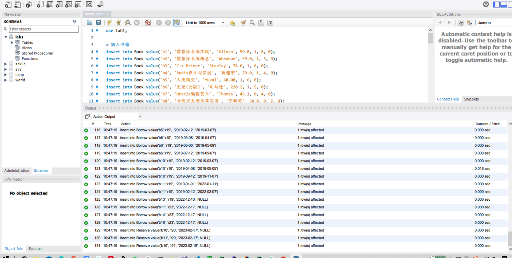
### 使用SQL语言完成特定的查询任务

#### 查询读者 Rose 借过的读书（包括已还和未还）的图书号、书名和借期
- mysql脚本
```mysql
select Book.ID, Book.name, Borrow.borrow_Date from Borrow, Book, Reader
where Borrow.book_ID = Book.ID and Borrow.reader_ID = Reader.ID and Reader.name = 'Rose';
```
- 结果
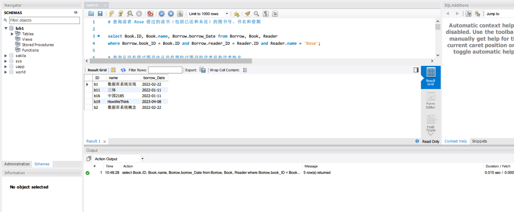

#### 查询从没有借过图书也从没有预约过图书的读者号和读者姓名
- mysql脚本
```mysql
select Reader.ID, Reader.name from Reader 
where not exists (
    select * from Borrow 
    where Borrow.reader_ID = ID
) and not exists (
    select * from Reserve 
    where Reserve.reader_ID = ID
);
```
- 结果
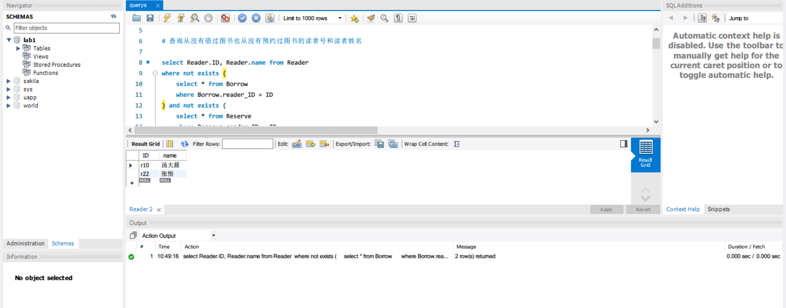
#### 查询被借阅次数最多的作者（注意一个作者可能写了多本书）
- mysql脚本
```mysql
select author from (
	select Book.author as author, SUM(Book.borrow_Times) as borrow_times_sum from Book
    group by Book.author
) Author
where borrow_times_sum = (
	select MAX(borrow_times_sum) from (
		select Book.author, SUM(Book.borrow_Times) as borrow_times_sum from Book
		group by Book.author
	) Author
);
```
- 结果
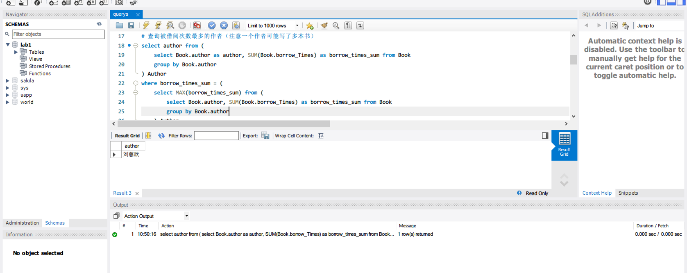
#### 查询目前借阅未还的书名中包含“MySQL”的的图书号和书名
- mysql脚本
```mysql
select Book.ID, Book.name from Book
where Book.name like '%MySQL%' and exists (
    select * from Borrow
    where book_ID = Book.ID and return_Date is null 
);
```
- 结果
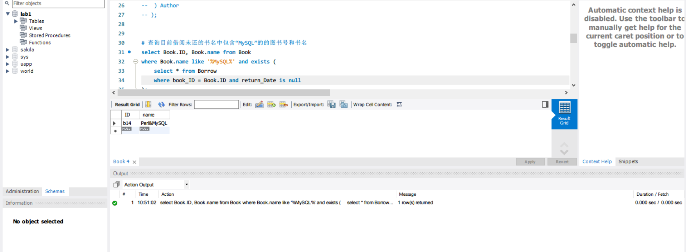
#### 查询借阅图书数目超过 10 本的读者姓名
- mysql脚本
```mysql
select Reader.name from Reader 
where (
    select COUNT(*) from Borrow
    where reader_ID = Reader.ID
) > 10;
```
- 结果
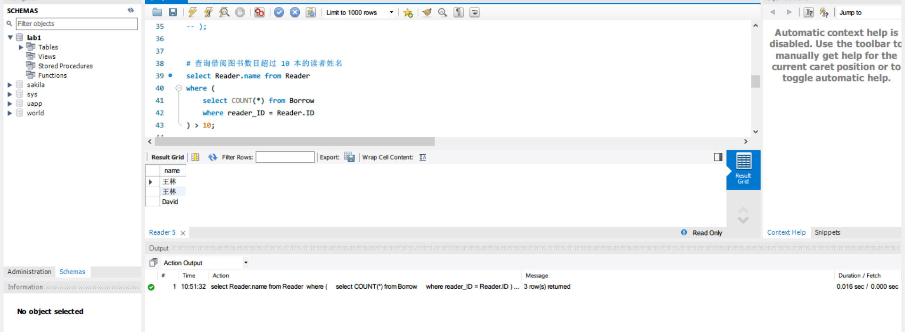
#### 查询没有借阅过任何一本 John 所著的图书的读者号和姓名
- mysql脚本
```mysql
select Reader.ID, Reader.name from Reader
where not exists (
    select * from Borrow, Book
    where Borrow.book_ID = Book.ID and Borrow.reader_ID = Reader.ID and Book.author = 'John'
);
```
- 结果
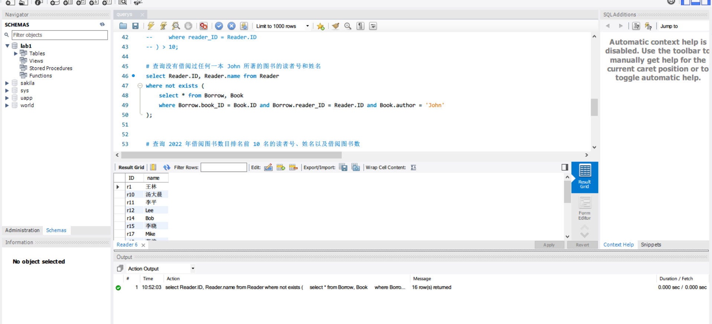
#### 查询 2022 年借阅图书数目排名前 10 名的读者号、姓名以及借阅图书数
- mysql脚本
```mysql
select Reader.ID, Reader.name, COUNT(*) as reader_borrow_times from Reader, Book, Borrow
where Reader.ID = Borrow.reader_ID and Book.ID = Borrow.book_ID and Borrow.borrow_Date >= '2022-01-01' and Borrow.borrow_Date < '2023-01-01'
group by Reader.ID, Reader.name
order by reader_borrow_times desc
limit 10;
```
- 结果
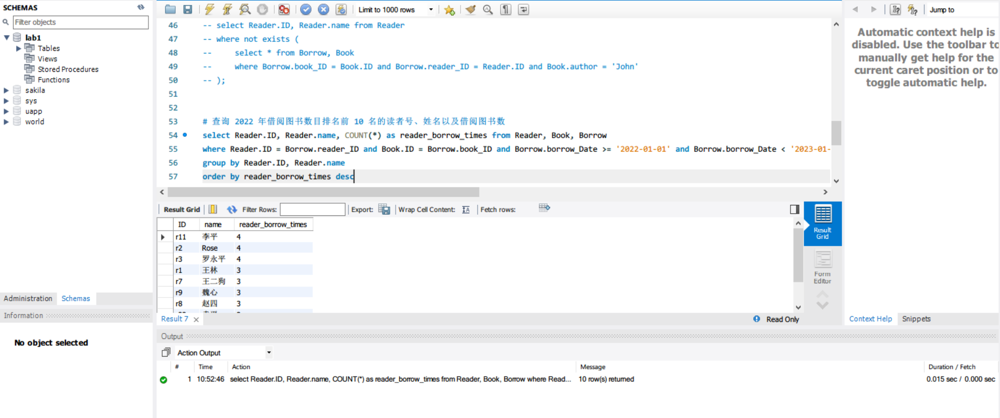
#### 创建一个读者借书信息的视图,该视图包含读者号、姓名、所借图书号、图书名和借期；并使用该视图查询最近一年所有读者的读者号以及所借阅的不同图书数
- mysql脚本
```mysql
create view borrow_view(reader_id, reader_name, book_id, book_name, borrow_time) 
as select Reader.ID, Reader.name, Book.ID, Book.name, Borrow.borrow_Date from Book, Borrow, Reader
    where Book.ID = Borrow.book_ID and Reader.ID = Borrow.reader_id;

select reader_id, count(distinct book_id) from borrow_view
where borrow_time >= date_sub(curdate(), interval 1 year)
group by reader_id;
```
- 结果
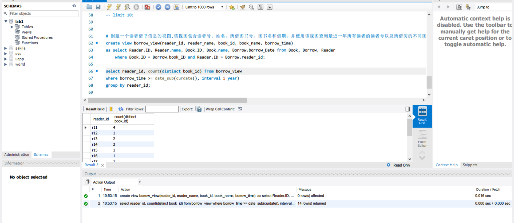

### 设计一个存储过程 updateReaderID,实现对读者表的 ID 的修改
- 分析
```markdown
- 功能实现: 对于读者ID的更新由于其被借阅表用作外键，无法直接修改,采用将借阅表中读者ID为待修改ID的各行移入一张临时表表并在临时表中完成读者ID的更改,同时待读者表更改读者ID后再将这些表项移回到借阅表完成读者ID的更改

- 错误处理: 针对待修改读者旧ID不存在和新ID已存在做错误提醒并退出过程
```
- mysql脚本
```mysql
delimiter //
create procedure updateReaderID(IN old_id char(8), IN new_id char(8))
begin

    declare old_id_exist, new_id_exist bool;

    select (count(*) > 0) as exist from Reader 
    where ID = old_id 
        into old_id_exist;

    select (count(*) > 0) as exist from Reader 
    where ID = new_id 
        into new_id_exist;
    
    if old_id_exist and not new_id_exist then

        # 迁移Borrow表中相关数据迁移到临时表
        create table borrow_backup(
            book_ID char(8),
            reader_ID char(8),
            borrow_Date date,
            return_Date date,
            primary key (book_ID, borrow_Date)
        );

        insert into borrow_backup
            select * from Borrow 
            where Borrow.reader_ID = old_id;

        delete from Borrow where Borrow.reader_ID = old_id;   

        # 更新Reader表及临时表
        update Reader 
        set ID = new_id
        where ID = old_id;
        
        update borrow_backup
        set reader_ID = new_id;

        # 将临时表中的数据迁移回Borrow表
        insert into Borrow
            select * from borrow_backup;

        # 删除临时表
        drop table borrow_backup;

    else 
        select "old_id not exist or new_id has existed in Reader table" as message;
    end if;
end //
delimiter ;

SET SQL_SAFE_UPDATES = false;
call updateReaderID('r100', 'r1');

select * from reader
where ID = 'r100';
```
- 结果
1. 执行`call updateReaderID('r100', 'r1');`,报告错误
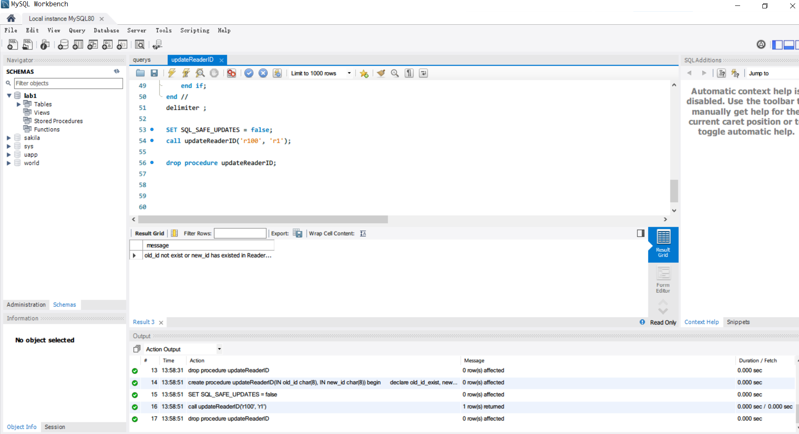

2. 执行`call updateReaderID('r1', 'r100');`,并执行`select * from reader where ID = 'r100';`和`select * from borrow where reader_ID = 'r100';`,成功执行
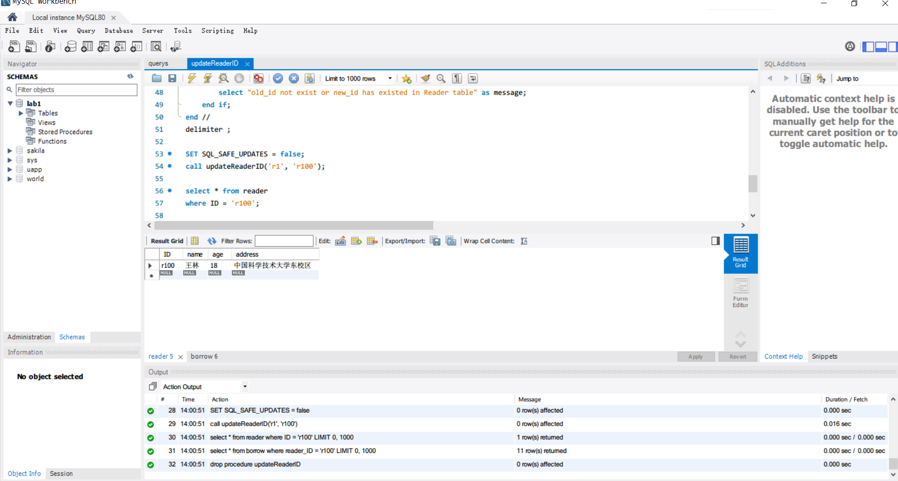
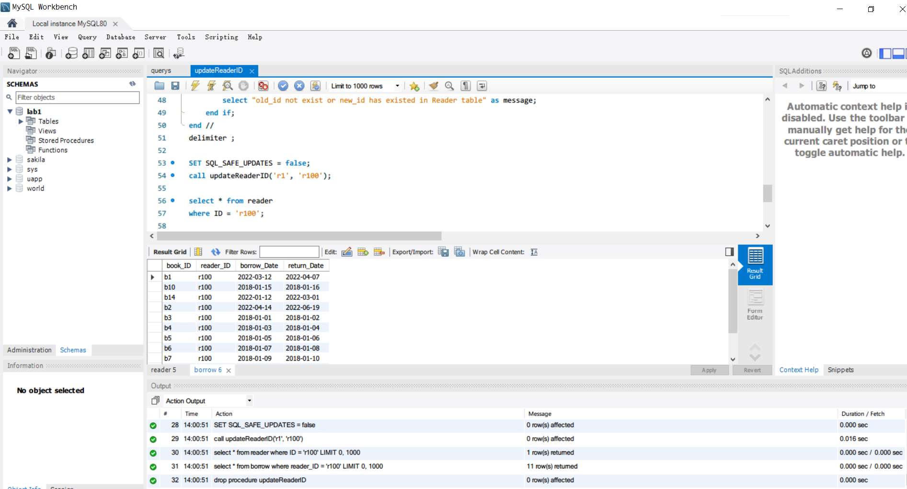

### 设计一个存储过程 borrowBook, 当读者借书时调用该存储过程完成借书处理
- 分析
```markdown
功能实现: 预先进行各种条件是否满足的判断，只有在条件都满足时才允许借书并更新相关的表

错误处理: 针对不能借阅的情况给出错误信息并退出过程
```
- mysql脚本
```mysql
delimiter //
create procedure borrowBook(IN reader_id char(8), IN book_id char(8))
begin

    declare book_can_be_borrowed bool default false;
    declare today_have_borrow_this_book bool default false;
    declare book_have_reserved bool default false;
    declare reader_have_borrowed_too_many_books bool default false;
    declare reader_have_reserved_the_book bool default false;

    select (case status when 1 then false else true end) from Book
    where ID = book_id
        into book_can_be_borrowed;

    # 同一天不允许同一个读者重复借阅同一本书
    if exists (
        select * from Borrow 
        where Borrow.reader_ID = reader_id and day(Borrow.borrow_Date) = day(curdate()) and Borrow.book_ID = book_id 
    ) then
        set today_have_borrow_this_book = true;
    end if;
    
    # 如果该图书存在预约记录，而当前借阅者没有预约，则不允许借阅
    if exists (
        select * from Reserve 
        where Reserve.book_ID = book_id
    ) then
        set book_have_reserved = true;
    end if;

    # 一个读者最多只能借阅 3 本图书，意味着如果读者已经借阅了 3 本图书并且未归还则不允许再借书
    
    select count(*) >= 3 from Borrow
    where return_Date is null and Borrow.reader_ID = reader_id
        into reader_have_borrowed_too_many_books;
    
    # 如果借阅者已经预约了该图书，则允许借阅，但要求借阅完成后删除借阅者对该图书的预约记录
    if exists (
        select * from Reserve
        where reader_ID = reader_id and book_ID = book_id
    ) then
        set reader_have_reserved_the_book = true;
    end if;

    # 借阅成功后图书表中的 times 加 1 
    # 借阅成功后修改 status

    if not book_can_be_borrowed then
        select "The book can't be borrowed now" as message;
    elseif today_have_borrow_this_book then
        select "One reader can't borrow the same book in one day" as message;
    elseif reader_have_borrowed_too_many_books then
        select "One reader can't borrow more than 3 book which is not returned" as message;
    elseif book_have_reserved and not reader_have_reserved_the_book then
        select "The book has reserved by some other reader" as message;
    elseif reader_have_reserved_the_book then
        update Book
        set status = 1, borrow_Times = borrow_Times + 1
        where Book.ID = book_id;  
        
        insert into Borrow
        value(book_id, reader_id, curdate(), null);
                    
        delete from Reserve
        where Reserve.book_ID = book_id and Reserve.reader_ID = reader_id;  
    else
        insert into Borrow
        value(book_id, reader_id, curdate(), null);

        update Book
        set status = 1, borrow_Times = borrow_Times + 1
        where Book.ID = book_id;
    end if;
end //
delimiter ;

SET SQL_SAFE_UPDATES = false;
call borrowBook('r14', 'b18');
drop procedure borrowBook;
```
- 结果
执行`call borrowBook('r14', 'b18')`,成功借书
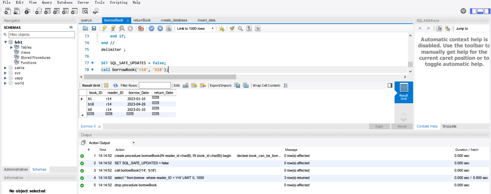

### 设计一个存储过程 returnBook，当读者还书时调用该存储过程完成还书处理
- 分析
```markdown
功能实现: 在无错误的情况下更新borrow表和book表即可

错误处理: 针对读者归还其未曾借阅的书的情况给出错误信息并退出过程
```
- mysql脚本
```mysql
delimiter //
create procedure returnBook(IN reader_id char(8), IN book_id char(8))
begin

    if not exists (
        select * from Borrow
        where Borrow.book_ID = book_id and Borrow.reader_ID = reader_id and Borrow.return_Date is null
    ) then
        select "you can not return the book" as message;
    else
        update Book
        set status = 0
        where ID = book_id;

        update Borrow
        set return_Date = curdate()
        where Borrow.book_ID = book_id and Borrow.reader_ID = reader_id and Borrow.return_Date is null;
    end if;
end //
delimiter ;

call returnBook('r14', 'b18');
drop procedure returnBook;

select * from Borrow
where reader_ID = 'r14';
```
- 结果
执行`call returnBook('r14', 'b18');`,成功还书
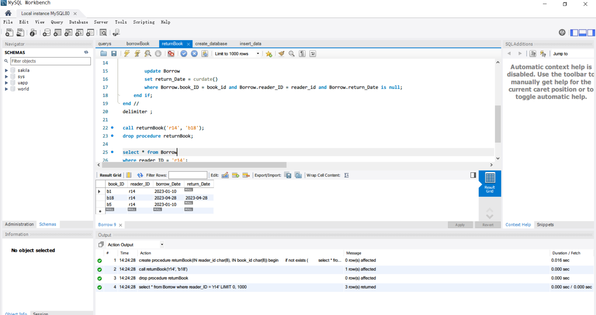

### 设计一个触发器，实现：当一本书被预约时, 自动将 Book 表中相应图书的status 修改为 2，并增加 reserve_Times；当某本预约的书被借出时或者读者取消预约时, 自动减少 reserve_Times

- mysql脚本
```mysql
delimiter //
create trigger lab_trigger1
after insert on Reserve for each row
begin
    update Book 
    set status = 2, reserve_Times = reserve_Times + 1
    where Book.ID = new.book_ID 
end
delimiter ;

delimiter //
create trigger lab_trigger2
after delete on Reserve for each row
begin
    update Book 
    set reserve_Times = reserve_Times - 1
    where Book.ID = old.book_ID
end
delimiter ;
```
## 总结与思考

```markdown
通过此次实验，具体实践了SQL语句用于数据库创建以及增删改查等操作，存储过程和触发器的使用,
另外以mysql为实例加深了对SQL和过程化SQL的理解和使用
```
