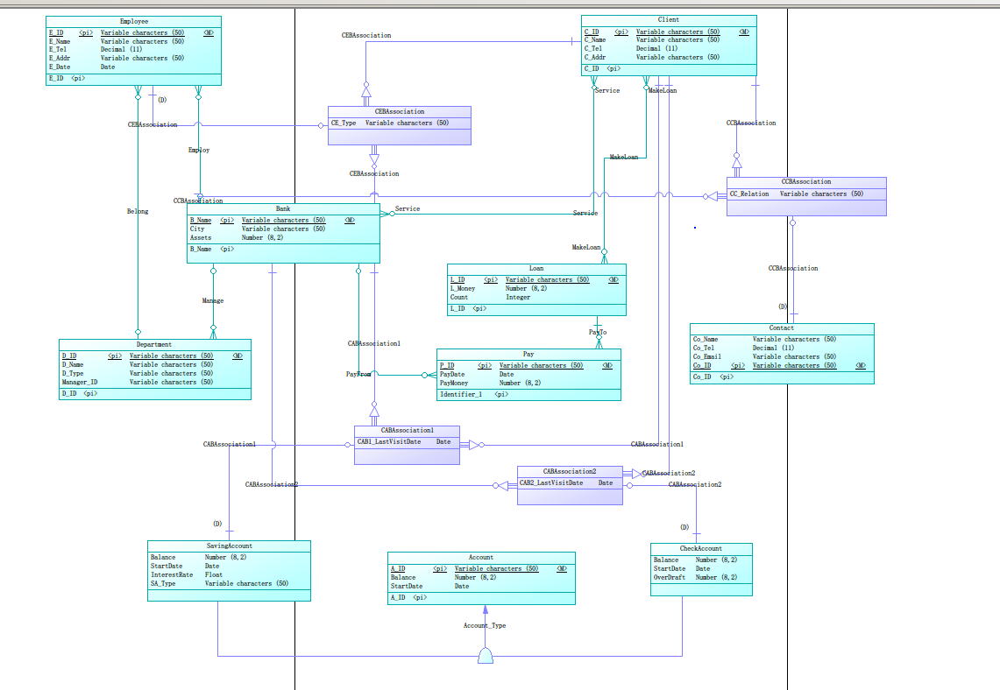
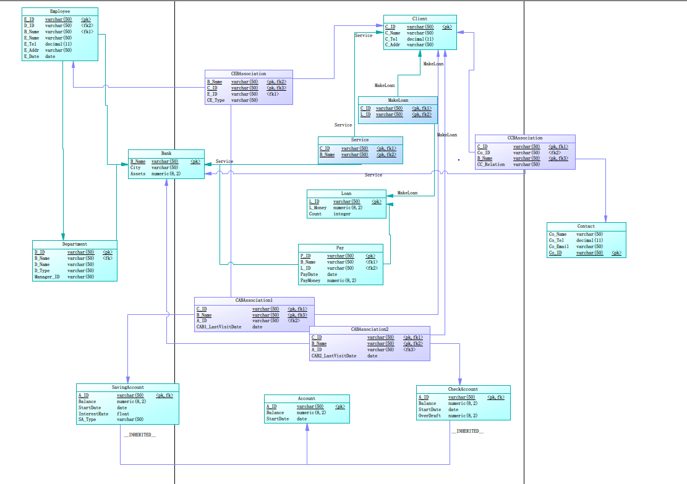

# 银行业务管理系统数据库设计

学号 PB20061338 姓名 柯志伟

## 概念模型设计

### 实体设计
|实体|实体属性|实体标识|设计理由|
|:--:|:--:|:--:|:--:|
|Bank|B_Name、City、Assets|B_Name|银行的每个支行具有自身的一些属性并于其他实体发生联系|
|Client|C_ID、C_Name、C_Tel、C_Addr|C_ID|客户具有多个属性，且会与员工、银行等实体发生联系|
|Contact|Co_ID、Co_Name、Co_Tel、Co_Email|E_ID||
|Employee|E_ID、E_Name、E_Tel、E_Addr、E_Date|E_ID|每个支行的员工具有多个属性，并与客户、部门等发生联系|
|Department|D_ID、D_Name、D_Type、Manager_ID|D_ID|部门包含了多个属性，且每个部门可能含有多个员工，每个支行可能含有多个部门|
|Account|A_ID、Balance、StartDate|A_ID|账户具有自身的一些属性，且分成两个子类，与支行和客户发生联系|
|SavingAccount|InterestRate、SA_Type||作为账户实体的子类，具有自身特有的属性,利率和货币类型|
|CheckAccount|OverDraft||作为账户实体的子类，具有自身的属性，透支额|
|Loan|L_ID、L_Money、Count|L_ID|贷款具有多个属性，且与银行和客户间存在联系|
|Pay|P_ID、PayDate、PayMoney|P_ID|支行针对自身借贷出的每个贷款可能分多次支付,且具有支付金额，第几次支付等属性|

**对应含义如下:**

|实体|实体属性|实体标识|设计理由|
|:--:|:--:|:--:|:--:|
|支行|名字、城市、资产|名字|见上|
|客户|身份证号、名字、联系电话、家庭住址|身份证号|见上|
|联系人|身份证号、姓名、手机号、Email|身份证号|见上|
|员工|身份证号、姓名、电话号码、家庭住址、开始工作日期|身份证号|见上|
|部门|部门号、部门名称、部门类型、部门经理身份证号|部门号|见上|
|账户|账户号、余额、开户日期|账户号|见上|
|储蓄账户|利率、货币类型||见上|
|支票账户|透支额||见上|
|贷款|贷款号、贷款余额、逐次支付情况|贷款号|见上|
|付款|付款号、付款日期、付款金额|付款号|见上|

### 联系设计
|联系|联系实体|联系属性|设计理由|
|:--:|:--:|:--:|:--:|
|Service|Client、Bank|无|银行为客户提供服务、且两者之间关系的约束为`客户:银行=多:多`|
|Employ|Bank、Employee|无|银行雇佣职员、且两者之间关系的约束为`银行:职工=1:多`|
|Belong|Employee、Department|无|每个银行职员隶属银行的某个部门、且两者之间关系的约束为`职工:部门=多:1`|
|Manage|Bank、Department|无|银行管理多个部门、两者之间关系的约束为`银行:部门=1:多`|
|MakeLoan|Client、Loan|无|客户会申请贷款、且一个贷款可能为多人所有、两者之间关系的约束为`客户:贷款=多:多`|
|PayFrom|Pay、Bank|无|银行向贷款支付、且可能分多次支付、两者之间关系的约束为`付款:银行=多:1`|
|PayTo|Pay、Loan|无|每次付款都是针对一个贷款的、两者之间关系的约束为`付款:贷款=多:1`|
|CEBAssociation|Bank,Client、Employee|CE_Type|银行要求每个客户与一个银行员工发生联系且存储两者的关系,三者之前关系的约束是`银行:客户:职工=多:多:1`|
|CCBAssociation|Client、Contact、Bank|CC_Relation|支行要求存有它的客户的一位联系人信息,联系人和客户之间的关系是一对多,两者之间关系的约束为`客户:银行:联系人=多:多:1`|
|CABAssociation1|Bank、SavingAccount、Client|CAB1_LastVisitDAte|每个储蓄账户与某个银行关联并属于某个客户,每个支行要求每个客户只能有一个储蓄账号,三者之前关系的约束是`银行:储蓄账号:客户=多:1:多`|
|CABAssociation2|Bank、CheckAccount、Client|CAB2_LastVisitDAte|每个支票账户与某个银行关联并属于某个客户,每个支行要求每个客户只能有一个支票账号,三者之前关系的约束是`银行:支票账号:客户=多:1:多`|

### Power Designer的ER图

## 概念模型到逻辑模型的转换

### 实体转换

**将实体转换如下:**

Bank (**B_Name**、City、Assets)
Client (**C_ID**、C_Name、C_Tel、C_Addr)
Contact (**Co_ID**、Co_Name、Co_Tel、Co_Email)
Employee (**E_ID**、E_Name、E_Tel、E_Addr、E_Date)
Department (**D_ID**、D_Name、D_Type、Manager_ID)
Account (**A_ID**、Balance、StartDate)
SavingAccount (**A_ID**,InterestRate、SA_Type)
CheckAccount (**A_ID**,OverDraft)
Loan (**L_ID**、L_Money、Count)
Pay (**P_ID**、PayDate、PayMoney)

[注]: SavingAccount、CheckAccount是Account的子类实体

### 联系转换
- `Service`关系的约束为`客户:银行=多:多`
Service (**C_ID**、**B_Name**)
- `Employ`关系的约束为`银行:职工=1:多`
Employee (**E_ID**、E_Name、E_Tel、E_Addr、E_Date、B_Name)
- `Belong`关系的约束为`职工:部门=多:1`
Employee (**E_ID**、E_Name、E_Tel、E_Addr、E_Date、B_Name、D_ID)
- `Manage`关系的约束为`银行:部门=1:多`
Department (**D_ID**、D_Name、D_Type、Manager_ID、B_Name)
- `MakeLoan`关系的约束为`客户:贷款=多:多`
MakeLoan (**C_ID**、**L_ID**)
- `PayFrom`关系的约束为`付款:银行=多:1`
Pay (**P_ID**、PayDate、PayMoney、B_Name)
- `PayTo`关系的约束为`付款:贷款=多:1`
Pay (**P_ID**、PayDate、PayMoney、B_Name、L_ID)
- `CEAssociation`关系的约束是`银行:客户:职工=多:多:1`
CEBAssociation (**B_Name**、**C_ID**、E_ID)
- `CCBAssociation`关系的约束为`客户:银行:联系人=多:多:1`
CCBAssociation (**C_ID**、**B_Name**、Co_ID)
- `CABAssociation1`关系的约束是`银行:储蓄账号:客户=多:1:多`
CABAssociation1 (**B_Name**、**C_ID**、A_ID)
- `CABAssociation2`关系的约束是`银行:支票账号:客户=多:1:多`
CABAssociation2 (**B_Name**、**C_ID**、A_ID)

### 最终的关系模式
Bank (**B_Name**、City、Assets)
Client (**C_ID**、C_Name、C_Tel、C_Addr)
Contact (**Co_ID**、Co_Name、Co_Tel、Co_Email)
Employee (**E_ID**、E_Name、E_Tel、E_Addr、E_Date、B_Name、D_ID)
Department (**D_ID**、D_Name、D_Type、Manager_ID、B_Name)
Account (**A_ID**、Balance、StartDate)
SavingAccount (**A_ID**,InterestRate、SA_Type)
CheckAccount (**A_ID**,OverDraft)
Loan (**L_ID**、L_Money、Count)
Pay (**P_ID**、PayDate、PayMoney、B_Name、L_ID)
CCBAssociation (**C_ID**、**B_Name**、Co_ID)
CEBAssociation (**B_Name**、**C_ID**、E_ID)
CABAssociation1 (**B_Name**、**C_ID**、A_ID)
CABAssociation2 (**B_Name**、**C_ID**、A_ID)

## MySQL数据库结构实现

### Power Designer的PDM图

### 数据库表定义

#### Bank表

| 列名     | 中文含义     | 类型      | 允许为空 | 是否主键 | 是否外键 |
| -------- | ------------ | --------- | -------- | -------- | -------- |
| B_Name   | 支行名       | varchar(50)  | 否       | 是       | 否       |
| City   | 支行所在城市 | varchar(50)  | 否       | 否       | 否       |
| Assets | 支行资产     | numeric(8,2) | 否       | 否       | 否       |

#### Client表

| 列名      | 中文含义   | 类型     | 允许为空 | 是否主键 | 是否外键 |
| --------- | ---------- | -------- | -------- | -------- | -------- |
| C_ID      | 客户身份证 |    varchar(50)   | 否       | 是       | 否       |
| C_Name    | 客户名     | varchar(50) | 否       | 否       | 否       |
| C_Tel     | 客户电话   | decimal(11)      | 是       | 否       | 否       |
| C_Address | 客户住址   | varchar(50) | 是       | 否       | 否       |

#### Employee表

| 列名         | 中文含义     | 类型     | 允许为空 | 是否主键 | 是否外键            |
| ------------ | ------------ | -------- | -------- | -------- | ------------------- |
| E_ID         | 员工身份证   | varchar(50)      | 否       | 是       | 否                  |
| D_ID         | 部门号       | varchar(50)      | 是       | 否       | 是(Department:D_ID) |
| B_Name       | 支行名       | varchar(50) | 否       | 否       | 是(Bank:B_Name)     |
| E_Tel        | 员工电话     | decimal(11)      | 是       | 否       | 否                  |
| E_Address    | 员工住址     | varchar(50) | 是       | 否       | 否                  |
| E_Begin_Work | 开始工作时间 | date     | 否       | 否       | 否                  |

#### Department表

| 列名        | 中文含义       | 类型     | 允许为空 | 是否主键 | 是否外键 |
| ----------- | -------------- | -------- | -------- | -------- | -------- |
| D_ID        | 部门号         | varchar(50)      | 否       | 是       | 否       |
| B_Name | 支行名 | varchar(50)      | 否       | 否       | 是(Bank:B_Name)       |
| D_Name      | 部门名         | varchar(50) | 否       | 否       | 否       |
| D_Type      | 部门类型       | varchar(50) | 否       | 否       | 否       |
| Manager_ID | 部门经理身份证 | varchar(50)      | 否       | 否       | 否       |

#### Contact表

| 列名        | 中文含义   | 类型     | 允许为空 | 是否主键 | 是否外键         |
| ----------- | ---------- | -------- | -------- | -------- | ---------------- |
| Co_ID        | 联系人身份证 | varchar(50)      | 否       | 是       | 否 |
| Co_Name     | 联系人名   | varchar(50) | 否       | 否       | 否               |
| Co_Email    | 联系人邮箱 | varchar(50) | 是       | 否       | 否               |
| Co_Tel      | 联系人电话 | varchar(50)     | 否       | 否       | 否               |

#### Account表

| 列名           | 中文含义 | 类型     | 允许为空 | 是否主键 | 是否外键         |
| -------------- | -------- | -------- | -------- | -------- | ---------------- |
| A_ID           | 账户号   |  varchar(50)      | 否       | 是       | 否               |
| Balance      | 账户余额 |  varchar(50) | 否       | 否       | 否               |
| StartDate | 开户时间 | date     | 否       | 否       | 否               |

#### SavingAccount表

| 列名   | 中文含义 | 类型      | 允许为空 | 是否主键 | 是否外键         |
| ------ | -------- | --------- | -------- | -------- | ---------------- |
| A_ID   | 账户号   | int       | 否       | 是       | 是(Account:A_ID) |
| Balance      | 账户余额 |  varchar(50) | 否       | 否       | 否       |
| StartDate | 开户时间 | date     | 否       | 否       | 否               |
| S_Rate | 利率     | float | 否       | 否       | 否               |
| S_Type | 储蓄类型 | varchar(50)  | 否       | 否       | 否               |

#### CheckAccount表

| 列名        | 中文含义 | 类型      | 允许为空 | 是否主键 | 是否外键         |
| ----------- | -------- | --------- | -------- | -------- | ---------------- |
| A_ID   | 账户号   | int       | 否       | 是       | 是(Account:A_ID) |
| Balance      | 账户余额 |  varchar(50) | 否       | 否       | 否       |
| StartDate | 开户时间 | date     | 否       | 否       | 否               |
| C_OverDraft | 透支额   | numeric(8,2) | 否       | 否       | 否               |

#### Loan表 

| 列名    | 中文含义 | 类型      | 允许为空 | 是否主键 | 是否外键        |
| ------- | -------- | --------- | -------- | -------- | --------------- |
| L_ID    | 贷款号   | varchar(50)      | 否       | 是       | 否              |
| L_Money | 贷款金额 | numeric(8,2) | 否       | 否       | 否              |
| Count   | 取钱次数 | integer       | 否       | 否       | 否              |

#### Pay表
| 列名 | 中文含义   | 类型 | 允许为空 | 是否主键 | 是否外键         |
| ---- | ---------- | ---- | -------- | -------- | ---------------- |
| P_ID | 支付号     | varchar(50)  | 否       | 是       | 否   |
| B_Name | 支行名 | varchar(50)      | 否       | 否       | 是(Bank:B_Name)       |
| L_ID    | 贷款号   | varchar(50)      | 否       | 否       | 是(Loan:L_ID)              |
| PayDate | 支付日期 | date  | 否       | 否       | 否 |
| PayMoney | 支付金额 | numeric(8,2)  | 否       | 否       | 否 |

#### Service表

| 列名 | 中文含义   | 类型 | 允许为空 | 是否主键 | 是否外键         |
| ---- | ---------- | ---- | -------- | -------- | ---------------- |
| C_ID | 客户身份证 |varchar(50)  | 否       | 是       | 是(Client：C_ID) |
| B_Name | 支行名 | varchar(50)      | 否       | 是       | 是(Bank:B_Name)       |

#### MakeLoan表
| 列名 | 中文含义   | 类型 | 允许为空 | 是否主键 | 是否外键         |
| ---- | ---------- | ---- | -------- | -------- | ---------------- |
| C_ID | 客户身份证 |varchar(50)  | 否       | 是       | 是(Client：C_ID) |
| L_ID | 借贷号 | varchar(50)      | 否       | 是       | 是(Loan:L_ID)       |

#### CEBAssociation表
| 列名 | 中文含义   | 类型 | 允许为空 | 是否主键 | 是否外键         |
| ---- | ---------- | ---- | -------- | -------- | ---------------- |
| B_Name | 支行名 | varchar(50)      | 否       | 是       | 是(Bank:B_Name)       |
| C_ID | 客户身份证 |varchar(50)  | 否       | 是       | 是(Client：C_ID) |
| E_ID         | 员工身份证   | varchar(50)      | 否       | 否       | 是(Employee:E_ID)                  |

#### CCBAssociation表
| 列名 | 中文含义   | 类型 | 允许为空 | 是否主键 | 是否外键         |
| ---- | ---------- | ---- | -------- | -------- | ---------------- |
| B_Name | 支行名 | varchar(50)      | 否       | 是       | 是(Bank:B_Name)       |
| C_ID | 客户身份证 |varchar(50)  | 否       | 是       | 是(Client：C_ID) |
| Co_ID         | 联系人身份证   | varchar(50)      | 否       | 否       | 是(Contact:Co_ID)                  |

#### CABAssociation1表
| 列名 | 中文含义   | 类型 | 允许为空 | 是否主键 | 是否外键         |
| ---- | ---------- | ---- | -------- | -------- | ---------------- |
| C_ID | 客户身份证 |varchar(50)  | 否       | 是       | 是(Client：C_ID) |
| B_Name | 支行名 | varchar(50)      | 否       | 是       | 是(Bank:B_Name)       |
| A_ID         | 账户号   | varchar(50)      | 否       | 否       | 是(SavingAccount:A_ID)                  |

#### CABAssociation2表
| 列名 | 中文含义   | 类型 | 允许为空 | 是否主键 | 是否外键         |
| ---- | ---------- | ---- | -------- | -------- | ---------------- |
| C_ID | 客户身份证 |varchar(50)  | 否       | 是       | 是(Client：C_ID) |
| B_Name | 支行名 | varchar(50)      | 否       | 是       | 是(Bank:B_Name)       |
| A_ID         | 账户号   | varchar(50)      | 否       | 否       | 是(CheckAccount:A_ID)                  |

### 总结与体会

**通过此次实验实际体验到根据用户需求的描述来设计一个关系数据库模式,体会到在关系模式设计中的困难:实体和关系不易区分,总感觉有多种划分方案都可以,对用户需求的理解可能存在问题,另外在设计ER图时,在确定实体之间的关系是多对1还是多对多与实体选择的标识和业务需求有关，这点直接从最终需要的关系模式倒推感觉更容易,最后一点就是power design不是那么好用，使用图形拖拽的方式编程，虽然方便，但不太容易理解什么图形可以互相连接，连接后又代表什么含义，在使用过程中常常遇到找不到所需的图例，造成麻烦。**

