## lab1实验报告
```
学号：PB20061338
姓名： 柯志伟
```
#### 实验题目
```
排序算法
```
#### 实验内容
```
排序n个元素，元素为随机生成的0到2^15 − 1之间的整数，n的取值2^3,2^6,2^9,2^12,
2^15,2^18，并实现以下算法：堆排序，快速排序， 归并排序，计数排序
```
#### 实验要求
- 编程要求
```
C/C++，排序算法要自己实现，不能直接调用qsort()等解决
```

- 目录格式
```
实验需建立根文件夹，文件夹名称为：编号-姓名-学号-project1，在根文件夹下需包括实验报告和ex1
子文件夹。实验报告命名为编号-姓名-学号-project1.pdf， ex1子文件夹又包含3个子文件夹：
    - input文件夹：存放输入数据
    - src文件夹：源程序
    - output文件夹：输出数据

input(输入文件中每行一个随机数据，总行数大于等于2^15)

output:(每种算法建立一个子文件夹，其输出结果数据导出到其对应子文件下面)
    - result_n.txt：排序结果的数据(N为数据规模的指数)，每个数据规模一个输出文件
    - time.txt：运行时间效率的数据，五个规模的时间结果都写到同一个文件
```

- 实验报告
```
- 必须包含实验内容、实验设备和环境、实验方法和步骤、实验结果与
分析
- 截图
    - 四个排序算法n=2^3时排序结果的截图
    - 任一排序算法六个输入规模运行时间的截图
- 根据不同输入规模时记录的数据，画出各算法在不同输入规模下的运
行时间曲线图。比较你的曲线是否与课本中的算法渐进性能是否相同，
若否，为什么，给出分析
- 比较不同的排序算法的时间曲线，分析在不同输入规模下哪个更占优
势

```

#### 实验设备和环境
平台: linux(ubuntu)
编程语言: C与C++


#### 实验步骤
1. 使用C++的随机数库random产生0-2^15-1的共2^18个满足均匀分布的随机数
```c++
#include <iostream>
#include <fstream>
#include <random>
#include <ctime>

using namespace std;

/* 
 * 产生[0,2^15-1]的均匀分布的共2^18个随机数
 */

int main(){

    FILE* fout = fopen("../input/input.txt","w");

    std::default_random_engine e;
    std::uniform_int_distribution<int>u(0,(1<<15)-1);
    e.seed(time(0));
    int data;

    for(int i=0;i<(1<<18);i++){
        data = u(e);
        fprintf(fout,"%d\n",data);
    }

    fclose(fout);
    return 0;

}

```
2. 完成归并排序、堆排序、计数排序、快速排序的代码
```
    具体代码见ex1/src/文件夹下
```

3. 使用四种排序算法进行排序并记录结果


4. 使用python脚本检验结果的正确性
```python
import argparse
import os

data_base_path = "/home/jack/workspace/algorithm-labs/lab1/5-柯志伟-PB20061338-project1/ex1/"
def generate_verify_result(radix):
    raw_datas = []
    count = 0
    nums = 1 << radix
    with open(data_base_path+"input/input.txt","r") as f:
        for i in f.readlines():
            count = count+1
            raw_datas.append(int(i))
            if(count == nums):
                break
    
    raw_datas.sort()

    with open(data_base_path+"input/verify"+str(radix)+".txt","w") as f:
        for i in raw_datas:
            f.write(str(i)+"\n")

def verify_sort_data(alg):
    algs = {
        "mergesort":"/home/jack/workspace/algorithm-labs/lab1/5-柯志伟-PB20061338-project1/ex1/output/mergesort/",
        "countingsort":"/home/jack/workspace/algorithm-labs/lab1/5-柯志伟-PB20061338-project1/ex1/output/countingsort/",
        "quicksort":"/home/jack/workspace/algorithm-labs/lab1/5-柯志伟-PB20061338-project1/ex1/output/quicksort/",
        "heapsort":"/home/jack/workspace/algorithm-labs/lab1/5-柯志伟-PB20061338-project1/ex1/output/heapsort/"
    }   
    verify_dir = "/home/jack/workspace/algorithm-labs/lab1/scripts/"
    for file in os.listdir(algs[alg]):
        try:
            index = file.split(".")[0].split('_')[1]
        except:
            continue
        f1 = open(algs[alg]+file,"r")
        f2 = open(verify_dir+"verify"+str(index)+".txt","r")
        for i in f2.readlines():
            j = f1.readline()
            if i.strip("\n") != j.strip("\n"):
                print(alg+" is wrong\n")
                print("The index is "+str(index))
                return
        print(alg+" is right\n")
        

if __name__ == '__main__':
    parser = argparse.ArgumentParser()
    parser.add_argument("--mode",type=str,default="generate")
    parser.add_argument("--alg",type=str,default=None)
    args = parser.parse_args()
    if(args.mode == "generate"):
        generate_verify_result(3)
        generate_verify_result(6)
        generate_verify_result(9)
        generate_verify_result(12)
        generate_verify_result(15)
        generate_verify_result(18)
    elif(args.mode == "verify"):
        verify_sort_data(args.alg)

```


#### 实验结果
四种算法排序结果(2^3规模下)的截图
- 归并排序
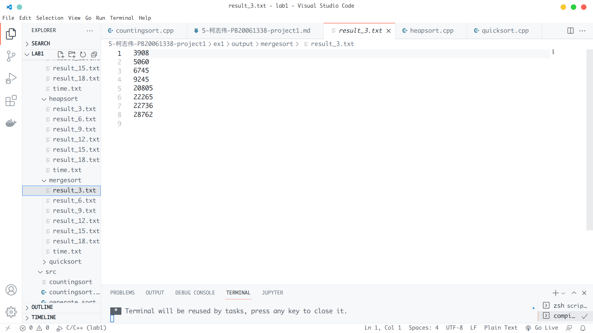
- 堆排序
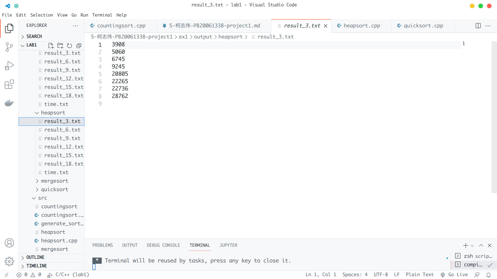
- 计数排序
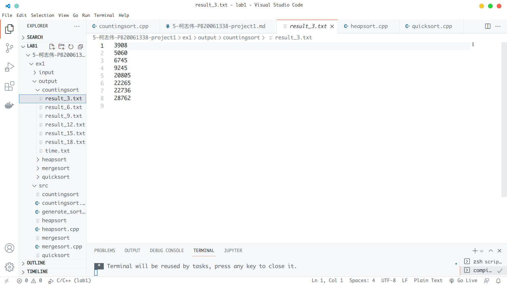

- 快速排序


计数排序6种输入规模下的运行时间截图
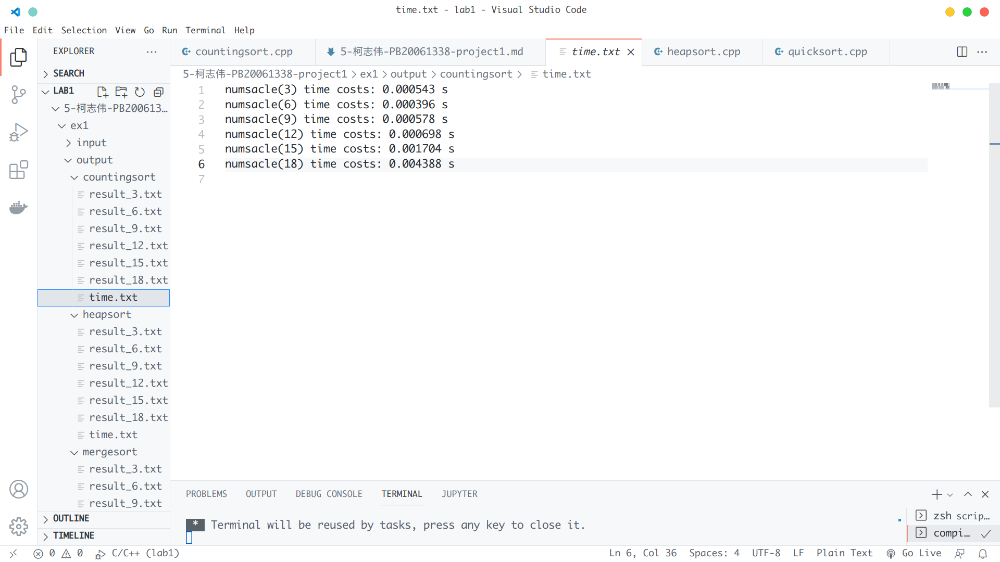

使用python脚本验证算法结果的正确性
- 归并排序
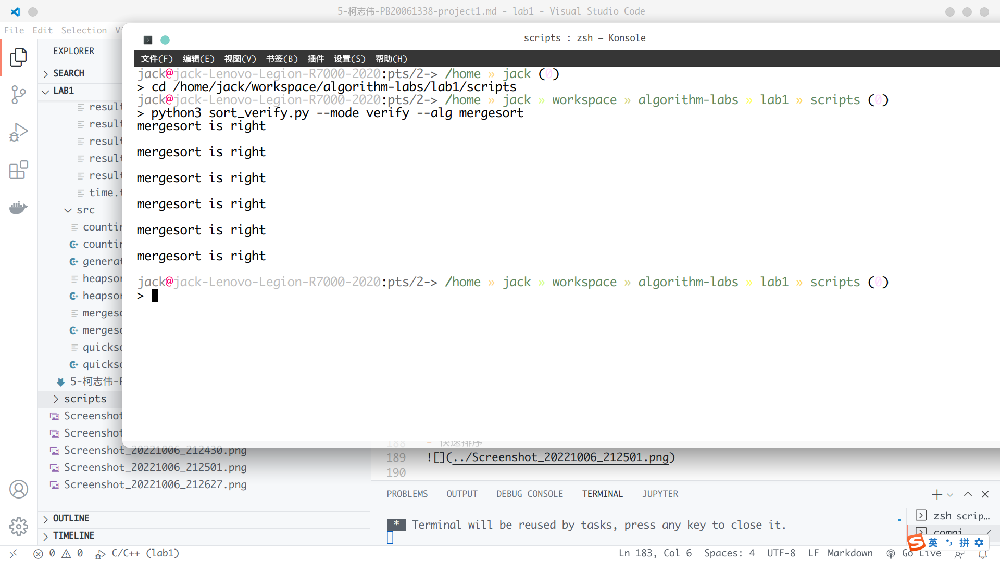
- 堆排序
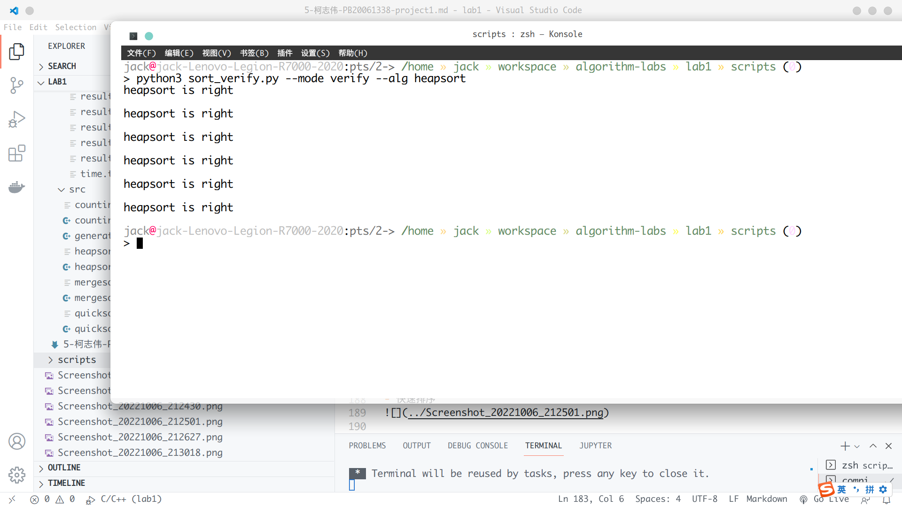
- 计数排序
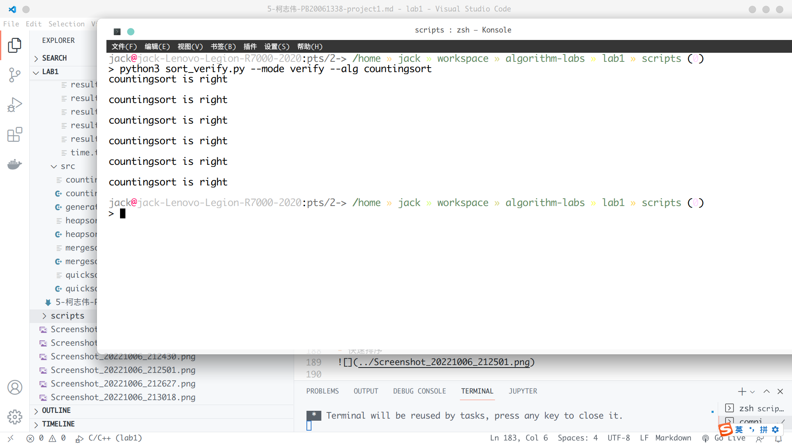

- 快速排序
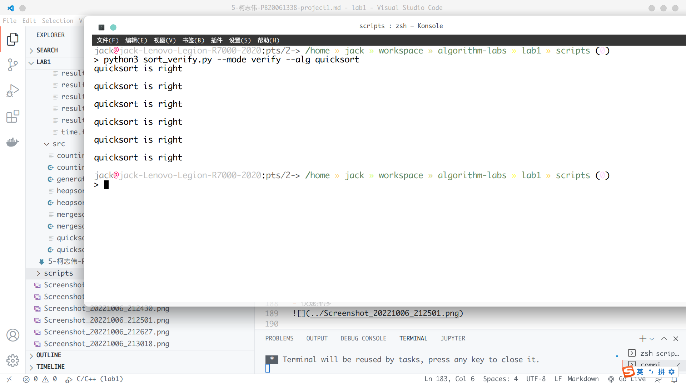

经过脚本验证，每种算法对6中输入规模下产生的结果均正确


#### 实验分析
 
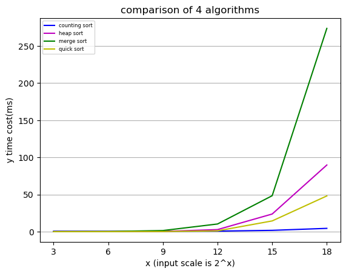

```
从四种算法随输入规模的运行时间可以看出：
    随着数据规模的增大，计数排序效果最好，归并排序效果最差，快
    速排序仅次于计数排序

```

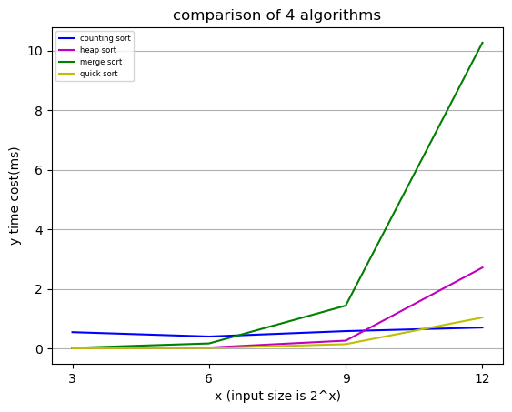
```
    从较小规模下四种算法的运行情况可以看出，运行规模较小时，计数排序和归并排序效果较差，此时，采用比较次数作为衡量运行时间的模型并不适用，数据的搬运次数以及cache的影响很大，归并排序在合并时会消耗额外空间，计数排序也需要额外空间来记录计数结果，因此运行效果较差

```

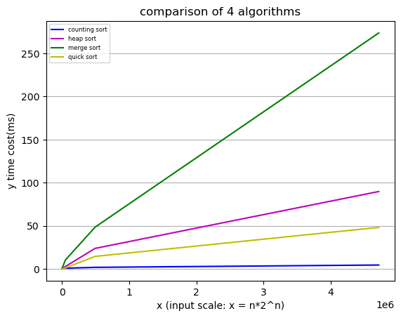
```
    从此图可以看出，四种算法随着输入规模的增长，渐进趋势为O(nlogn),
    从算法分析角度，在基于将比较次数作为算法运行时间的衡量时，四种算法
    的运行时间的复杂度为O(nlogn),在图中可以看出，在输入规模较小时(nlogn
    部分较小)，曲线有所偏折，此时由于内存数据搬运，cache等的影响，导致
    nlogn在运行时间中并不一定占主体部分，但随着数据规模增大，最终nlogn
    占据运行时间主体，起决定作用，因此曲线趋于直线
```


