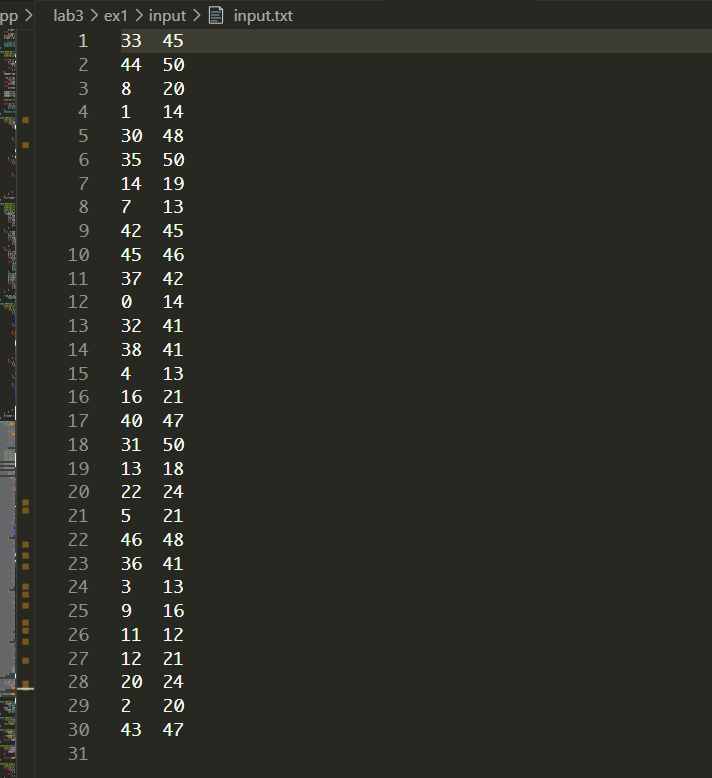
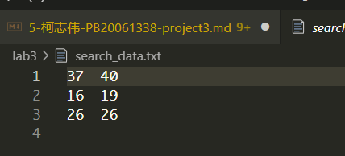
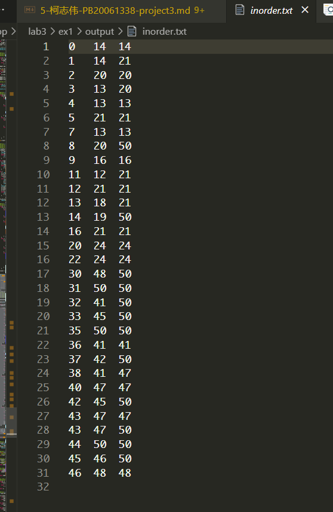
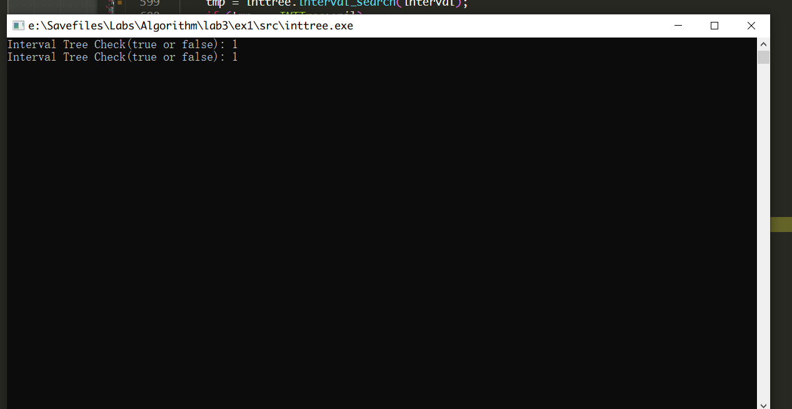
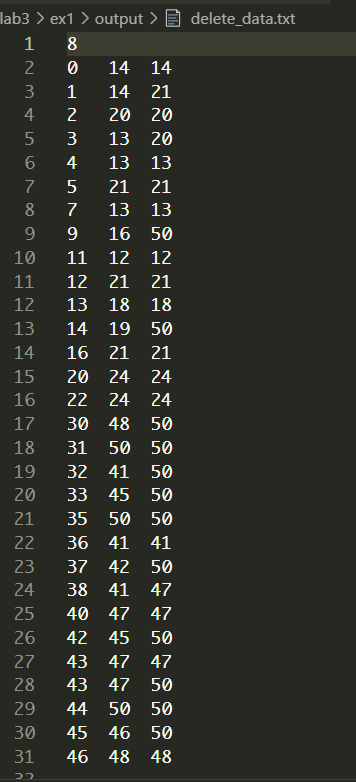
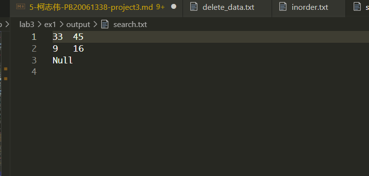

# lab3实验报告
<center>
学号：PB20061338
姓名： 柯志伟
</center>


## 实验设备和环境

    平台: windows
    编程语言: C与C++

## 实验内容及要求

### 实验内容

#### 实验3.1：区间树

    实现区间树的基本算法，随机生成30个正整数区间，以这30个正整数区 间的左端点作为关键字构建红黑树，先向一棵初始空的红黑树中依次插入 30个节点，然后随机选择其中3个区间进行删除，最后对随机生成的3个区间(其中一个区间取自(25,30))进行搜索。实现区间树的插入、删除、遍历和查找算法


### 实验要求
    1. 实验设备和环境、实验内容及要求、方法和步骤、结果与分析
    2. 比较实际复杂度和理论复杂度是否相同，给出分析


### 方法和步骤

#### 1. 实现红黑树并扩展成区间树

**数据结构实现如下:**
```c++
#define red 0
#define black 1

struct Interval {
    int low;
    int high;
    Interval() : low(0), high(0) {}
    Interval(int low,int high) : low(low),high(high) {}
    
    bool overlap(Interval interval) {
            return (this->low <= interval.high && interval.low <= this->high);
    }
};


struct interval_tree_node {
    int color;
    int key;
    int max;
    Interval interval;
    interval_tree_node* par;
    interval_tree_node* lchird;
    interval_tree_node* rchird;

    interval_tree_node(int k, int high, int low, int max, int col, interval_tree_node* p=nullptr, interval_tree_node* lch=nullptr, interval_tree_node* rch=nullptr ) :
        key(k), par(p), lchird(lch), rchird(rch), color(col),interval(low, high),max(max){}

    static void free_node_iterate(interval_tree_node* nodeptr);
};

class INTTree {

    public:
        INTTree() { root = nil;}

        ~INTTree() { rbdestroy();}

        static interval_tree_node* nil;

    public:
        void rbtransplant(interval_tree_node* u, interval_tree_node* v);
        interval_tree_node* rbsearch(int key);
        void rbleftRotate(interval_tree_node* x);
        void rbrightRotate(interval_tree_node* x);
        void rbinsert(interval_tree_node* nodeptr);
        void rbinsert_fixup(interval_tree_node* x);
        void rbdelete(interval_tree_node* nodeptr);
        void rbdelete_fixup(interval_tree_node* x);
        void rbdestroy();
        interval_tree_node* rbmin(interval_tree_node* nodeptr);
        interval_tree_node* get_root() { return root; }

        bool rb_tree_check();

        void interval_insert(interval_tree_node* nodeptr) { rbinsert(nodeptr); }
        void interval_delete(interval_tree_node* nodeptr) { rbdelete(nodeptr); }
        interval_tree_node* interval_search(Interval interval);

        void interval_fixup(interval_tree_node* x);  

        void inorder_visit(interval_tree_node* node);

        void inttree_inorder_visit() {
            fout.open(fileout_path, ios::app);  
            inorder_visit(this->root); 
            fout.close();
        }

        void init_fout(string fpath) { fileout_path = fpath; }

        bool inttree_check();   
    private:
        interval_tree_node* root;  
        string fileout_path; 
        ofstream fout;
};

```
**具体实现见代码**


#### 2. 产生30个随机区间以及三个待搜索的区间

**使用python脚本模拟随机选择的区间**
```python
import random

## 产生30个随机区间,所有区间取自区间[0,25]或[30,50]且各区间左端点互异，不要和(25,30)有重叠

a = [i for i in range(26)]
b = [30 + i for i in range(21)]
gen_sets = ['a', 'b']

data = []
data_l = []

while (len(data) != 30):
    gen_set = random.choice(gen_sets)
    if gen_set == 'a':
        l = random.choice(a)
        r = random.choice(a)
        if l == r:
            continue
        if l > r:
            l, r = r, l

        if l in data_l:
            continue
        else:
            data_l.append(l)
            data.append((l, r))
    else:
        l = random.choice(b)
        r = random.choice(b)
        if l == r:
            continue
        if l > r:
            l, r = r, l
        if l in data_l:
            continue
        else:
            data_l.append(l)
            data.append((l, r))

with open("E:\\Savefiles\\Labs\\Algorithm\\lab3\\ex1\\input\\input.txt", "w") as f:
    for (a,b) in data:
        f.write(str(a))
        f.write('\t')
        f.write(str(b))
        f.write('\n')

search_data = []
while (len(search_data) != 2):
    gen_set = random.choice(gen_sets)
    if gen_set == 'a':
        l = random.choice(a)
        r = random.choice(a)
        if l > r:
            l, r = r, l
        else:
            search_data.append((l, r))
    else:
        l = random.choice(b)
        r = random.choice(b)
        if l > r:
            l, r = r, l
        else:
            search_data.append((l, r))
            
c = [26, 27, 28, 29]
l = random.choice(c)
r = random.choice(c)

if l > r:
    l, r = r, l
search_data.append((l, r))

with open("E:\\Savefiles\\Labs\\Algorithm\\lab3\\search_data.txt", "w") as f:
    for (a,b) in search_data:
        f.write(str(a))
        f.write('\t')
        f.write(str(b))
        f.write('\n')

```
**30个随机区间**



**3个随机搜索区间**



#### 3. 为保证算法实现的正确性，实现区间树性质的检验代码

```c++

bool INTTree::inttree_check() {
    bool check = true;
    // 红黑树性质
        // 1. 每个节点或是红色,或是黑色: 通过创建节点保证
        // 2. 根节点是黑色
    if (this->root->color != black)
            check = false;
        // 3. 每个叶节点是黑色
        // 4. 如果一个节点是红色,那么两个子节点也是黑色
        // 5. 该节点到所有后代节点的黑高度相同
        // 6. 该树是一颗二叉树
    // 区间树性质
        // 7. node.max = max(node.int.high, node.lch.max, node.rch.max)
        
    // 以上几条使用深度优先遍历检测
    interval_tree_node* prev;
    std::vector<interval_tree_node*> leafs;
    std::vector<interval_tree_node*> stack;
    std::map<interval_tree_node*, int> black_height;
    std::map<interval_tree_node*, bool> visited;

    black_height[nil] = 0;

    stack.push_back(this->root);

    while(! stack.empty()) {
        prev = stack.back();

        if(prev->lchird != nil && prev->rchird != nil) {
            // 检查满足二叉树性质
            if(! (prev->lchird->key <= prev->key && prev->rchird->key >= prev->key))
                check = false;
            // 检查满足区间树的max域性质 
            int max = prev->interval.high;
            if(prev->lchird->max > max)
                max = prev->lchird->max;
            if(prev->rchird->max > max)
                max = prev->rchird->max;
            if(max != prev->max)
                check = false;    
            //  更新黑高度
            if(prev->color == black)
                black_height[prev] = black_height[prev->par] + 1;
            else
                black_height[prev] = black_height[prev->par];
            // 如果一个节点是黑色,那么两个子节点也是黑色 
            if(prev->color == red && (prev->lchird->color == red || prev->rchird->color == red))
                check = false;
            if(visited.find(prev->lchird) != visited.end() && visited[prev->lchird] == false || visited.find(prev->lchird) == visited.end()) {
                stack.push_back(prev->lchird);
            }    
            else if(visited.find(prev->rchird) != visited.end() && visited[prev->rchird] == false || visited.find(prev->rchird) == visited.end()) {
                stack.push_back(prev->rchird);
            }
            else {
                visited[prev] = true;
                stack.pop_back();
            }
        }
        else if(prev->lchird != nil) {
            // 检查满足二叉树性质
            if(! (prev->lchird->key <= prev->key))
                check = false;
            // 检查满足区间树的max域性质 
            int max = prev->interval.high;
            if(prev->lchird->max > max)
                max = prev->lchird->max;
            if(max != prev->max)
                check = false;    
            //  更新黑高度
            if(prev->color == black)
                black_height[prev] = black_height[prev->par] + 1;
            else
                black_height[prev] = black_height[prev->par];
            // 如果一个节点是黑色,那么两个子节点也是黑色 
            if(prev->color == red && prev->lchird->color == red)
                check = false;
            if(visited.find(prev->lchird) != visited.end() && visited[prev->lchird] == false || visited.find(prev->lchird) == visited.end()) {
                stack.push_back(prev->lchird);
            }    
            else {
                visited[prev] = true;
                stack.pop_back();
            }
        }
        else if(prev->rchird != nil) {
            // 检查满足二叉树性质
            if(! (prev->rchird->key >= prev->key))
                check = false;
            // 检查满足区间树的max域性质 
            int max = prev->interval.high;
            if(prev->rchird->max > max)
                max = prev->rchird->max;
            if(max != prev->max)
                check = false;    
            //  更新黑高度
            if(prev->color == black)
                black_height[prev] = black_height[prev->par] + 1;
            else
                black_height[prev] = black_height[prev->par];
            // 如果一个节点是黑色,那么两个子节点也是黑色 
            if(prev->color == red && prev->rchird->color == red)
                check = false;
            if(visited.find(prev->rchird) != visited.end() && visited[prev->rchird] == false || visited.find(prev->rchird) == visited.end()) {
                stack.push_back(prev->rchird);
            }
            else {
                visited[prev] = true;
                stack.pop_back();
            }
        }
        else {
            // 此时为叶子节点
            // 检查满足二叉树性质
            // 检查满足区间树的max域性质 
            if(prev->max != prev->interval.high)   
                check = false;
            //  更新黑高度
            if(prev->color == black)
                black_height[prev] = black_height[prev->par] + 1;
            else
                black_height[prev] = black_height[prev->par];
            // 如果一个节点是黑色,那么两个子节点也是黑色 
            visited[prev] = true;
            stack.pop_back();
            leafs.push_back(prev);
        }
    }

    // 检查所有叶子的黑高度
    int bh = black_height[*(leafs.begin())];
    for(auto &node: leafs) {
        if(bh != black_height[node])
            check = false;
    }

    return check;
}

```


### 结果与分析

#### 读入30个随机区间构建区间树,并完成中序遍历,以及第一次区间树检查





#### 搜索键值为8的红黑树节点并删除,执行中序遍历,以及第二次区间树检查



**注:** 区间树两次检查结果都在图中(true为1，false为0)

#### 搜索三个随机区间



#### 结果分析
由于只构建一棵区间树,而且以不同的插入方式最终构建出的区间树形态有所差异，且中间插入和删除涉及的操作执行次数也受此影响，导致时间复杂度较难分析,故不再分析


