# lab4实验报告
<center>
学号：PB20061338
姓名： 柯志伟
</center>


## 实验设备和环境

    平台: windows
    编程语言: C与C++

## 实验内容及要求

### 实验内容

#### 实验4.1：Johnson算法

    实现求所有点对最短路径的Johnson算法。有向图的顶点数 N 的取值分 别为:	27、81、243、729 ，每个顶点作为起点引出的边的条数取值分别 为：log_5⁡N、 log_7⁡N  （取下整）。图的输入规模总共有4*2=8个，若同一个N，边的两种规模取值相等，则按后面输出要求输出两次，并在报告里说明。(不允许多重边，可以有环。)

### 实验要求
    1. 实验设备和环境、实验内容及要求、方法和步骤、结果与分析
    2. 比较实际复杂度和理论复杂度是否相同，给出分析


### 方法和步骤


#### 1. 以最小堆实现优先队列,分别实现 `dijkstra算法`, `bellman ford算法`


**以邻接表实现图的数据结构,并使用二维数组维护各边的权重,使用一维数组维护最短路径中各个顶点的前驱顶点,使用的数据结构如下**


```c++
typedef struct node {
    int id;
    struct node* next;
} node,*vertex_list;

int Graph_weights[Vertex_num_expand][Vertex_num_expand];
vertex_list Graph_edges[Vertex_num_expand];
int Graph_pi[Vertex_num_expand];    // 顶点的前驱, 供bellman_ford使用
int Graph_d[Vertex_num_expand];     // 目前的最短距离, 供bellman_ford使用
int Graph_D[Vertex_num_expand][Vertex_num_expand]; // dijkstra使用
int Graph_PI[Vertex_num_expand][Vertex_num_expand]; // dijkstra使用
int Heap_nodes[Vertex_num+1]; // 使用堆实现优先队列, 0号元素对应优先队列的长度
int Heap_size;

```

**根据dijkstra算法,bellman ford算法实现具体代码,函数接口如下,详细见代码**


```c++
void dijkstra(int s, int* d, int* pi);   // 传入源s, 储存当前各顶点的最小距离的数组d,储存前趋顶点数组pi

bool bellman_ford(int s, int *l, int* r); // 传入源s, 以及l,r供检测到负环时,函数向外传递检测到负环的边的左右顶点序号


```

#### 2. 分别产生顶点数为`27,81,243,729`,顶点的度为`log5N`,`$log7N$`的随机图(各边权重在[-10,50], 无重边, 可含环)


**使用python脚本产生程序的输入数据**


```python
import math
import random

vertex_scale = [27, 81, 243, 729]
weights = [i for i in range(-10, 51, 1)]
lines1 = []
lines2 = []

for index, i in enumerate(vertex_scale):
    lines1.clear()
    lines2.clear()
    vertexs = [i for i in range(i)]
    degree1 = int(math.log(i, 5))
    degree2 = int(math.log(i, 7))

    for j in range(i):
        vertex_list = []
        for k in range(degree1):
            vertex = random.choice(vertexs)
            while vertex == j or vertex in vertex_list:
                vertex = random.choice(vertexs)
            vertex_list.append(vertex)
            weight = random.choice(weights)
            lines1.append([str(j), str(vertex), str(weight)])

        with open("E:\\Savefiles\\Labs\\Algorithm\\lab4\\ex1\\input\\input" + str(index + 1) + "1.txt", "w") as f:
            for line in lines1:
                f.write("\t".join(line) + "\n")

        vertex_list = []
        for k in range(degree2):
            vertex = random.choice(vertexs)
            while vertex == j or vertex in vertex_list:
                vertex = random.choice(vertexs)
            vertex_list.append(vertex)
            weight = random.choice(weights)
            lines2.append([str(j), str(vertex), str(weight)])

        with open("E:\\Savefiles\\Labs\\Algorithm\\lab4\\ex1\\input\\input" + str(index + 1) + "2.txt", "w") as f:
            for line in lines2:
                f.write("\t".join(line) + "\n")

```

#### 3. 实现求解所有节点最短路径的`johnson算法`


**扩展原有图, 增加节点s, 并初始化其到其余顶点的距离为0,由于使用全局变量储存图的信息,使用的数据结构为数组,预留了空间，直接使用预留的空间即可**


```c++
for(int i=0; i< Vertex_num; i++) {
    node* new_node = (node*) malloc(sizeof(node));
    new_node->id = i;
    Graph_weights[Vertex_num][i] = 0;
    if(! Graph_edges[Vertex_num]) {
        new_node->next = nullptr;
        Graph_edges[Vertex_num] = new_node;
    }
    else {
        node* list_head = Graph_edges[Vertex_num];
        new_node->next = list_head->next;
        list_head->next = new_node;
    }
}

```

**在扩展图上执行bellman ford算法,同时使用bellman ford算法的返回值判断是否含有负环,如果含有就删除检测到负环时的边,重新执行直到成功**


```c++
// 如果有负环就删除负环中的一条边
    while(!success) {
        success = bellman_ford(Vertex_num, &l, &r);
        node* node_ptr = Graph_edges[l];
        node* node_prev = Graph_edges[l];
        if(!success) {
            cout << "the input graph contains a negative-weight cycle, try delete the edge ( " << l << ", " << r << " )" << endl;
            while(node_ptr) {
                if(node_ptr->id == r) {
                    if(node_ptr == Graph_edges[l]) {
                        Graph_edges[l] = node_ptr->next;
                    }
                    else {
                        node_prev->next = node_ptr->next;
                    }
                    free(node_ptr);
                    break;
                }
                node_ptr = node_ptr->next;
            }
        }
    }


```

**重新赋值各个权重,并以各个顶点为源在更改权重后的原图上执行dijkstra算法求解各顶点对之间的最短距离，并在求解后还原原本的最短距离**


```c++
for(int i=0; i<Vertex_num; i++) {
        node* node_ptr = Graph_edges[i];
        while(node_ptr) {
            Graph_weights[i][node_ptr->id] += Graph_d[i] - Graph_d[node_ptr->id];
            node_ptr = node_ptr->next;
        }
    }

    for(int i=0; i< Vertex_num; i++) {
        dijkstra(i, Graph_D[i], Graph_PI[i]);
        for(int j=0; j<Vertex_num;j++) {
            if(Graph_D[i][j] != Infty) {
                Graph_D[i][j] += Graph_d[j] - Graph_d[i];
            }
        }
    }

```

**代码实现上的一些细节说明**


```
1. 由于各边的权重在[-10,50]的范围内,考虑图中顶点数最多为729,同时考虑算法执行过程中不会溢出 以 `#define Infty   (2147483647 >> 2)` 作为权重的无穷大

2. 为支持johnson算法扩展图的要求,在表示图的各顶点数组以及权重数组中预留空间,扩展的顶点即为最后一号元素

3. 由于使用具体数值代表无穷大,同时由于图可能不连通,导致点对间的距离为无穷大,最后将结果保存到文件中时,此时根据与无穷大的比较来判断是否点对间的距离为无穷大,因此在使用johnson算法还原原有距离时要对这样的边跳过处理,一面后续与无穷大的比较出错

4. 在将结果保存到文件时,以`Infty`代表点对间的距离为无穷大

```

**详细见代码**


### 结果与分析


#### 结果展示

**input11.txt Vertex 27, Degree 2**

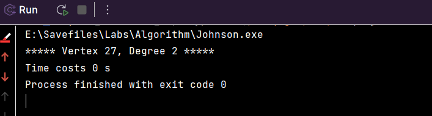

**input12.txt Vertex 27, Degree 1**

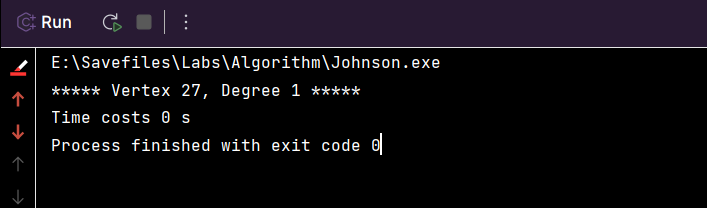


**input21.txt Vertex 81, Degree 2**


**input22.txt Vertex 81, Degree 2**

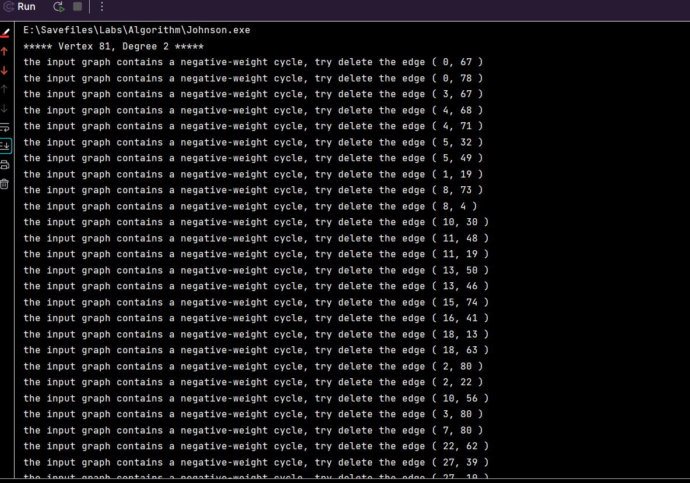
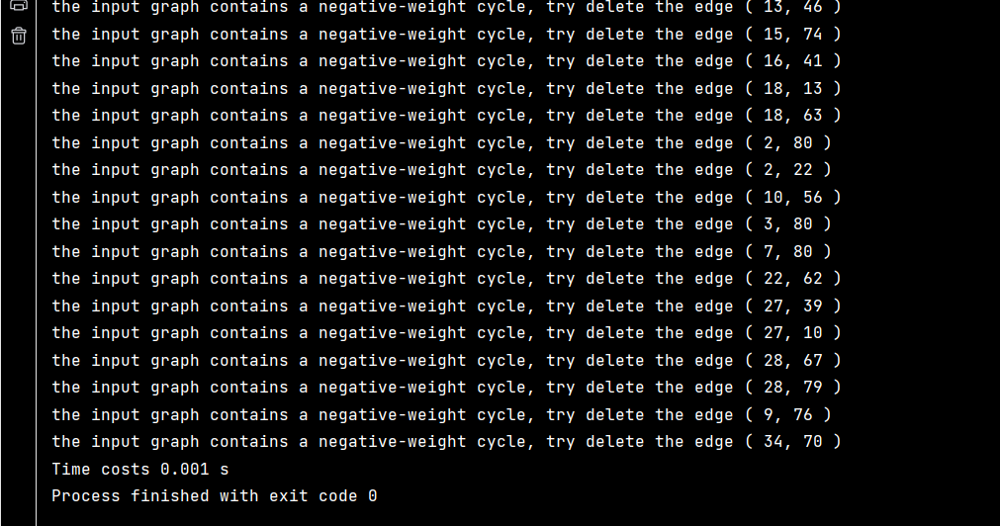

**input31.txt Vertex 243, Degree 3**

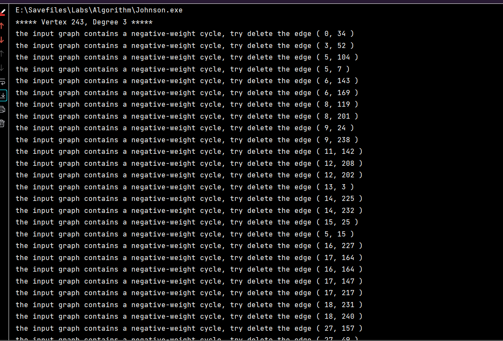
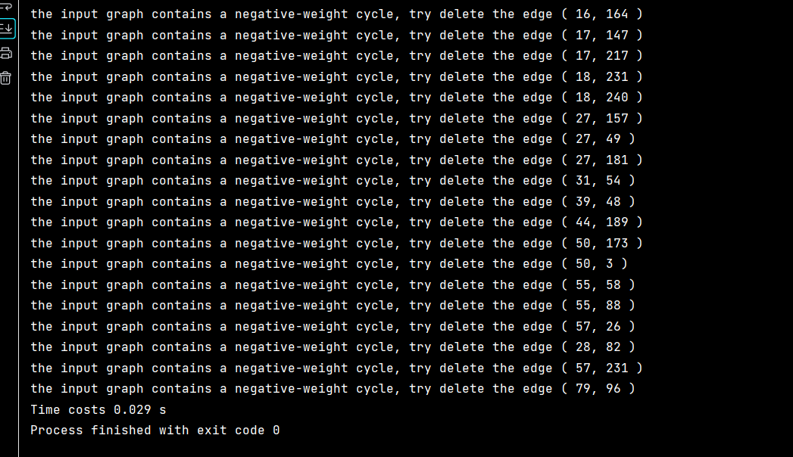

**input32.txt Vertex 243, Degree 2**

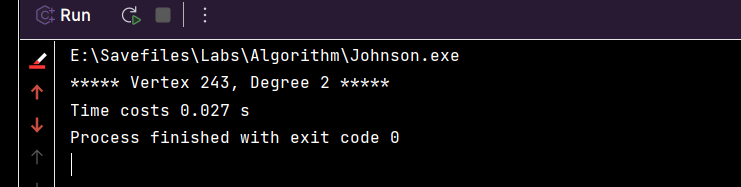

**input41.txt Vertex 729, Degree 4**

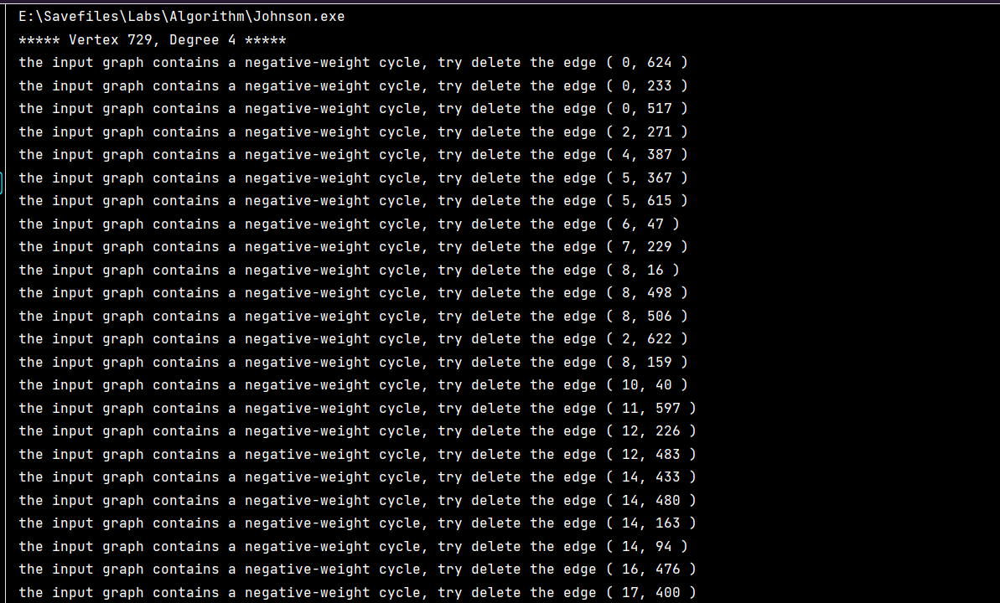
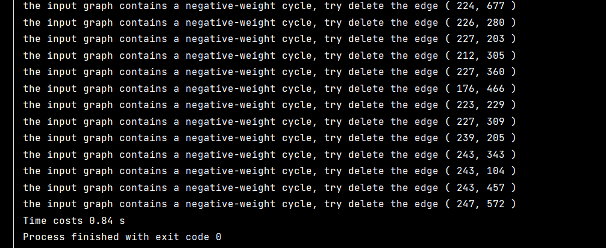

**input42.txt Vertex 729, Degree 3**

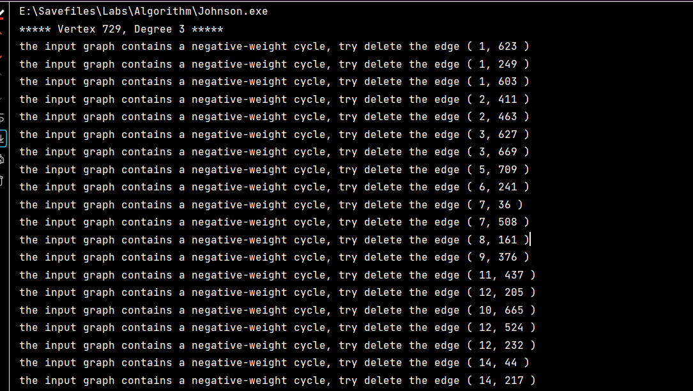
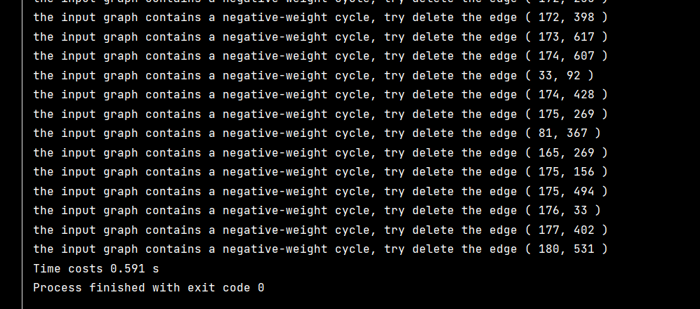


#### 数据分析


**图的规模以及运行时间如下:**


| 顶点数  | 边数  | V(V+E)lgV  | 运行时间(s) |
|:--:   |:--:|:--:|:--:|
| 27  | 54  | 1.03e+04  | 0  |
| 27  | 27  | 6.93e+03  | 0  |
|  81 | 162  | 1.24e+05  |  0.002 |
| 81  | 162  |  1.24e+05 | 0.001  |
| 243  | 729  | 1.87e+06  | 0.029  |
| 243  | 486  | 1.40e+06  | 0.027  |
|  729 | 2916  | 2.52e+07  |0.84   |
| 729  | 2187  | 2.02e+07  | 0.591  |

**以预期时间复杂度绘制折线图如下:**


```python
import numpy as np
import matplotlib.pyplot as plt
## johnson算法
time = np.array([0,0,0.002,0.001,0.029,0.027,0.84,0.591])
vertex = np.array([27,27,81,81,243,243,729,729])
degree = np.array([2,1,2,2,3,2,4,3])

edges = vertex * degree

scales = vertex*(vertex+edges)*np.log2(vertex)


x = scales / 10000
y = time*1000

plt.title("Johnson")

plt.plot(x, y,'b')
plt.xlabel("x (scale: 10^4)")
plt.ylabel("y (time: ms)")
plt.grid(axis='y')
plt.plot()

```

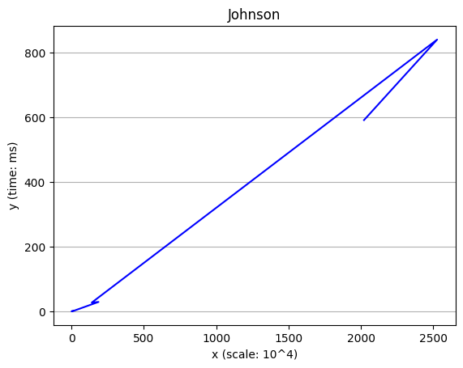


**johnson算法主体依靠dijkstra算法获得各点对之间的最短距离,而dijkstra算法的性能很大程度上依赖于优先队列的实现,本次实验中以二叉堆实现的优先队列的EXTRACT-MIN和DECREASE-KEY的时间复杂度均为lgN,在dijkstra算法中两者执行的次数分别为V,E,故dijkstra算法的时间复杂度为O((V+E)lgV),因此johnson算法的时间复杂度为O(V(V+E)lgV),由图可知除异常的一个数据外，其余数据大致在一条直线上,由于本次实验中的图为随机生成,且由于可能产生负圈导致最后的图的规模与原图有一定偏差,最终有一定误差,因此该图可以较好的符合该时间复杂度**


